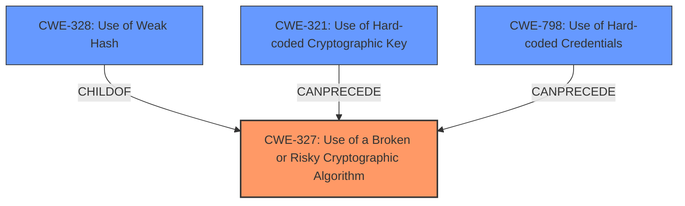

# Analysis for CVE-2024-36496

# Summary
| CWE ID | CWE Name | Confidence | CWE Abstraction Level | CWE Vulnerability Mapping Label | CWE-Vulnerability Mapping Notes |
|---|---|---|---|---|---|
| CWE-327 | Use of a Broken or Risky Cryptographic Algorithm | 0.9 | Class | Allowed-with-Review | Primary CWE: The root cause is the use of a broken cryptographic algorithm, MD5, and RC4 |
| CWE-321 | Use of Hard-coded Cryptographic Key | 0.7 | Variant | Allowed | The encryption key is derived from a static password. |
| CWE-328 | Use of Weak Hash | 0.6 | Base | Allowed | The application uses the outdated MD5 hashing algorithm without a salt to hash the password. |
| CWE-798 | Use of Hard-coded Credentials | 0.5 | Base | Allowed | Hardcoded five-character password |

## Evidence and Confidence

*   **Confidence Score:** 0.7
*   **Evidence Strength:** HIGH

## Relationship Analysis
The primary weakness is the use of broken or risky cryptographic algorithms (CWE-327). This leads to potential exploitation of the configuration file. The use of a weak hash (CWE-328) and a hardcoded key (CWE-321) contribute to the overall vulnerability. CWE-327 is a class-level CWE with child CWEs like CWE-328 (Use of Weak Hash) and CWE-916 (Use of Password Hash With Insufficient Computational Effort). The weakness also involves the use of hardcoded credentials (CWE-798) in the form of a static password.

## Vulnerability Chain
1.  The application uses a **hardcoded five-character password** (CWE-798)
2.  The application hashes this password using the **MD5 algorithm without a salt** (CWE-328)
3.  The application uses the **first five bytes of the hash as a key for RC4** (CWE-321, CWE-327)
4.  The **configuration file is encrypted** using these parameters (CWE-327)
5.  An attacker can **decrypt the configuration file and extract sensitive information**

## Summary of Analysis
The primary vulnerability is the **use of broken or risky cryptographic algorithms** (CWE-327) because the application uses the outdated MD5 algorithm and RC4. The configuration file is encrypted with these parameters allowing an attacker to decrypt it. This is supported by the "Vulnerability Description Key Phrases" where the **rootcause** is stated as **weak encryption of five-character password**. The CVE Reference Links Content Summary also confirms that the application uses a **weak hashing algorithm (MD5 without salt)** and a **weak encryption algorithm (RC4)**.

CWE-327 is more appropriate than its children, such as CWE-328 (Use of Weak Hash) or CWE-916 (Use of Password Hash With Insufficient Computational Effort), because it encompasses both the hashing and encryption aspects of the vulnerability. However, CWE-328 is also included since the MD5 hash is part of the weakness, and CWE-321 as the hardcoded password is used as the basis of the key.

I considered CWE-798 (Use of Hard-coded Credentials) because the application uses a hardcoded five-character password to derive the encryption key. This is a contributing factor to the overall vulnerability, but not the primary cause. I included it to completely describe all the weaknesses found.

Relevant CWE Information:
*   **CWE-327**: This is a Class-level CWE which suggests using more precise child CWEs where applicable. However, it effectively captures the core issue of using broken crypto.
*   **CWE-328**: The description matches the application's use of MD5 without salt.
*   **CWE-321**: The description matches the application's derivation of the encryption key from a static password.