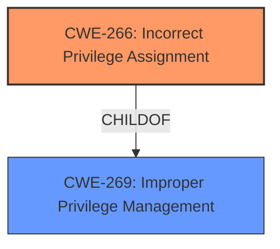

# Analysis for CVE-2024-36500

# Summary
| CWE ID  | CWE Name                      | Confidence | CWE Abstraction Level | CWE Vulnerability Mapping Label | CWE-Vulnerability Mapping Notes |
| :-------- | :---------------------------- | :--------- | :-------------------- | :------------------------------ | :------------------------------ |
| CWE-266 | Incorrect Privilege Assignment | 0.8        | Base                  | Primary                         | Allowed                         |

## Evidence and Confidence

*   **Confidence Score:** 0.8
*   **Evidence Strength:** HIGH

## Relationship Analysis
The primary CWE selected, CWE-266, is at the Base level, which is preferred for root cause analysis. It has parent Class CWE-269, Improper Privilege Management, which is more general and therefore less suitable. The Privileges vs Permissions Guidance highlights the importance of distinguishing between privilege and permission issues, and CWE-266 directly addresses privilege misassignment.

## Vulnerability Chain
The vulnerability chain starts with the **incorrect privilege assignment** (CWE-266) within the AMS module, leading to potential privilege escalation and ultimately impacting service confidentiality. The root cause is the **incorrect assignment** itself.

## Summary of Analysis
Based on the evidence, the most appropriate CWE is CWE-266 (Incorrect Privilege Assignment). The vulnerability description explicitly states a "**Privilege escalation vulnerability**" and the CVE Reference Links Content Summary confirms the issue as a "**Privilege escalation vulnerability** in the AMS module". The fact that it's related to privilege escalation and the **incorrect** assignment of privileges points directly to CWE-266.

The Privileges vs Permissions Guidance provided helps in determining the correct CWE. It highlights that "Escalate to root/admin" suggests a privilege escalation impact, and the table indicates that "Role misassignment" maps to CWE-266.

Other CWEs were considered but deemed less suitable:

*   CWE-269 (Improper Privilege Management): This is a Class-level CWE and is too general. The provided guidance discourages its use.
*   CWE-285 (Improper Authorization): This is about incorrect permission checks, which isn't the core issue here.
*   CWE-250 (Execution with Unnecessary Privileges): This is about running code with higher privileges than needed, which isn't the explicit problem here.
*   CWE-284 (Improper Access Control): This is too broad and should only be used if more specific CWEs don't fit.

The selection of CWE-266 is at the optimal level of specificity because it directly addresses the **incorrect privilege assignment** within the AMS module, which is the root cause of the vulnerability.