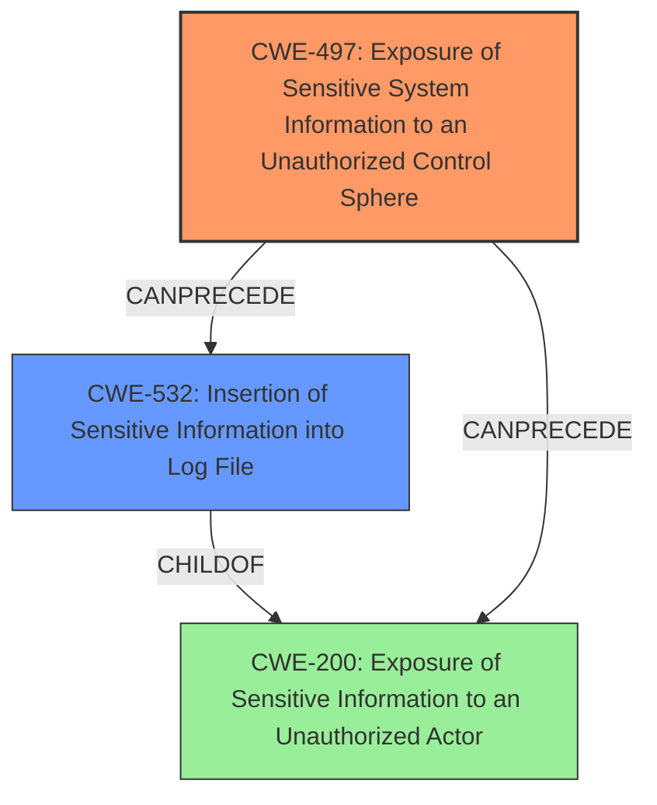

# Analysis Report for CVE-2024-36509

# Vulnerability Analysis Report: CVE-2024-36509

## Description

An **exposure of sensitive system information to an unauthorized control sphere vulnerability [CWE-497]** in FortiWeb version 7.6.0, version 7.4.3 and below, version 7.2.10 and below, version 7.0.10 and below, version 6.3.23 and below may allow an authenticated attacker to access the encrypted passwords of other administrators via the Log Access Event logs page.

## Vulnerability Description Key Phrases

- **Rootcause:** exposure of sensitive system information to an unauthorized control sphere vulnerability [CWE-497]
- **Impact:** access encrypted passwords of other administrators
- **Attacker:** authenticated attacker
- **Product:** FortiWeb
- **Version:** 7.6.0, 7.4.3 and below, 7.2.10 and below, 7.0.10 and below, 6.3.23 and below
- **Component:** Log Access Event logs page

## Analysis (with Relationship Data)

# Summary
| CWE ID | CWE Name | Confidence | CWE Abstraction Level | CWE Vulnerability Mapping Label | CWE-Vulnerability Mapping Notes |
|---|---|---|---|---|---|
| CWE-497 | Exposure of Sensitive System Information to an Unauthorized Control Sphere | 1.0 | Base | Allowed | Primary CWE. The vulnerability is caused by the exposure of sensitive system information. |
| CWE-532 | Insertion of Sensitive Information into Log File | 0.7 | Base | Allowed | Secondary Candidate. The vulnerability results in sensitive information being written to a log file. |
| CWE-200 | Exposure of Sensitive Information to an Unauthorized Actor | 0.5 | Class | Discouraged | Secondary Candidate. The vulnerability results in exposure of sensitive information. |

## Evidence and Confidence

*   **Confidence Score:** 0.9
*   **Evidence Strength:** HIGH

## Relationship Analysis
The primary CWE, CWE-497, is a base-level CWE that describes the root cause of the vulnerability: exposure of sensitive system information. CWE-532, Insertion of Sensitive Information into Log File, and CWE-200, Exposure of Sensitive Information to an Unauthorized Actor, are related as potential consequences of this initial exposure. CWE-532 is more specific than CWE-200, because the logs are the vulnerable resource.



## Vulnerability Chain
The vulnerability chain starts with the **exposure of sensitive system information [CWE-497]**, specifically the encrypted administrator passwords. This information is then **inserted into the log files [CWE-532]**, which can be accessed by authenticated users, leading to an **exposure of sensitive information [CWE-200]**.

## Summary of Analysis
The analysis is based on the vulnerability description, which explicitly states the **rootcause** as an **exposure of sensitive system information to an unauthorized control sphere [CWE-497]**. The CVE Reference Links Content Summary confirms this, stating that the "root cause of vulnerability" is "Exposure of sensitive system information to an unauthorized control sphere." The vulnerability description also mentions the impact of the vulnerability, which is that an authenticated attacker can "access the encrypted passwords of other administrators via the Log Access Event logs page." This aligns with CWE-497, which describes a scenario where sensitive system-level information can be accessed by unauthorized actors.

CWE-532 (Insertion of Sensitive Information into Log File) is also considered, as the passwords are being written to a log file. This is a valid secondary CWE, as it describes how the sensitive information is being exposed.

CWE-200 (Exposure of Sensitive Information to an Unauthorized Actor) is a more general CWE, and while applicable, it is less specific than CWE-497 and CWE-532. The MITRE guidance discourages the use of CWE-200 as it is a high-level class.

The selected CWEs are at the optimal level of specificity. CWE-497 is a base-level CWE that accurately describes the root cause of the vulnerability. CWE-532 is also a base-level CWE that describes the mechanism by which the sensitive information is exposed.

Relevant CWE Information:

# Enhanced Context (25 CWEs)
The following CWEs were identified as potentially relevant to this vulnerability:

## CWE-497: Exposure of Sensitive System Information to an Unauthorized Control Sphere
**Abstraction Level**: Base
**Similarity Score**: 0.79
**Source**: dense

**Description**:
The product does not properly prevent sensitive system-level information from being accessed by unauthorized actors who do not have the same level of access to the underlying system as the product does.

**Mapping Guidance**:
- Usage: Allowed
- Rationale: This CWE entry is at the Base level of abstraction, which is a preferred level of abstraction for mapping to the root causes of vulnerabilities.


## CWE-311: Missing Encryption of Sensitive Data
**Abstraction Level**: Class
**Similarity Score**: 0.73
**Source**: dense

**Description**:
The product does not encrypt sensitive or critical information before storage or transmission.

**Mapping Guidance**:
- Usage: Discouraged
- Rationale: CWE-311 is high-level with more precise children available. It is a level-1 Class (i.e., a child of a Pillar).


## CWE-668: Exposure of Resource to Wrong Sphere
**Abstraction Level**: Class
**Similarity Score**: 0.73
**Source**: dense

**Description**:
The product exposes a resource to the wrong control sphere, providing unintended actors with inappropriate access to the resource.

**Mapping Guidance**:
- Usage: Discouraged
- Rationale: CWE-668 is high-level and is often misused as a catch-all when lower-level CWE IDs might be applicable. It is sometimes used for low-information vulnerability reports [REF-1287]. It is a level-1 Class (i.e., a child of a Pillar). It is not useful for trend analysis.


## CWE-798: Use of Hard-coded Credentials
**Abstraction Level**: Base
**Similarity Score**: 0.72
**Source**: dense

**Description**:
The product contains hard-coded credentials, such as a password or cryptographic key.

**Mapping Guidance**:
- Usage: Allowed
- Rationale: This CWE entry is at the Base level of abstraction, which is a preferred level of abstraction for mapping to the root causes of vulnerabilities.


## CWE-288: Authentication Bypass Using an Alternate Path or Channel
**Abstraction Level**: Base
**Similarity Score**: 0.72
**Source**: dense

**Description**:
The product requires authentication, but the product has an alternate path or channel that does not require authentication.

**Mapping Guidance**:
- Usage: Allowed
- Rationale: This CWE entry is at the Base level of abstraction, which is a preferred level of abstraction for mapping to the root causes of vulnerabilities.


## CWE-538: Insertion of Sensitive Information into Externally-Accessible File or Directory
**Abstraction Level**: Base
**Similarity Score**: 0.72
**Source**: dense

**Description**:
The product places sensitive information into files or directories that are accessible to actors who are allowed to have access to the files, but not to the sensitive information.

**Mapping Guidance**:
- Usage: Allowed
- Rationale: This CWE entry is at the Base level of abstraction, which is a preferred level of abstraction for mapping to the root causes of vulnerabilities.


## CWE-472: External Control of Assumed-Immutable Web Parameter
**Abstraction Level**: Base
**Similarity Score**: 0.72
**Source**: dense

**Description**:
The web application does not sufficiently verify inputs that are assumed to be immutable but are actually externally controllable, such as hidden form fields.

**Mapping Guidance**:
- Usage: Allowed
- Rationale: This CWE entry is at the Base level of abstraction, which is a preferred level of abstraction for mapping to the root causes of vulnerabilities.


## CWE-807: Reliance on Untrusted Inputs in a Security Decision
**Abstraction Level**: Base
**Similarity Score**: 0.72
**Source**: dense

**Description**:
The product uses a protection mechanism that relies on the existence or values of an input, but the input can be modified by an untrusted actor in a way that bypasses the protection mechanism.

**Mapping Guidance**:
- Usage: Allowed
- Rationale: This CWE entry is at the Base level of abstraction, which is a preferred level of abstraction for mapping to the root causes of vulnerabilities.


## CWE-1391: Use of Weak Credentials
**Abstraction Level**: Class
**Similarity Score**: 0.72
**Source**: dense

**Description**:
The product uses weak credentials (such as a default key or hard-coded password) that can be calculated, derived, reused, or guessed by an attacker.

**Mapping Guidance**:
- Usage: Allowed-with-Review
- Rationale: This CWE entry is a Class and might have Base-level children that would be more appropriate


## CWE-425: Direct Request ('Forced Browsing')
**Abstraction Level**: Base
**Similarity Score**: 0.72
**Source**: dense

**Description**:
The web application does not adequately enforce appropriate authorization on all restricted URLs, scripts, or files.

**Mapping Guidance**:
- Usage: Allowed
- Rationale: This CWE entry is at the Base level of abstraction, which is a


## CWE Relationship Analysis

Current CWEs represent these abstraction levels: .


### Vulnerability Chain Analysis

**Chain starting from CWE-288:**
- 288 (Authentication Bypass Using an Alternate Path or Channel) - ROOT


**Chain starting from CWE-1391:**
- 1391 (Use of Weak Credentials) - ROOT


### CWE Relationship Diagram

```mermaid
graph TD
    classDef primary fill:#f96,stroke:#333,stroke-width:2px
    classDef secondary fill:#69f,stroke:#333
    classDef tertiary fill:#9e9,stroke:#333
```


*Report generated on 2025-07-13 09:07:11*
