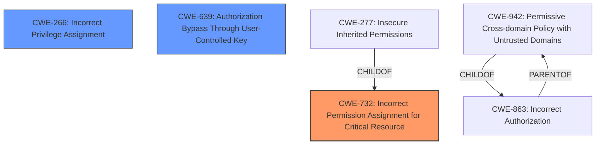

# Analysis for CVE-2024-36534

# Summary

| CWE ID | CWE Name | Confidence | CWE Abstraction Level | CWE Vulnerability Mapping Label | CWE-Vulnerability Mapping Notes |
|---|---|---|---|---|---|
| CWE-732 | Incorrect Permission Assignment for Critical Resource | 0.9 | Class | Allowed-with-Review | Primary CWE |
| CWE-266 | Incorrect Privilege Assignment | 0.7 | Base | Allowed | Secondary Candidate |
| CWE-639 | Authorization Bypass Through User-Controlled Key | 0.6 | Base | Allowed | Secondary Candidate |

## Evidence and Confidence

*   **Confidence Score:** 0.8
*   **Evidence Strength:** HIGH

## Relationship Analysis
The primary relationship influencing the decision is the hierarchical structure, specifically the ChildOf relationships. CWE-732 is a class-level CWE, and its description aligns well with the vulnerability. The provided text also suggests the potential for more specific Base-level CWEs, such as CWE-266, which addresses incorrect privilege assignment. The chain relationships are less relevant here, as the vulnerability primarily revolves around the initial **incorrect permission assignment**. The abstraction levels were crucial in selecting CWE-732 as the primary, with consideration given to refining it further with a more specific Base-level CWE.

## Vulnerability Chain
The vulnerability chain starts with the **insecure permission** assignment to the `hwameistor-admin` cluster role (CWE-732). This leads to the ability to steal the service account token. The stolen token then allows for privilege escalation and access to sensitive data, ultimately leading to potential cluster takeover.

Insecure Permission Assignment (CWE-732) -> Service Account Token Exposure -> Privilege Escalation & Sensitive Data Access -> Potential Cluster Takeover

## Summary of Analysis
The initial analysis focused on identifying the root cause of the vulnerability, which the description clearly states as **"Insecure permissions"**. The Retriever Results highlighted CWE-732, CWE-639, and CWE-266 as potential candidates. After reviewing the detailed CWE specifications and guidance, CWE-732 emerged as the most appropriate primary mapping due to its focus on **incorrect permission assignment for critical resources**.

The guidance on "Privileges vs Permissions" helped clarify the distinction and reinforced the selection of CWE-732 over other privilege-related CWEs. While the vulnerability leads to privilege escalation, the root cause is the **incorrect assignment of permissions**, not a general privilege management issue.

CWE-266 was considered because the **incorrect permissions** ultimately lead to **incorrect privilege assignment**. CWE-639 was also considered because the **insecure permissions** allow the attacker to use a compromised key to bypass authorization.

The final decision is based on the evidence provided in the vulnerability description and CVE Reference Links Content Summary, which clearly points to **insecure permissions** as the fundamental flaw. The selected CWEs are at the optimal level of specificity, addressing both the immediate cause and the potential consequences of the vulnerability.

Relevant CWE Information:

# Enhanced Context (25 CWEs)
The following CWEs were identified as potentially relevant to this vulnerability:

## CWE-732: Incorrect Permission Assignment for Critical Resource
**Abstraction Level**: Class
**Similarity Score**: 1993.72
**Source**: sparse

**Description**:
The product specifies permissions for a security-critical resource in a way that allows that resource to be read or modified by unintended actors.

**Mapping Guidance**:
- Usage: Allowed-with-Review
- Rationale: While the name itself indicates an assignment of permissions for resources, this is often misused for vulnerabilities in which "permissions" are not checked, which is an "authorization" weakness (CWE-285 or descendants) within CWE's model [REF-1287].

**Analysis:**
The vulnerability description states "**Insecure permissions** in hwameistor v0.14.3 allows attackers to access sensitive data and escalate privileges by obtaining the service accounts token."
The "CVE Reference Links Content Summary" mentions "The root cause of the vulnerability lies in insecure permissions within the `hwameistor` Kubernetes component... Specifically, the `hwameistor-admin` cluster role, associated with the `hwameistor-local-disk-manager` DaemonSet, grants excessive privileges (`update/patch` verb on `nodes` resource)."

This clearly indicates an **incorrect permission assignment** to a critical resource (the cluster role), making CWE-732 a strong candidate. While the mapping guidance advises caution due to potential misuse with authorization weaknesses, the core issue here is indeed the **incorrect assignment of permissions**, not merely a failure to check authorization. Therefore, CWE-732 is the best fit as the primary CWE.

## CWE-266: Incorrect Privilege Assignment
**Abstraction Level**: Base
**Similarity Score**: 1.80
**Source**: graph

**Description**:
A product incorrectly assigns a privilege to a particular actor, creating an unintended sphere of control for that actor.

**Mapping Guidance**:
- Usage: Allowed
- Rationale: This CWE entry is at the Base level of abstraction, which is a preferred level of abstraction for mapping to the root causes of vulnerabilities.

**Analysis:**

The vulnerability ultimately leads to **privilege escalation**, suggesting that an **incorrect privilege assignment** has occurred. The "**Insecure Permissions**" on the cluster role allow attackers to gain higher-than-intended privileges. Therefore, CWE-266 is a relevant secondary candidate.

## CWE-639: Authorization Bypass Through User-Controlled Key
**Abstraction Level**: Base
**Similarity Score**: 0.73
**Source**: dense

**Description**:
The system's authorization functionality does not prevent one user from gaining access to another user's data or record by modifying the key value identifying the data.

**Mapping Guidance**:
- Usage: Allowed
- Rationale: This CWE entry is at the Base level of abstraction, which is a preferred level of abstraction for mapping to the root causes of vulnerabilities.

**Analysis:**
The vulnerability allows an attacker to steal a service account token, which can then be used to authenticate with the Kubernetes API server. This is a form of **authorization bypass** where the attacker uses a user-controlled key (the stolen token) to gain unauthorized access. Therefore, CWE-639 is a relevant secondary candidate.

## CWE-276: Incorrect Default Permissions
**Abstraction Level**: Base
**Similarity Score**: 0.75
**Source**: dense

**Description**:
During installation, installed file permissions are set to allow anyone to modify those files.

**Mapping Guidance**:
- Usage: Allowed
- Rationale: This CWE entry is at the Base level of abstraction, which is a preferred level of abstraction for mapping to the root causes of vulnerabilities.

**Analysis:**
This CWE is less relevant because the **insecure permissions** are not necessarily related to installation-time default permissions, but rather to the configuration of a cluster role within Kubernetes.

## CWE-341: Predictable from Observable State
**Abstraction Level**: base
**Similarity Score**: 2.33
**Source**: graph

**Description**:
CWE-341: Predictable from Observable State

**Analysis:**
This CWE is not applicable as there is no mention of any predictable values being used.

## CWE-379: Creation of Temporary File in Directory with Insecure Permissions
**Abstraction Level**: base
**Similarity Score**: 2.12
**Source**: graph

**Description**:
CWE-379: Creation of Temporary File in Directory with Insecure Permissions

**Analysis:**
This CWE is not applicable as the vulnerability doesn't involve the creation of temporary files.

## CWE-285: Improper Authorization
**Abstraction Level**: Class
**Similarity Score**: 1955.42
**Source**: sparse

**Description**:
The product does not perform or incorrectly performs an authorization check when an actor attempts to access a resource or perform an action.

**Mapping Guidance**:
- Usage: Discouraged
- Rationale: CWE-285 is high-level and lower-level CWEs can frequently be used instead. It is a level-1 Class (i.e., a child of a Pillar).

**Analysis:**
While the vulnerability leads to unauthorized access, the root cause isn'