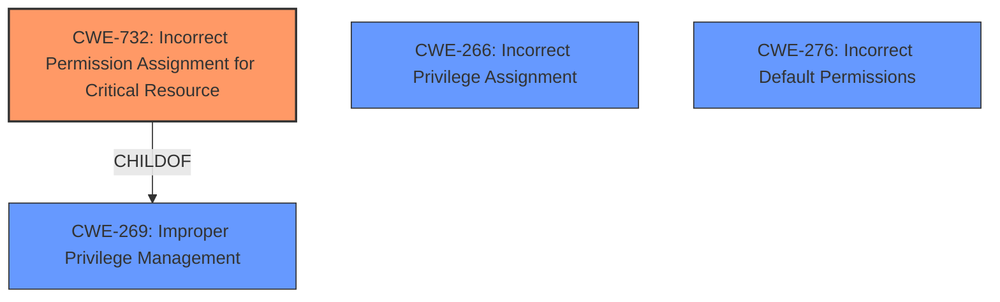

# Analysis Report for CVE-2024-36587

# Vulnerability Analysis Report: CVE-2024-36587

## Description

**Insecure permissions** in DNSCrypt-proxy v2.0.0alpha9 to v2.1.5 allows non-privileged attackers to escalate privileges to root via overwriting the binary dnscrypt-proxy.

## Vulnerability Description Key Phrases

- **Rootcause:** Insecure permissions
- **Impact:** escalate privileges to root
- **Vector:** overwriting the binary dnscrypt-proxy
- **Attacker:** non-privileged attackers
- **Product:** DNSCrypt-proxy
- **Version:** v2.0.0alpha9 to v2.1.5

## Analysis (with Relationship Data)

# Summary
| CWE ID | CWE Name | Confidence | CWE Abstraction Level | CWE Vulnerability Mapping Label | CWE-Vulnerability Mapping Notes |
|---|---|---|---|---|---|
| CWE-732 | Incorrect Permission Assignment for Critical Resource | 1.0 | Class | Allowed-with-Review | Primary CWE |
| CWE-266 | Incorrect Privilege Assignment | 0.5 | Base | Allowed | Secondary Candidate |
| CWE-276 | Incorrect Default Permissions | 0.5 | Base | Allowed | Secondary Candidate |

## Evidence and Confidence

*   **Confidence Score:** 0.8
*   **Evidence Strength:** MEDIUM

## Relationship Analysis
The primary relationship influencing the decision is the parent-child relationship between CWE-269 (Improper Privilege Management) and CWE-732 (Incorrect Permission Assignment for Critical Resource) and the privilege vs permission guidance. The vulnerability description indicates **insecure permissions** on a critical resource, which aligns more closely with CWE-732 than the broader CWE-269. While CWE-732 is a Class-level CWE and would usually be avoided, it is the most specific one. The other possible candidates, such as CWE-266 and CWE-276, are related to privilege or permission management.



## Vulnerability Chain
The vulnerability chain starts with **insecure permissions** on the `dnscrypt-proxy` binary (CWE-732), which allows a non-privileged attacker to overwrite the binary. This leads to privilege escalation, as the attacker can then execute arbitrary code with root privileges. The chain is:
1.  **Insecure Permissions (CWE-732)** - Root Cause
2.  Privilege Escalation (Impact)

## Summary of Analysis
The initial analysis focused on identifying the root cause of the vulnerability, which is the **insecure permissions** on the `dnscrypt-proxy` binary. While the vulnerability description mentions privilege escalation as the impact, the primary concern is the incorrect permission assignment.

Based on the provided evidence, CWE-732 (Incorrect Permission Assignment for Critical Resource) appears to be the most appropriate choice. The description explicitly states "**Insecure permissions** in DNSCrypt-proxy...allows non-privileged attackers to escalate privileges to root via overwriting the binary dnscrypt-proxy." This aligns perfectly with CWE-732, which focuses on incorrect permission assignments for critical resources. The retriever results also list CWE-732 as the top candidate.

CWE-266 (Incorrect Privilege Assignment) and CWE-276 (Incorrect Default Permissions) were considered as secondary candidates, but they are less specific than CWE-732 in this context. CWE-266 typically involves assigning incorrect privileges to users, while CWE-276 focuses on incorrect default permissions during installation. In this case, the issue is with the permissions of the `dnscrypt-proxy` binary itself, rather than user privileges or installation defaults.

Relevant CWE Information:

# Enhanced Context (25 CWEs)
The following CWEs were identified as potentially relevant to this vulnerability:

## CWE-732: Incorrect Permission Assignment for Critical Resource
**Abstraction Level**: Class
**Similarity Score**: 1296.05
**Source**: sparse

**Description**:
The product specifies permissions for a security-critical resource in a way that allows that resource to be read or modified by unintended actors.

**Mapping Guidance**:
- Usage: Allowed-with-Review
- Rationale: While the name itself indicates an assignment of permissions for resources, this is often misused for vulnerabilities in which "permissions" are not checked, which is an "authorization" weakness (CWE-285 or descendants) within CWE's model [REF-1287].

## CWE-266: Incorrect Privilege Assignment
**Abstraction Level**: Base
**Similarity Score**: 0.79
**Source**: dense

**Description**:
A product incorrectly assigns a privilege to a particular actor, creating an unintended sphere of control for that actor.

**Mapping Guidance**:
- Usage: Allowed
- Rationale: This CWE entry is at the Base level of abstraction, which is a preferred level of abstraction for mapping to the root causes of vulnerabilities.

## CWE-276: Incorrect Default Permissions
**Abstraction Level**: Base
**Similarity Score**: 0.76
**Source**: dense

**Description**:
During installation, installed file permissions are set to allow anyone to modify those files.

**Mapping Guidance**:
- Usage: Allowed
- Rationale: This CWE entry is at the Base level of abstraction, which is a preferred level of abstraction for mapping to the root causes of vulnerabilities.

## Complete CWE Specifications

CWE-732: Incorrect Permission Assignment for Critical Resource
CWE-266: Incorrect Privilege Assignment
CWE-276: Incorrect Default Permissions


## CWE Relationship Analysis

Current CWEs represent these abstraction levels: .


### Vulnerability Chain Analysis

**Chain starting from CWE-732:**
- 732 (Incorrect Permission Assignment for Critical Resource) - ROOT


**Chain starting from CWE-269:**
- 269 (Improper Privilege Management) - ROOT


### CWE Relationship Diagram

```mermaid
graph TD
    classDef primary fill:#f96,stroke:#333,stroke-width:2px
    classDef secondary fill:#69f,stroke:#333
    classDef tertiary fill:#9e9,stroke:#333
```


*Report generated on 2025-07-13 09:12:21*
