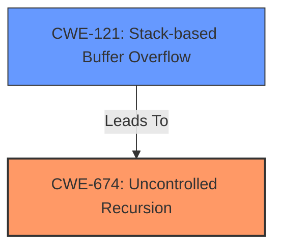

# Analysis Report for CVE-2024-36761

# Vulnerability Analysis Report: CVE-2024-36761

## Description

naga v0.14.0 was discovered to contain a **stack overflow** via the component /wgsl/parse/mod.rs.

## Vulnerability Description Key Phrases

- **Weakness:** stack overflow
- **Product:** naga
- **Version:** v0.14.0
- **Component:** /wgsl/parse/mod.rs

## Analysis (with Relationship Data)

# Summary
| CWE ID | CWE Name | Confidence | CWE Abstraction Level | CWE Vulnerability Mapping Label | CWE-Vulnerability Mapping Notes |
|---|---|---|---|---|---|
| CWE-674 | Uncontrolled Recursion | 1.0 | Class | Primary | Allowed-with-Review |
| CWE-121 | Stack-based Buffer Overflow | 0.7 | Variant | Secondary | Allowed |

## Evidence and Confidence

*   **Confidence Score:** 0.8
*   **Evidence Strength:** HIGH

## Relationship Analysis
The primary weakness is **CWE-674 Uncontrolled Recursion**, which leads to a stack overflow. **CWE-121 Stack-based Buffer Overflow** is a potential consequence of the recursion, but the root cause is the **lack of control over the recursion depth**. The relationship is that uncontrolled recursion can lead to a stack overflow. The abstraction level of **CWE-674** is Class, but it's the most accurate representation of the root cause given the available information. **CWE-121** is a Variant.



## Vulnerability Chain
The vulnerability chain starts with the **uncontrolled recursion** (**CWE-674**), which then leads to a **stack overflow** (**CWE-121**). The root cause is the **lack of input validation** on the depth of nested parentheses, which allows an attacker to trigger the excessive recursion.

## Summary of Analysis
The initial analysis identified the **stack overflow** as a key indicator. However, further examination of the vulnerability description and the CVE reference links content summary revealed that the root cause is the **uncontrolled recursion** in the parsing logic. The parser lacks proper input validation and depth checks, allowing an attacker to trigger excessive recursion through deeply nested parentheses. This ultimately leads to the **stack overflow**.

The relationship graph shows that **CWE-674** (Uncontrolled Recursion) leads to **CWE-121** (Stack-based Buffer Overflow). Therefore, **CWE-674** is more accurately mapped as the primary weakness and **CWE-121** as a secondary consequence.

The selection of **CWE-674** is based on the following evidence:

*   The vulnerability description states "a **stack overflow** via the component /wgsl/parse/mod.rs."
*   The CVE reference links content summary states "The parser recursively calls functions while processing nested parentheses in WGSL code without proper input validation and depth checks. This allows an attacker to trigger excessive recursion, which eventually leads to a **stack overflow**."
*   The CVE reference links content summary states "**Lack of Input Validation:** The parser doesn't adequately restrict the depth of nested parentheses, allowing for arbitrarily deep nesting and resulting in **uncontrolled** growth of the call stack."
*   The technical details section says "The stack trace shows deeply nested calls through multiple parsing related functions, which is a result of recursive descent parsing."

The selection of **CWE-121** is based on the fact that a stack overflow is occurring.

Relevant CWE Information:

# Enhanced Context (25 CWEs)
The following CWEs were identified as potentially relevant to this vulnerability:

## CWE-674: Uncontrolled Recursion
**Abstraction Level**: Class
**Similarity Score**: 0.69
**Source**: dense

**Description**:
The product does not properly control the amount of recursion that takes place,  consuming excessive resources, such as allocated memory or the program stack.

**Mapping Guidance**:
- Usage: Allowed-with-Review
- Rationale: This CWE entry is a Class and might have Base-level children that would be more appropriate

## CWE-121: Stack-based Buffer Overflow
**Abstraction Level**: Variant
**Similarity Score**: 1.00
**Source**: Retriever

**Description**:
The product copies data from a source to a buffer on the stack without properly checking the size of the data, potentially leading to a buffer overflow.

**Mapping Guidance**:
- Usage: Allowed
- Rationale: The CWE entry is at the Variant level of abstraction, which is a preferred level of abstraction for mapping to the root causes of vulnerabilities.

The other CWEs were considered but not used because they did not accurately represent the root cause of the vulnerability. For example, **CWE-125 Out-of-bounds Read** and **CWE-787 Out-of-bounds Write** might be symptoms or consequences of the stack overflow, but they are not the root cause. **CWE-190 Integer Overflow or Wraparound** and **CWE-789 Memory Allocation with Excessive Size Value** are not directly related to the recursive nature of the vulnerability. **CWE-1284 Improper Validation of Specified Quantity in Input** could be considered as a contributing factor, but the primary issue is the **uncontrolled recursion** itself.


## CWE Relationship Analysis

Current CWEs represent these abstraction levels: .


### Vulnerability Chain Analysis

**Chain starting from CWE-121:**
- 121 (Stack-based Buffer Overflow) - ROOT


**Chain starting from CWE-1284:**
- 1284 (Improper Validation of Specified Quantity in Input) - ROOT


### CWE Relationship Diagram

```mermaid
graph TD
    classDef primary fill:#f96,stroke:#333,stroke-width:2px
    classDef secondary fill:#69f,stroke:#333
    classDef tertiary fill:#9e9,stroke:#333
```


*Report generated on 2025-07-13 09:17:32*
