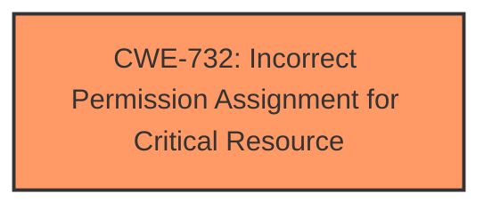

# Raw Analyzer Response for CVE-2024-36795

# Summary
| CWE ID | CWE Name | Confidence | CWE Abstraction Level | CWE Vulnerability Mapping Label | CWE-Vulnerability Mapping Notes |
|---|---|---|---|---|---|
| CWE-732 | Incorrect Permission Assignment for Critical Resource | 1.0 | Class | Allowed-with-Review | Primary CWE |

## Evidence and Confidence

*   **Confidence Score:** 1.0
*   **Evidence Strength:** HIGH

## Relationship Analysis
The primary relationship that influenced the decision was the hierarchical relationship between CWE-732 (Incorrect Permission Assignment for Critical Resource) and its potential children. Although CWE-732 is a Class-level CWE, no specific child CWEs were identified that would provide a more accurate representation of the **insecure permissions** vulnerability. The retriever results suggested several other CWEs, including those related to access control and privilege management. However, the core issue aligns most closely with the incorrect assignment of permissions, which is the focus of CWE-732.

## Vulnerability Chain
The vulnerability chain starts with the **incorrect permission assignment** for critical resources. This allows attackers to access URLs and directories embedded within the firmware, leading to unauthorized access to sensitive data and control over router settings.

Incorrect Permission Assignment -> Unauthorized Access to Resources -> Sensitive Data Exposure/Control of Router Settings

## Summary of Analysis
The initial analysis focused on identifying the root cause of the vulnerability, which was determined to be **insecure permissions**. The retriever results and complete CWE specifications were used to evaluate potential CWEs. CWE-732, Incorrect Permission Assignment for Critical Resource, was selected as the primary CWE because it most accurately reflects the root cause described in the vulnerability description: "**Insecure permissions** in Netgear WNR614 JNR1010V2/N300-V1.1.0.54_1.0.1 allows attackers to access URLs and directories embedded within the firmware".

The selection of CWE-732 is based on the evidence provided in the vulnerability description and the CVE reference links content summary. The evidence clearly indicates that the root cause is related to **incorrect permission assignment**. While CWE-732 is a Class-level CWE, it is the most specific and appropriate CWE given the available information.

The guidance provided in the "Privileges vs Permissions Guidance" section helped to confirm that the vulnerability is related to permissions rather than privileges, further supporting the selection of CWE-732.

Other CWEs Considered:

*   CWE-284 (Improper Access Control): While related, it is a more general CWE. CWE-732 is more specific to the permission assignment aspect.
*   CWE-425 (Direct Request ('Forced Browsing')): This CWE is more focused on the lack of authorization checks, whereas the primary issue here is the **incorrect assignment of permissions**.
*   CWE-285 (Improper Authorization): This CWE is relevant if the authorization check exists but is flawed. However, the provided information points to **incorrect permission assignment**, making CWE-732 the better fit.
*   CWE-266 (Incorrect Privilege Assignment): The "Privileges vs Permissions Guidance" section helped confirm that this is a permissions issue, not a privilege issue.

Relevant CWE Information:

# Enhanced Context (25 CWEs)
The following CWEs were identified as potentially relevant to this vulnerability:

## CWE-732: Incorrect Permission Assignment for Critical Resource
**Abstraction Level**: Class
**Similarity Score**: 1575.21
**Source**: sparse

**Description**:
The product specifies permissions for a security-critical resource in a way that allows that resource to be read or modified by unintended actors.

**Mapping Guidance**:
- Usage: Allowed-with-Review
- Rationale: While the name itself indicates an assignment of permissions for resources, this is often misused for vulnerabilities in which "permissions" are not checked, which is an "authorization" weakness (CWE-285 or descendants) within CWE's model [REF-1287].