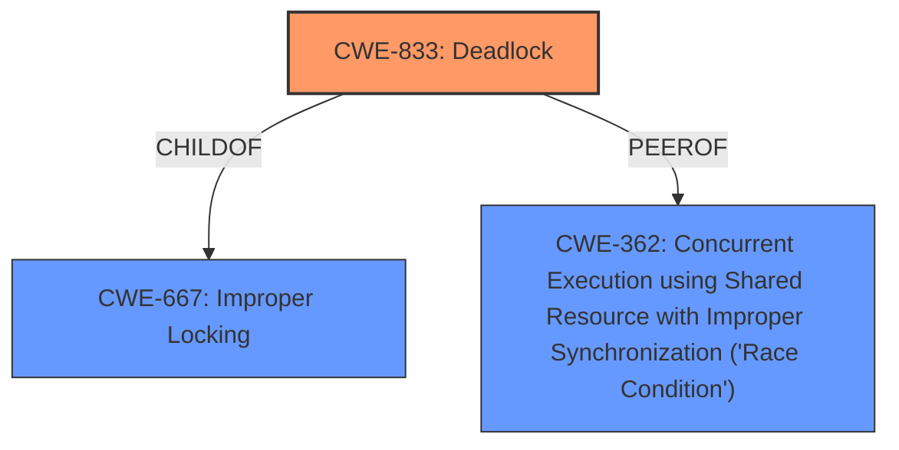

# Enhanced Analysis for CVE-2024-36976

# Summary
| CWE ID | CWE Name | Confidence | CWE Abstraction Level | CWE Vulnerability Mapping Label | CWE-Vulnerability Mapping Notes |
|---|---|---|---|---|---|
| CWE-833 | Deadlock | 0.9 | Base | Primary | Allowed |
| CWE-667 | Improper Locking | 0.7 | Class | Secondary | Allowed-with-Review |
| CWE-362 | Concurrent Execution using Shared Resource with Improper Synchronization ('Race Condition') | 0.6 | Class | Secondary | Allowed-with-Review |

## Evidence and Confidence

*   **Confidence Score:** 0.8
*   **Evidence Strength:** HIGH

## Relationship Analysis
The primary weakness is a deadlock (**CWE-833**), which is a specific type of concurrency issue that arises from improper locking. Therefore, **CWE-833** is a child of **CWE-667 (Improper Locking)**. The **unsafe locking scenario** can also be described as a **CWE-362 (Race Condition)**, since the deadlock occurs due to the concurrent execution of code sequences accessing shared resources with **improper synchronization**. The hierarchical relationship influenced the selection by confirming that **CWE-833** is a more specific and appropriate choice than its parent **CWE-667**, while **CWE-362** is a related Class-level weakness.



## Vulnerability Chain
The vulnerability chain starts with the introduction of a new commit that leads to an **unsafe locking scenario**. This **unsafe locking** results in a potential **deadlock**. The deadlock leads to a denial-of-service.

`Unsafe Locking` -> `Deadlock` -> `Denial of Service`

## Summary of Analysis
The analysis is based on the provided vulnerability description and CVE reference content summary. The key evidence is the mention of a "**unsafe locking scenario**" and the resulting "**potential deadlock**." The reference summary confirms that the root cause is an incorrect locking order, which leads to a deadlock.

**CWE-833 (Deadlock)** is chosen as the primary CWE because the vulnerability description explicitly states a "potential deadlock scenario." This is a Base level CWE, which is the preferred level of abstraction.
**CWE-667 (Improper Locking)** is considered as a secondary CWE because the deadlock is a direct consequence of an **improper locking scenario**, specifically an incorrect locking order. This is a Class level CWE, which is less specific than **CWE-833**.
**CWE-362 (Concurrent Execution using Shared Resource with Improper Synchronization ('Race Condition'))** is considered as a secondary CWE because the deadlock is a consequence of concurrent execution, a shared resource, and **improper synchronization**.
The graph relationships support the choice of **CWE-833** as the primary CWE, as it is a child of **CWE-667**, indicating a more specific classification.

Other CWEs Considered:
*   CWE-22: Improper Limitation of a Pathname to a Restricted Directory ('Path Traversal') - This is related to file path manipulation, which is not relevant to the described vulnerability.
*   CWE-1427: Improper Neutralization of Input Used for LLM Prompting - This is related to LLM prompting, which is not relevant to the described vulnerability.
*   CWE-663: Use of a Non-reentrant Function in a Concurrent Context - This is related to non-reentrant functions, which is not relevant to the described vulnerability.
* CWE-267: Privilege Defined With Unsafe Actions - This CWE relates to privilege issues, which are not present in the vulnerability description.

# Relevant CWE Information:

## CWE-667: Improper Locking
**Abstraction Level**: Class
**Similarity Score**: 0.81
**Source**: dense

**Description**:
The product does not properly acquire or release a lock on a resource, leading to unexpected resource state changes and behaviors.

**Mapping Guidance**:
- Usage: Allowed-with-Review
- Rationale: This CWE entry is a Class and might have Base-level children that would be more appropriate

**Technical Explanation**: The vulnerability involves an **unsafe locking scenario**, indicating that locks are not being properly acquired or released. This directly aligns with the description of **CWE-667**. The **improper locking** can lead to unexpected resource state changes.
**Security Implications**: **Improper locking** can lead to race conditions, deadlocks, and other concurrency-related issues that can cause denial of service or other unexpected behavior.
**Relationship**: **CWE-667** is a class-level CWE, and **CWE-833** is a child (more specific) CWE.
**Usage**: The mapping guidance is "Allowed-with-Review" because it's a Class-level CWE.
**Confidence**: 0.7

## CWE-833: Deadlock
**Abstraction Level**: Base
**Similarity Score**: 0.77
**Source**: dense

**Description**:
The product contains multiple threads or executable segments that are waiting for each other to release a necessary lock, resulting in deadlock.

**Mapping Guidance**:
- Usage: Allowed
- Rationale: This CWE entry is at the Base level of abstraction, which is a preferred level of abstraction for mapping to the root causes of vulnerabilities.

**Technical Explanation**: The vulnerability description explicitly mentions a "potential deadlock scenario." This directly aligns with the description of **CWE-833**.
**Security Implications**: A deadlock can cause a denial of service, as the system becomes unresponsive.
**Relationship**: **CWE-833** is a child of **CWE-667 (Improper Locking)**.
**Usage**: The mapping guidance is "Allowed".
**Confidence**: 0.9

## CWE-362: Concurrent Execution using Shared Resource with Improper Synchronization ('Race Condition')
**Abstraction Level**: Class
**Similarity Score**: 0.75
**Source**: dense

**Description**:
The product contains a concurrent code sequence that requires temporary, exclusive access to a shared resource, but a timing window exists in which the shared resource can be modified by another code sequence operating concurrently.

**Mapping Guidance**:
- Usage: Allowed-with-Review
- Rationale: This CWE entry is a Class and might have Base-level children that would be more appropriate

**Technical Explanation**: The vulnerability involves concurrent execution because the issue happens in multiple threads. These threads are accessing shared resources. The "**unsafe locking scenario**" means there is **improper synchronization** in the concurrent code.
**Security Implications**: Race conditions can lead to unpredictable behavior, data corruption, and denial of service. In the particular case, the race condition leads to a deadlock.
**Relationship**: **CWE-362** is related to **CWE-667 (Improper Locking)** and **CWE-833 (Deadlock)**, as improper synchronization can lead to deadlocks.
**Usage**: The mapping guidance is "Allowed-with-Review" because it's a Class-level CWE.
**Confidence**: 0.6


## CWE Relationship Analysis

Current CWEs represent these abstraction levels: .


### Vulnerability Chain Analysis

**Chain starting from CWE-22:**
- 22 (Improper Limitation of a Pathname to a Restricted Directory ('Path Traversal')) - ROOT


**Chain starting from CWE-667:**
- 667 (Improper Locking) - ROOT


### CWE Relationship Diagram

```mermaid
graph TD
    classDef primary fill:#f96,stroke:#333,stroke-width:2px
    classDef secondary fill:#69f,stroke:#333
    classDef tertiary fill:#9e9,stroke:#333
```