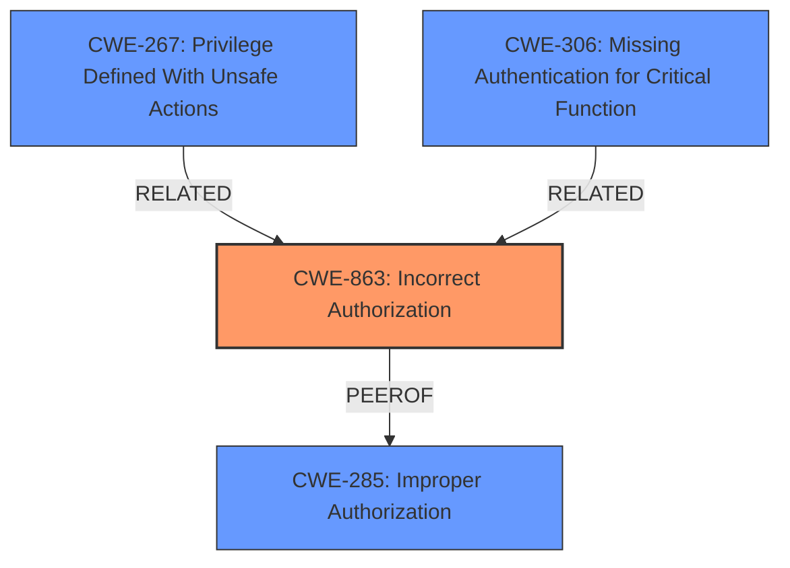

# Raw Analyzer Response for CVE-2024-36986

# Summary
| CWE ID    | CWE Name                                                                    | Confidence | CWE Abstraction Level | CWE Vulnerability Mapping Label | CWE-Vulnerability Mapping Notes |
| :---------- | :-------------------------------------------------------------------------- | :--------- | :-------------------- | :------------------------------ | :------------------------------ |
| CWE-863     | Incorrect Authorization                                                   | 0.9        | Class                 | Allowed-with-Review             | Primary CWE                   |
| CWE-267     | Privilege Defined With Unsafe Actions                                     | 0.6        | Base                  | Allowed                         | Secondary Candidate             |
| CWE-285     | Improper Authorization                                                    | 0.5        | Class                 | Discouraged                     | Secondary Candidate             |
| CWE-732     | Incorrect Permission Assignment for Critical Resource                     | 0.4        | Class                 | Allowed-with-Review             | Secondary Candidate             |
| CWE-306     | Missing Authentication for Critical Function                                                    | 0.4        | Base                 | Allowed             | Secondary Candidate             |

## Evidence and Confidence

*   **Confidence Score:** 0.7
*   **Evidence Strength:** MEDIUM

## Relationship Analysis

The primary weakness, **CWE-863 (Incorrect Authorization)**, is a Class-level CWE. It relates to the broader category of access control issues, but it's more specific than **CWE-285 (Improper Authorization)** as it indicates that the authorization logic is present but flawed. **CWE-863** has a hierarchical relationship with **CWE-942** as **CWE-942** is a child of **CWE-863**, however, **CWE-942** isn't applicable since it's more applicable to Cross-domain policies. The retriever results provide some candidates, but the privilege escalation guidance highlights the need to focus on root cause rather than impact.

## Vulnerability Chain

The vulnerability chain starts with **Incorrect Authorization (CWE-863)**, where the system fails to properly validate user permissions, leading to a privilege bypass. This allows an authenticated, low-privileged user to execute commands with the privileges of a higher-privileged user. The vulnerability requires a phishing attack, which suggests a CSRF-like component, but the core issue is the authorization **flaw** that permits the bypass in the first place.

## Summary of Analysis

Initially, the retriever results pointed to several potential CWEs, including **CWE-200 (Exposure of Sensitive Information to an Unauthorized Actor)**, **CWE-732 (Incorrect Permission Assignment for Critical Resource)**, and **CWE-269 (Improper Privilege Management)**. However, the privilege escalation guidance emphasizes identifying the root cause rather than just the impact. The CVE description and summary mention that the **vulnerability** allows an authenticated user to bypass SPL safeguards for risky commands, indicating that the application is not correctly authorizing the commands. This led to the selection of **CWE-863 (Incorrect Authorization)** as the primary CWE.

The evidence for this selection is: "an authenticated user could run risky commands using the permissions of a higher-privileged user to bypass SPL safeguards". This directly points to an authorization **flaw** as the root cause. While the attack requires social engineering, the core issue remains the **incorrect authorization** that allows the privilege bypass.

**CWE-267 (Privilege Defined With Unsafe Actions)** is a secondary candidate because the vulnerability allows the authenticated user to run commands using the permissions of a higher-privileged user, suggesting the higher-privileged user's privileges could be used in an unsafe way.

**CWE-285 (Improper Authorization)** was considered but is a higher-level Class and less specific than **CWE-863 (Incorrect Authorization)**, since an authorization check is performed but is incorrect.

**CWE-732 (Incorrect Permission Assignment for Critical Resource)** was considered since a critical resource is affected, but is less applicable since the core issue is an authorization **flaw** instead of a permission assignment.

**CWE-306 (Missing Authentication for Critical Function)** was considered because of the higher privledged access, but the evidence suggests there is authentication.

Relevant CWE Information:

# Enhanced Context (25 CWEs)
The following CWEs were identified as potentially relevant to this vulnerability:

## CWE-267: Privilege Defined With Unsafe Actions
**Abstraction Level**: Base
**Similarity Score**: 0.80
**Source**: dense

**Description**:
A particular privilege, role, capability, or right can be used to perform unsafe actions that were not intended, even when it is assigned to the correct entity.

**Mapping Guidance**:
- Usage: Allowed
- Rationale: This CWE entry is at the Base level of abstraction, which is a preferred level of abstraction for mapping to the root causes of vulnerabilities.