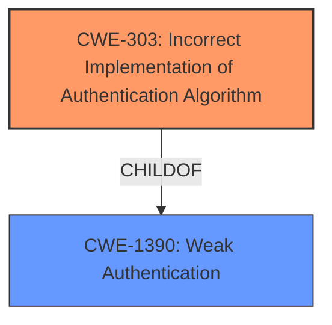

# Analysis for CVE-2024-37019

# Summary
| CWE ID | CWE Name | Confidence | CWE Abstraction Level | CWE Vulnerability Mapping Label | CWE-Vulnerability Mapping Notes |
|---|---|---|---|---|---|
| CWE-303 | Incorrect Implementation of Authentication Algorithm | 0.8 | Base | Primary | Allowed |
| CWE-1390 | Weak Authentication | 0.6 | Class | Secondary | Allowed-with-Review |

## Evidence and Confidence

*   **Confidence Score:** 0.7
*   **Evidence Strength:** MEDIUM

## Relationship Analysis
The primary relationship influencing the selection is that CWE-303 is a more specific Base CWE related to authentication than the Class CWE-1390. The vulnerability description and CVE summary point to an **incorrect implementation** of authentication, leading to the creation of duplicate users and potential account takeover. CWE-1390 is a broader classification that encompasses various types of weak authentication.

## Vulnerability Chain
The vulnerability chain starts with the **incorrect implementation of the authentication algorithm** (CWE-303) when integrating with an external SAML service. This leads to the creation of duplicate users, potentially leading to account takeover, compromised tenant separation, RBAC, and authentication.

## Summary of Analysis
The initial assessment pointed towards **weak authentication**, but after analyzing the CVE Reference Links Content Summary, it became clear that the root cause was an **incorrect implementation of the authentication algorithm**.

The evidence for this includes:
- "A bug in the authentication code of Mender Enterprise allows for the creation of duplicate users when integrating with an external SAML service."

This indicates a flaw in the logic of the authentication process, not simply a weak authentication scheme.

CWE-303 is a better fit because it directly addresses the root cause: an implementation error in the authentication algorithm. CWE-1390, while relevant, is a broader category. Since the evidence points to an implementation problem, CWE-303 is more specific and therefore more appropriate.

CWE-303 is at the Base level of abstraction, which is the preferred level.

Relevant CWE Information:

# Enhanced Context (25 CWEs)
The following CWEs were identified as potentially relevant to this vulnerability:

## CWE-303: Incorrect Implementation of Authentication Algorithm
**Abstraction Level**: Base
**Similarity Score**: 0.77
**Source**: dense

**Description**:
The requirements for the product dictate the use of an established authentication algorithm, but the implementation of the algorithm is incorrect.

**Mapping Guidance**:
- Usage: Allowed
- Rationale: This CWE entry is at the Base level of abstraction, which is a preferred level of abstraction for mapping to the root causes of vulnerabilities.