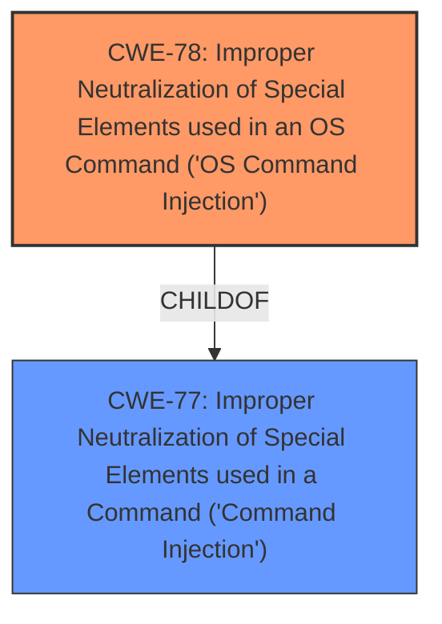

# Enhanced Analysis for CVE-2024-37023

# Summary
| CWE ID | CWE Name | Confidence | CWE Abstraction Level | CWE Vulnerability Mapping Label | CWE-Vulnerability Mapping Notes |
|---|---|---|---|---|---|
| CWE-78 | Improper Neutralization of Special Elements used in an OS Command ('OS Command Injection') | 1.0 | Base | Allowed | Primary CWE |
| CWE-77 | Improper Neutralization of Special Elements used in a Command ('Command Injection') | 0.7 | Class | Allowed-with-Review | Secondary Candidate |

## Evidence and Confidence

*   **Confidence Score:** 1.0
*   **Evidence Strength:** HIGH

## Relationship Analysis
The primary relationship is between CWE-78 and CWE-77. CWE-78 is a child of CWE-77, indicating that it is a more specific type of command injection that occurs at the OS level. The vulnerability description explicitly mentions "OS **command injection**", justifying the selection of the more specific CWE-78.



## Vulnerability Chain
The vulnerability chain starts with **improper neutralization** of special elements within a command, leading to OS **command injection**. This allows an authenticated remote attacker to execute arbitrary OS commands.

## Summary of Analysis
The initial assessment, based on the vulnerability description, identified OS **command injection** as the primary issue. The retriever results and graph relationships support this assessment. CWE-78 is the most specific and appropriate CWE, as it directly addresses the **improper neutralization** of special elements in OS commands. The evidence is strong, with the vulnerability description explicitly mentioning "OS **command injection** vulnerabilities".

The selection of CWE-78 is justified by its specificity and the explicit mention of OS commands. While CWE-77 is a parent class, CWE-78 provides a more precise characterization of the vulnerability.

Relevant CWE Information:

# Enhanced Context (25 CWEs)
The following CWEs were identified as potentially relevant to this vulnerability:

## CWE-78: Improper Neutralization of Special Elements used in an OS Command ('OS Command Injection')
**Abstraction Level**: Base
**Similarity Score**: 0.77
**Source**: dense

**Description**:
The product constructs all or part of an OS command using externally-influenced input from an upstream component, but it does not neutralize or incorrectly neutralizes special elements that could modify the intended OS command when it is sent to a downstream component.

**Mapping Guidance**:
- Usage: Allowed
- Rationale: This CWE entry is at the Base level of abstraction, which is a preferred level of abstraction for mapping to the root causes of vulnerabilities.

## CWE-77: Improper Neutralization of Special Elements used in a Command ('Command Injection')
**Abstraction Level**: Class
**Similarity Score**: 1.00
**Source**: alternate_terms

**Description**:
The product constructs all or part of a command using externally-influenced input from an upstream component, but it does not neutralize or incorrectly neutralizes special elements that could modify the intended command when it is sent to a downstream component.

**Mapping Guidance**:
- Usage: Allowed-with-Review
- Rationale: This CWE entry is a Class and might have Base-level children that would be more appropriate

## Detailed Analysis for each CWE

### CWE-78: Improper Neutralization of Special Elements used in an OS Command ('OS Command Injection')
*   **Match:** The vulnerability description explicitly states "Multiple OS **command injection** vulnerabilities". The root cause summary also indicates "improper neutralization of special elements used in a command, leading to OS **command injection** vulnerabilities."
*   **Security Implication:** This allows an attacker to execute arbitrary OS commands on the affected device.
*   **Relationship:** ChildOf CWE-77
*   **Primary/Secondary:** Primary
*   **Mapping Guidance:** The usage is "Allowed" and the abstraction level is "Base", which is preferred.

### CWE-77: Improper Neutralization of Special Elements used in a Command ('Command Injection')
*   **Match:** This is a more general form of command injection. While the vulnerability is specifically OS **command injection**, CWE-77 could be considered.
*   **Security Implication:** Allows execution of arbitrary commands, potentially leading to system compromise.
*   **Relationship:** ParentOf CWE-78
*   **Primary/Secondary:** Secondary. It is less specific than CWE-78.
*   **Mapping Guidance:** The usage is "Allowed-with-Review", as there might be more specific children, like CWE-78.

### Other CWEs Considered and Rejected:
*   CWE-20: Improper Input Validation - While input validation is important, the core issue is the **improper neutralization**, not the validation itself.
*   CWE-88: Improper Neutralization of Argument Delimiters in a Command ('Argument Injection') - This is a specific type of **command injection**, but not directly indicated in the description.
*   CWE-138: Improper Neutralization of Special Elements - Too general; CWE-78 is more specific.
*   CWE-93: Improper Neutralization of CRLF Sequences ('CRLF Injection') - Not related to **command injection**.
*   CWE-94: Improper Control of Generation of Code ('Code Injection') - While the impact is code execution, the root cause is not related to code generation.
*   CWE-284: Improper Access Control - Access control is a prerequisite for the attack, but not the root cause.

Given the explicit mention of OS **command injection**, CWE-78 is the most appropriate and specific CWE.


## CWE Relationship Analysis

Current CWEs represent these abstraction levels: .


### Vulnerability Chain Analysis

**Chain starting from CWE-94:**
- 94 (Improper Control of Generation of Code ('Code Injection')) - ROOT


**Chain starting from CWE-93:**
- 93 (Improper Neutralization of CRLF Sequences ('CRLF Injection')) - ROOT


### CWE Relationship Diagram

```mermaid
graph TD
    classDef primary fill:#f96,stroke:#333,stroke-width:2px
    classDef secondary fill:#69f,stroke:#333
    classDef tertiary fill:#9e9,stroke:#333
```