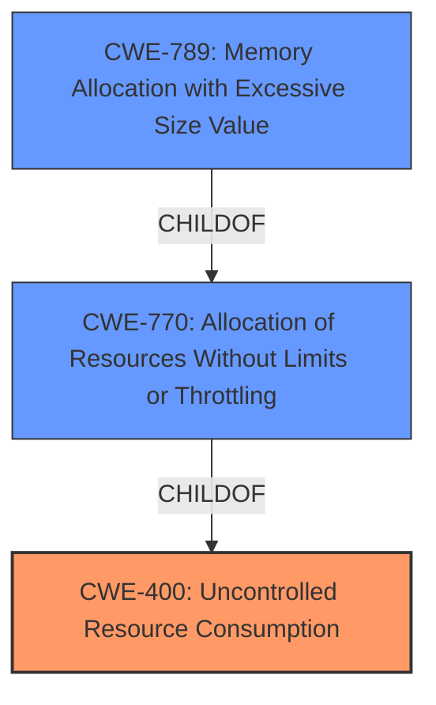

# Raw Analyzer Response for CVE-2024-37125

# Summary
| CWE ID | CWE Name | Confidence | CWE Abstraction Level | CWE Vulnerability Mapping Label | CWE-Vulnerability Mapping Notes |
|---|---|---|---|---|---|
| CWE-400 | Uncontrolled Resource Consumption | 1.0 | Class | Primary | Discouraged |
| CWE-770 | Allocation of Resources Without Limits or Throttling | 0.7 | Base | Secondary Candidate | Allowed |
| CWE-789 | Memory Allocation with Excessive Size Value | 0.6 | Variant | Secondary Candidate | Allowed |

## Evidence and Confidence

*   **Confidence Score:** 0.8
*   **Evidence Strength:** HIGH

## Relationship Analysis
The primary CWE identified is CWE-400 **Uncontrolled Resource Consumption**, a Class-level CWE. While generally discouraged, in this specific case, it accurately captures the high-level **weakness** described in the vulnerability. A more specific Base or Variant CWE isn't explicitly supported by the provided description, but two good possibilities are CWE-770 **Allocation of Resources Without Limits or Throttling** and CWE-789 **Memory Allocation with Excessive Size Value**.

## Vulnerability Chain
The vulnerability chain starts with the **Uncontrolled Resource Consumption** (CWE-400). The absence of proper resource management leads to resource exhaustion, which in turn results in a denial-of-service (DoS) condition.
- Root Cause: CWE-400 **Uncontrolled Resource Consumption**
- Impact: Denial of Service

## Summary of Analysis
The initial analysis correctly identified CWE-400 **Uncontrolled Resource Consumption** as the primary **weakness**. The vulnerability description explicitly states that the software contains an **Uncontrolled Resource Consumption** vulnerability.
> Dell SmartFabric OS10 Software, versions 10.5.6.x, 10.5.5.x, 10.5.4.x,10.5.3.x, contains an **Uncontrolled Resource Consumption** vulnerability. A remote unauthenticated host could potentially exploit this vulnerability leading to a denial of service.

The evidence supports the selection of CWE-400 as the primary CWE. Although CWE-400 is a Class-level CWE and is generally discouraged, in this case, it accurately represents the core issue. The retriever results also list CWE-400 as the top candidate.

CWE-770 **Allocation of Resources Without Limits or Throttling** and CWE-789 **Memory Allocation with Excessive Size Value** are potential, more specific, secondary candidates. However, without further information about how the resources are being consumed, it is difficult to select a more precise CWE with high confidence.

Relevant CWE Information:

# Enhanced Context (25 CWEs)
The following CWEs were identified as potentially relevant to this vulnerability:

## CWE-400: Uncontrolled Resource Consumption
**Abstraction Level**: Class
**Similarity Score**: 0.76
**Source**: dense

**Description**:
The product does not properly control the allocation and maintenance of a limited resource, thereby enabling an actor to influence the amount of resources consumed, eventually leading to the exhaustion of available resources.

**Mapping Guidance**:
- Usage: Discouraged
- Rationale: CWE-400 is intended for incorrect behaviors in which the product is expected to track and restrict how many resources it consumes, but CWE-400 is often misused because it is conflated with the "technical impact" of vulnerabilities in which resource consumption occurs. It is sometimes used for low-information vulnerability reports. It is a level-1 Class (i.e., a child of a Pillar).

## CWE-770: Allocation of Resources Without Limits or Throttling
**Abstraction Level**: Base
**Similarity Score**: 845.86
**Source**: sparse

**Description**:
The product allocates a reusable resource or group of resources on behalf of an actor without imposing any restrictions on the size or number of resources that can be allocated, in violation of the intended security policy for that actor.

**Mapping Guidance**:
- Usage: Allowed
- Rationale: This CWE entry is at the Base level of abstraction, which is a preferred level of abstraction for mapping to the root causes of vulnerabilities.

## CWE-789: Memory Allocation with Excessive Size Value
**Abstraction Level**: Variant
**Similarity Score**: 884.43
**Source**: sparse

**Description**:
The product allocates memory based on an untrusted, large size value, but it does not ensure that the size is within expected limits, allowing arbitrary amounts of memory to be allocated.

**Mapping Guidance**:
- Usage: Allowed
- Rationale: This CWE entry is at the Variant level of abstraction, which is a preferred level of abstraction for mapping to the root causes of vulnerabilities.