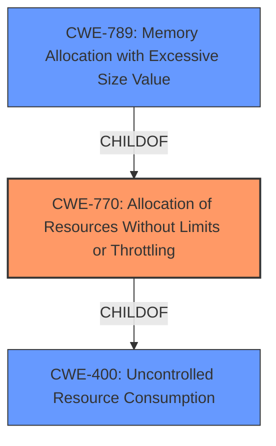

# Analysis for CVE-2024-37153

# Summary
| CWE ID | CWE Name | Confidence | CWE Abstraction Level | CWE Vulnerability Mapping Label | CWE-Vulnerability Mapping Notes |
|---|---|---|---|---|---|
| CWE-770 | Allocation of Resources Without Limits or Throttling | 0.9 | Base | Allowed | Primary CWE |
| CWE-789 | Memory Allocation with Excessive Size Value | 0.7 | Variant | Allowed | Secondary Candidate |
| CWE-400 | Uncontrolled Resource Consumption | 0.6 | Class | Allowed | Secondary Candidate |

## Evidence and Confidence

*   **Confidence Score:** 0.8
*   **Evidence Strength:** MEDIUM

## Relationship Analysis
The primary CWE selected is CWE-770, which addresses the **allocation of resources without limits or throttling**. This is a Base-level CWE. CWE-789 is a Variant of CWE-770 and represents a more specific case of allocating memory with an excessive size value. CWE-400 is a parent Class of CWE-770 and represents a more general case of uncontrolled resource consumption. The relationships between these CWEs influenced the decision to select CWE-770 as the primary, as it best captures the specific vulnerability described.

## Vulnerability Chain
The vulnerability chain begins with the **improper handling of local state changes** in conjunction with ICS20 transfers. This leads to an **incorrect balance update**, which allows for the allocation of more resources (tokens) than intended, resulting in an **infinite money glitch**.

Root Cause: **Improper local state change handling** leading to **incorrect balance update**
Weakness: **Allocation of Resources Without Limits or Throttling (CWE-770)**
Impact: **"Infinite money glitch"**, leading to a doubled Evmos supply.

## Summary of Analysis
The primary assessment focuses on the **allocation of resources without limits or throttling (CWE-770)** because the vulnerability enables contracts to effectively double the supply of Evmos tokens after each transaction due to **incorrect balance handling** when making inter-blockchain communication transfers. This aligns well with the description of CWE-770, which emphasizes the absence of restrictions on the size or number of resources allocated. The "CVE Reference Links Content Summary" section explicitly mentions this **incorrect balance handling** as a key weakness.

The retriever results and graph relationships supported this choice by highlighting the connection between CWE-770 and its related CWEs, such as CWE-789 (Memory Allocation with Excessive Size Value) and CWE-400 (Uncontrolled Resource Consumption). While CWE-789 is a more specific variant, the description focuses on the general lack of limits on resource allocation, making CWE-770 the more appropriate primary classification.

CWE-1284 (Improper Validation of Specified Quantity in Input) was considered but not selected because the core issue is not about the validation of the input quantity itself, but rather the **improper handling of state changes** that leads to the incorrect balance, therefore the focus should be on the uncontrolled allocation enabled by this flaw. Similarly, CWE-835 (Loop with Unreachable Exit Condition ('Infinite Loop')) was not chosen because the vulnerability doesn't involve an infinite loop in the traditional sense, but rather the ability to repeatedly generate tokens due to the **incorrect balance update**.

Relevant CWE Information:

# Enhanced Context (25 CWEs)
The following CWEs were identified as potentially relevant to this vulnerability:

## CWE-770: Allocation of Resources Without Limits or Throttling
**Abstraction Level**: Base
**Similarity Score**: 1213.72
**Source**: sparse

**Description**:
The product allocates a reusable resource or group of resources on behalf of an actor without imposing any restrictions on the size or number of resources that can be allocated, in violation of the intended security policy for that actor.

**Mapping Guidance**:
- Usage: Allowed
- Rationale: This CWE entry is at the Base level of abstraction, which is a preferred level of abstraction for mapping to the root causes of vulnerabilities.

## CWE-789: Memory Allocation with Excessive Size Value
**Abstraction Level**: Variant
**Similarity Score**: 1194.37
**Source**: sparse

**Description**:
The product allocates memory based on an untrusted, large size value, but it does not ensure that the size is within expected limits, allowing arbitrary amounts of memory to be allocated.

**Mapping Guidance**:
- Usage: Allowed
- Rationale: This CWE entry is at the Variant level of abstraction, which is a preferred level of abstraction for mapping to the root causes of vulnerabilities.