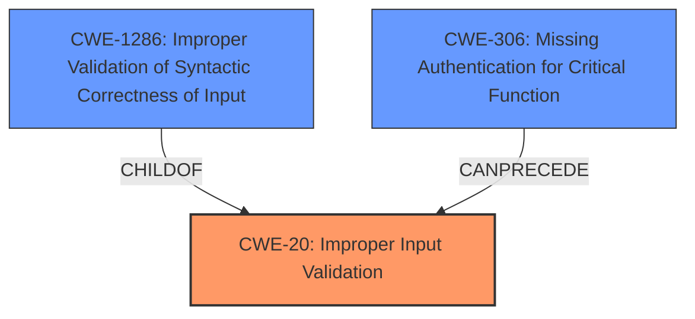

# Raw Analyzer Response for CVE-2024-37155

# Summary
| CWE ID | CWE Name | Confidence | CWE Abstraction Level | CWE Vulnerability Mapping Label | CWE-Vulnerability Mapping Notes |
|---|---|---|---|---|---|
| CWE-20 | Improper Input Validation | 0.8 | Class | Primary CWE | Discouraged |
| CWE-1286 | Improper Validation of Syntactic Correctness of Input | 0.7 | Base | Secondary Candidate | Allowed |
| CWE-306 | Missing Authentication for Critical Function | 0.6 | Base | Secondary Candidate | Allowed |

## Evidence and Confidence

*   **Confidence Score:** 0.7
*   **Evidence Strength:** MEDIUM

## Relationship Analysis
The primary relationship influencing the decision is the parent-child relationship between CWE-20 and CWE-1286. CWE-20 is a class-level CWE representing a broad category of input validation issues. CWE-1286 is a base-level CWE that is a child of CWE-20 and specifically addresses the lack of validation of the syntactic correctness of input. The choice of CWE-20 as the primary CWE is based on the evidence suggesting the vulnerability is due to a lack of input validation in general, while CWE-1286 is a more specific instance. Additionally, CWE-306 was considered due to the impact of the vulnerability allowing unauthorized access, which could suggest a missing authentication issue for a critical function.

## Vulnerability Chain
The vulnerability chain starts with **improper input validation** (**CWE-20**). This leads to a **bypass of the introspection restriction** in GraphQL queries. This allows an **unauthenticated user** to gather information, perform unauthorized actions, and potentially conduct a denial-of-service attack.

## Summary of Analysis
The initial assessment pointed towards **CWE-20** (Improper Input Validation) due to the **regex validation bypass**. The vulnerability description clearly states that the **root cause** is the insufficient validation of GraphQL queries using a regular expression that can be bypassed. The reference link content summary confirms that the vulnerability stems from **inadequate input validation**.

However, **CWE-20** is a Class-level CWE and the description mentions the **regex validation bypass** and the bypass of introspection.

Therefore, **CWE-1286** (Improper Validation of Syntactic Correctness of Input) was considered as a more specific option. However, the vulnerability doesn't explicitly mention a failure to validate the syntactic correctness, but rather a bypass of a validation using regex.

The guidance suggests that authentication issues should be categorized as **CWE-306**, while authorization failures should be categorized as **CWE-862 or CWE-863**. Given that the attacker is unauthenticated, **CWE-306** was considered as a potential candidate, since this allows an unauthenticated user to perform unauthorized actions.

Ultimately, **CWE-20** was selected as the primary CWE because the **root cause** is the **regex validation bypass**. The impact of this vulnerability is unauthorized access and potential DoS, but the underlying issue lies in how the input is being validated. **CWE-1286** and **CWE-306** are considered as secondary issues.

Relevant CWE Information:

*   **CWE-20**: Improper Input Validation
    *   **Description**: The product receives input or data, but it does not validate or incorrectly validates that the input has the properties that are required to process the data safely and correctly.
    *   **Relevance**: This CWE directly applies as the GraphQL queries are not properly validated, allowing malicious queries to bypass restrictions.
    *   **Abstraction Level**: Class
    *   **Usage**: Discouraged, but chosen because a more specific CWE isn't a perfect fit.
*   **CWE-1286**: Improper Validation of Syntactic Correctness of Input
    *   **Description**: The product receives input that is expected to be well-formed - i.e., to comply with a certain syntax - but it does not validate or incorrectly validates that the input complies with the syntax.
    *   **Relevance**: This CWE is relevant because the input queries are not validated to ensure they conform to the expected structure, allowing bypass via removal of whitespace, carriage return, and line feed characters.
    *   **Abstraction Level**: Base
    *   **Usage**: Allowed
*   **CWE-306**: Missing Authentication for Critical Function
    *   **Description**: The product does not perform any authentication for functionality that requires a provable user identity or consumes a significant amount of resources.
    *   **Relevance**: Although the primary weakness is the improper input validation, a consequence of the vulnerability is unauthorized access, which could be related to missing authentication.
    *   **Abstraction Level**: Base
    *   **Usage**: Allowed