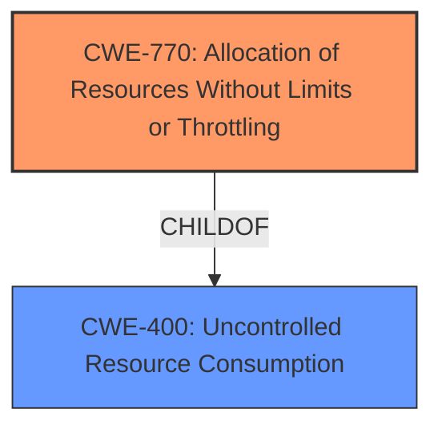

# Enhanced Analysis for CVE-2024-37281

# Summary
| CWE ID | CWE Name | Confidence | CWE Abstraction Level | CWE Vulnerability Mapping Label | CWE-Vulnerability Mapping Notes |
|---|---|---|---|---|---|
| CWE-770 | Allocation of Resources Without Limits or Throttling | 0.9 | Base | Allowed | Primary CWE |
| CWE-400 | Uncontrolled Resource Consumption | 0.7 | Class | Discouraged | Secondary Candidate |

## Evidence and Confidence

*   **Confidence Score:** 0.8
*   **Evidence Strength:** MEDIUM

## Relationship Analysis
The primary relationship influencing the CWE selection is the parent-child relationship between CWE-770 (Allocation of Resources Without Limits or Throttling) and CWE-400 (Uncontrolled Resource Consumption). CWE-770 is a more specific Base level CWE, detailing the **allocation of resources without limits**, which directly aligns with the vulnerability's root cause. CWE-400, a Class level CWE, represents the broader consequence of **uncontrolled resource consumption**, which is the resulting impact of the vulnerability. Selecting CWE-770 over CWE-400 provides a more accurate and detailed representation of the **root cause**.



## Vulnerability Chain
The vulnerability chain starts with the **allocation of resources without limits or throttling (CWE-770)**. This leads to the **uncontrolled consumption of resources (CWE-400)**, ultimately resulting in a crash and denial of service.

## Summary of Analysis
The analysis is primarily based on the vulnerability description and the "CVE Reference Links Content Summary". The key evidence lies in the phrases: "large number of maliciously crafted requests," and "cause a Kibana instance to crash". This indicates a **denial of service** vulnerability resulting from the system's inability to handle a high volume of requests, pointing towards **resource exhaustion**.

The retriever results initially suggested CWE-400 (Uncontrolled Resource Consumption) as a potential candidate. However, further analysis revealed that CWE-770 (Allocation of Resources Without Limits or Throttling) is a more precise match, as it directly addresses the root cause of the vulnerability: the lack of limits on resource allocation. CWE-400 represents the impact of this weakness.

The graph relationships reinforced this decision by highlighting the parent-child relationship between CWE-770 and CWE-400. CWE-770 is a child of CWE-400, indicating that it's a more specific type of resource consumption issue.

The selected CWEs are at the optimal level of specificity because they accurately represent both the root cause (CWE-770) and the resulting impact (CWE-400). CWE-770 explains the specific mechanism of the vulnerability (unlimited resource allocation), while CWE-400 describes the general outcome (resource exhaustion).

Relevant CWE Information:

# Enhanced Context (25 CWEs)
The following CWEs were identified as potentially relevant to this vulnerability:

## CWE-770: Allocation of Resources Without Limits or Throttling
**Abstraction Level**: Base
**Similarity Score**: 0.64
**Source**: dense

**Description**:
The product allocates a reusable resource or group of resources on behalf of an actor without imposing any restrictions on the size or number of resources that can be allocated, in violation of the intended security policy for that actor.

**Mapping Guidance**:
- Usage: Allowed
- Rationale: This CWE entry is at the Base level of abstraction, which is a preferred level of abstraction for mapping to the root causes of vulnerabilities.

## CWE-400: Uncontrolled Resource Consumption
**Abstraction Level**: Class
**Similarity Score**: 0.63
**Source**: dense

**Description**:
The product does not properly control the allocation and maintenance of a limited resource, thereby enabling an actor to influence the amount of resources consumed, eventually leading to the exhaustion of available resources.

**Mapping Guidance**:
- Usage: Discouraged
- Rationale: CWE-400 is intended for incorrect behaviors in which the product is expected to track and restrict how many resources it consumes, but CWE-400 is often misused because it is conflated with the "technical impact" of vulnerabilities in which resource consumption occurs. It is sometimes used for low-information vulnerability reports. It is a level-1 Class (i.e., a child of a Pillar).

## CWE-770: Allocation of Resources Without Limits or Throttling
**Abstraction Level**: Base
**Similarity Score**: 596.45
**Source**: sparse

**Description**:
The product allocates a reusable resource or group of resources on behalf of an actor without imposing any restrictions on the size or number of resources that can be allocated, in violation of the intended security policy for that actor.

**Mapping Guidance**:
- Usage: Allowed
- Rationale: This CWE entry is at the Base level of abstraction, which is a preferred level of abstraction for mapping to the root causes of vulnerabilities.

## CWE-789: Memory Allocation with Excessive Size Value
**Abstraction Level**: Variant
**Similarity Score**: 572.33
**Source**: sparse

**Description**:
The product allocates memory based on an untrusted, large size value, but it does not ensure that the size is within expected limits, allowing arbitrary amounts of memory to be allocated.

**Mapping Guidance**:
- Usage: Allowed
- Rationale: This CWE entry is at the Variant level of abstraction, which is a preferred level of abstraction for mapping to the root causes of vulnerabilities.

## CWE-770: Allocation of Resources Without Limits or Throttling
**Abstraction Level**: Base
**Similarity Score**: 2.86
**Source**: graph

**Description**:
The product allocates a reusable resource or group of resources on behalf of an actor without imposing any restrictions on the size or number of resources that can be allocated, in violation of the intended security policy for that actor.

**Mapping Guidance**:
- Usage: Allowed
- Rationale: This CWE entry is at the Base level of abstraction, which is a preferred level of abstraction for mapping to the root causes of vulnerabilities.

### CWE Detail

*   **CWE-770: Allocation of Resources Without Limits or Throttling**

    *   **Technical Explanation:** The Kibana instance allocates resources (e.g., memory, threads) to handle incoming requests. The **vulnerability lies in the absence of restrictions on the number or size of resources** allocated for handling requests from users with Viewer roles. This allows an attacker to flood the system with maliciously crafted requests, consuming excessive resources and leading to a crash.
    *   **Security Implications:** This vulnerability can lead to a denial-of-service condition, disrupting Kibana's availability and potentially impacting dependent services.
    *   **Relationship:** CWE-770 is a child of CWE-400 (Uncontrolled Resource Consumption), indicating that it's a specific type of resource consumption issue caused by unlimited allocation.
    *   **Primary/Secondary:** Primary. This is the **root cause of the vulnerability**.
    *   **Mapping Guidance:** The MITRE mapping guidance ALLOWS this mapping, as it's a Base level CWE.
*   **CWE-400: Uncontrolled Resource Consumption**

    *   **Technical Explanation:** The Kibana instance doesn't properly control the allocation and maintenance of limited resources (e.g., CPU, memory) when handling requests. By sending a large number of maliciously crafted requests, an attacker can influence the amount of resources consumed, eventually exhausting the available resources and causing a crash.
    *   **Security Implications:** This vulnerability leads to a denial-of-service condition.
    *   **Relationship:** CWE-400 is the parent of CWE-770.
    *   **Primary/Secondary:** Secondary. This is the **impact of the vulnerability**, resulting from the root cause CWE-770.
    *   **Mapping Guidance:** The MITRE mapping guidance DISCOURAGES direct mapping to CWE-400 when more specific CWEs are available, but it's still relevant as a broader impact.

### Considered but not used

*   **CWE-20: Improper Input Validation:** While the crafted requests contribute to the issue, the core weakness is the lack of resource management, not necessarily the **improper input validation** of the requests themselves. So it does not fit as well as CWE-770.
*   **CWE-789: Memory Allocation with Excessive Size Value:** This is specific to memory allocation, but the vulnerability could involve other resources besides memory (e.g., threads, sockets), making CWE-770 a broader and more fitting classification.
*   **CWE-755: Improper Handling of Exceptional Conditions:** While a crash is an exceptional condition, this CWE is too generic, and the root cause is more precisely described by CWE-770.
*   **CWE-119: Improper Restriction of Operations


## CWE Relationship Analysis

Current CWEs represent these abstraction levels: .


### Vulnerability Chain Analysis

**Chain starting from CWE-400:**
- 400 (Uncontrolled Resource Consumption) - ROOT


**Chain starting from CWE-770:**
- 770 (Allocation of Resources Without Limits or Throttling) - ROOT


### CWE Relationship Diagram

```mermaid
graph TD
    classDef primary fill:#f96,stroke:#333,stroke-width:2px
    classDef secondary fill:#69f,stroke:#333
    classDef tertiary fill:#9e9,stroke:#333
```