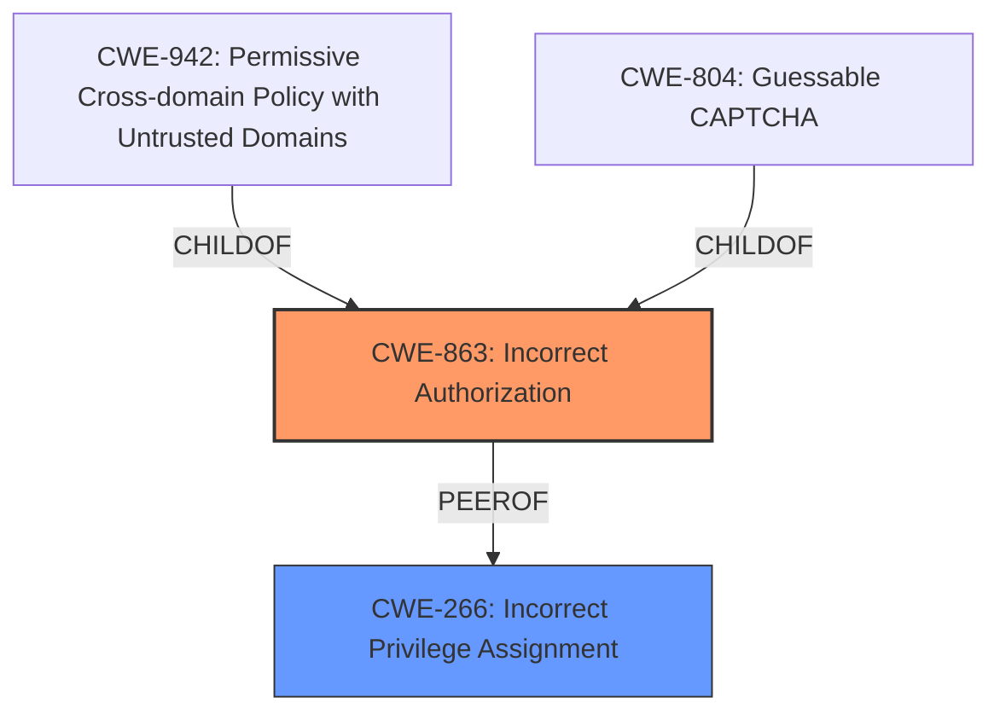

# Enhanced Analysis for CVE-2024-37282

# Summary
| CWE ID  | CWE Name                                                                | Confidence | CWE Abstraction Level | CWE Vulnerability Mapping Label | CWE-Vulnerability Mapping Notes |
| :-------- | :---------------------------------------------------------------------- | :--------- | :-------------------- | :------------------------------ | :------------------------------ |
| CWE-863 | CWE-863: Incorrect Authorization                                         | 0.9        | Class                 | Primary CWE                     | Allowed-with-Review             |
| CWE-266 | CWE-266: Incorrect Privilege Assignment                                 | 0.7        | Base                 | Secondary Candidate                     | Allowed             |

## Evidence and Confidence

*   **Confidence Score:** 0.8
*   **Evidence Strength:** HIGH

## Relationship Analysis
The primary CWE is CWE-863, Incorrect Authorization, which is a Class-level CWE. CWE-863 has child CWEs like CWE-942, Permissive Cross-domain Policy with Untrusted Domains and CWE-804, Guessable CAPTCHA. CWE-266, Incorrect Privilege Assignment is a Base-level CWE. Given the vulnerability description speaks to an **improper authorization** issue during API key creation, CWE-863 is more appropriate. CWE-266 is a possible secondary candidate as the impact does affect privilege.



## Vulnerability Chain
The vulnerability chain starts with **improper authorization**. The **root cause** is that an API key created with specific privileges can be used to create new API keys with elevated privileges, bypassing intended access controls. The **weakness** then allows an attacker with a limited-privilege API key to escalate their privileges by creating new API keys with higher privileges, potentially leading to unauthorized access, data manipulation, or other malicious activities.
- **Root Cause**: **Improper Authorization** during API key creation.
- **Weakness**: Limited-privilege API key is able to create new API keys with elevated privileges,
- **Impact**: Privilege escalation, unauthorized access, data manipulation, or other malicious activities.

## Summary of Analysis
The analysis is based on the vulnerability description and CVE reference links content summary provided. The key evidence is:
- **Root cause of vulnerability**: **Improper authorization** in Elastic Cloud Enterprise (ECE) API key creation.
- **Weaknesses/vulnerabilities present**: An API key created with specific privileges could be used to create new API keys with elevated privileges, bypassing intended access controls.
The graph relationships influenced the final selection by highlighting the hierarchical structure and alternative classifications. CWE-863 is selected as the primary CWE because it accurately represents the **incorrect authorization** during API key creation. CWE-266 is considered as a secondary candidate because the impact of the vulnerability involves privilege escalation, but it is not the primary **root cause**. The selected CWEs are at the optimal level of specificity, as CWE-863 captures the core authorization issue, and CWE-266 acknowledges the privilege-related impact.

**CWE Considerations:**

*   **CWE-863: Incorrect Authorization** - This is the most appropriate primary CWE because the vulnerability lies in the **incorrect authorization** check during the creation of new API keys. The vulnerability description explicitly states that API keys created with specific privileges can be used to create new API keys with elevated privileges, indicating a flaw in the authorization mechanism.
*   **CWE-266: Incorrect Privilege Assignment** - This is a secondary candidate because the vulnerability ultimately leads to an incorrect assignment of privileges. However, the **root cause** is the **improper authorization** check, not the assignment itself.
*   **CWE-285: Improper Authorization** - This CWE was considered but deemed less specific than CWE-863. While CWE-285 also deals with **improper authorization**, it is a more general category and doesn't capture the specific nuance of the **authorization failure** during API key creation.
*   **CWE-732: Incorrect Permission Assignment for Critical Resource** - This CWE was considered but deemed less relevant as the vulnerability does not directly involve the assignment of permissions to a resource, but rather the **improper authorization** during the creation of API keys with elevated privileges.
*   **CWE-306: Missing Authentication for Critical Function** - This CWE was considered but deemed not applicable because the vulnerability is related to **improper authorization**, not a missing authentication mechanism.
*   **CWE-269: Improper Privilege Management** - This CWE was considered but deemed too high-level and discouraged for use according to the MITRE guidelines. The vulnerability is better captured by the more specific CWE-863.
*   **CWE-648: Incorrect Use of Privileged APIs** - This CWE was considered but deemed not applicable as the vulnerability does not involve the incorrect use of privileged APIs but rather the **improper authorization** during API key creation.


## CWE Relationship Analysis

Current CWEs represent these abstraction levels: .


### Vulnerability Chain Analysis

**Chain starting from CWE-863:**
- 863 (Incorrect Authorization) - ROOT


**Chain starting from CWE-732:**
- 732 (Incorrect Permission Assignment for Critical Resource) - ROOT


### CWE Relationship Diagram

```mermaid
graph TD
    classDef primary fill:#f96,stroke:#333,stroke-width:2px
    classDef secondary fill:#69f,stroke:#333
    classDef tertiary fill:#9e9,stroke:#333
```