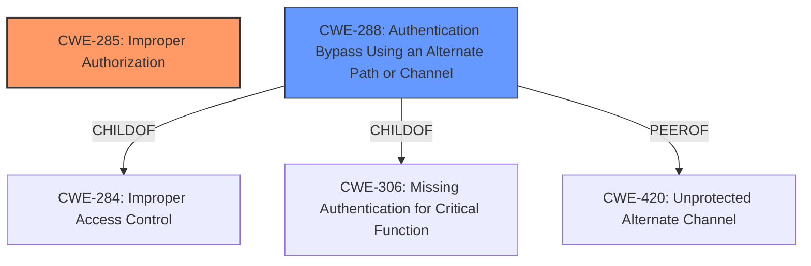

# Enhanced Analysis for CVE-2024-37314

# Summary
| CWE ID | CWE Name | Confidence | CWE Abstraction Level | CWE Vulnerability Mapping Label | CWE-Vulnerability Mapping Notes |
|---|---|---|---|---|---|
| CWE-285 | Improper Authorization | 0.9 | Class | Primary | Allowed-with-Review |
| CWE-288 | Authentication Bypass Using an Alternate Path or Channel | 0.6 | Base | Secondary | Allowed |

## Evidence and Confidence

*   **Confidence Score:** 0.8
*   **Evidence Strength:** HIGH

## Relationship Analysis
The primary relationship impacting the decision is that CWE-285 is a class-level CWE, and while it broadly describes the **missing authorization**, there may be more specific child CWEs. However, the information provided does not allow for a more specific classification. CWE-288 is considered as a possible authentication bypass because access to the shared album via a public link could be considered an alternate channel, bypassing normal authentication.



## Vulnerability Chain
The chain of events is:
1.  **Missing Authorization Check (CWE-285)**: The system **fails to properly authorize** the user's request to remove a photo.
2.  **Data Integrity Loss (Impact)**: Because of the **missing authorization**, a user can remove photos, leading to data loss.

## Summary of Analysis
The primary weakness is the **lack of proper authorization** before allowing a user to remove a photo from an album. This is supported by the CVE Reference Links Content Summary: "The primary weakness is the absence of a proper authorization check before allowing a user to remove a photo from an album." This directly aligns with CWE-285, which describes situations where a product does not perform or incorrectly performs an authorization check.

CWE-285 is a class-level CWE, and the guidance suggests that lower-level CWEs can frequently be used instead. While it might be possible to find a more specific child of CWE-285, the provided information lacks the necessary details to make that determination confidently. A possible alternative, CWE-288 Authentication Bypass Using an Alternate Path or Channel, was considered because the public link access could be considered an alternate channel, but there is no clear evidence that authentication was required in the first place. Therefore, CWE-285 remains the best choice based on the available evidence, although it is at a higher level of abstraction than preferred.

Relevant CWE Information:

# Enhanced Context (25 CWEs)
The following CWEs were identified as potentially relevant to this vulnerability:

## CWE-285: Improper Authorization
**Abstraction Level**: Class
**Similarity Score**: 1113.07
**Source**: sparse

**Description**:
The product does not perform or incorrectly performs an authorization check when an actor attempts to access a resource or perform an action.

**Mapping Guidance**:
- Usage: Discouraged
- Rationale: CWE-285 is high-level and lower-level CWEs can frequently be used instead. It is a level-1 Class (i.e., a child of a Pillar).

## CWE-288: Authentication Bypass Using an Alternate Path or Channel
**Abstraction Level**: base
**Similarity Score**: 2.40
**Source**: graph

**Description**:
CWE-288: Authentication Bypass Using an Alternate Path or Channel

**Mapping Guidance**:
- Usage: Allowed
- Rationale: This CWE entry is at the Base level of abstraction, which is a preferred level of abstraction for mapping to the root causes of vulnerabilities.

**Relationships**:
- PARENTOF -> CWE-425
- PARENTOF -> CWE-1299
- PEEROF -> CWE-420
- CHILDOF -> CWE-284
- CHILDOF -> CWE-306


## CWE Relationship Analysis

Current CWEs represent these abstraction levels: .


### Vulnerability Chain Analysis

**Chain starting from CWE-288:**
- 288 (Authentication Bypass Using an Alternate Path or Channel) - ROOT


**Chain starting from CWE-306:**
- 306 (Missing Authentication for Critical Function) - ROOT


### CWE Relationship Diagram

```mermaid
graph TD
    classDef primary fill:#f96,stroke:#333,stroke-width:2px
    classDef secondary fill:#69f,stroke:#333
    classDef tertiary fill:#9e9,stroke:#333
```