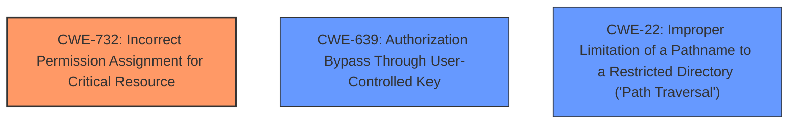

# Raw Analyzer Response for CVE-2024-37317

# Summary
| CWE ID | CWE Name | Confidence | CWE Abstraction Level | CWE Vulnerability Mapping Label | CWE-Vulnerability Mapping Notes |
|---|---|---|---|---|---|
| **CWE-732** | Incorrect Permission Assignment for Critical Resource | 0.9 | Class | Primary | Allowed-with-Review |
| CWE-639 | Authorization Bypass Through User-Controlled Key | 0.6 | Base | Secondary Candidate | Allowed |
| CWE-22 | Improper Limitation of a Pathname to a Restricted Directory ('Path Traversal') | 0.5 | Base | Secondary Candidate | Allowed |

## Evidence and Confidence

*   **Confidence Score:** 0.8
*   **Evidence Strength:** MEDIUM

## Relationship Analysis
The primary CWE, CWE-732, is a Class-level weakness related to incorrect permission assignment. While it might seem broad, it captures the essence of the vulnerability where the application **incorrectly** uses a pre-existing shared folder instead of creating a new one with appropriate permissions.

CWE-639 is related to authorization bypass through user-controlled keys. This could be relevant as the attacker essentially controls the "key" (the folder name) that the application uses for storage.

CWE-22 is related to path traversal. Although not a direct path traversal issue, the application's **incorrect** handling of the path to the notes folder could be seen as a related concern.

## Vulnerability Chain
1.  Attacker creates a shared folder named "Notes/".
2.  The application **incorrectly** assigns permissions or **incorrectly** handles folder creation, leading to the use of the attacker-controlled folder for the user's notes.
3.  User's notes are stored in a location accessible to the attacker (Confidentiality Breach).
4.  Attacker may manipulate the notes (Integrity Violation).

The **root cause** is the **incorrect permission assignment** or folder handling by the application.

## Summary of Analysis
The primary issue is that the Nextcloud Notes application doesn't properly handle the scenario where a shared folder with the name "Notes/" already exists before a new user's first login. This leads to the application using the attacker-controlled shared folder to store the user's notes, which results in a confidentiality breach.

The most fitting CWE is CWE-732: Incorrect Permission Assignment for Critical Resource. This CWE addresses the scenario where a product specifies permissions for a security-critical resource in a way that allows that resource to be read or modified by unintended actors. In this case, the "critical resource" is the notes folder, and the "unintended actor" is the attacker who created the shared folder.

The vulnerability description states that "If an attacker managed to share a folder called `Notes/` with a newly created user before they logged in, the Notes app would use that folder store the personal notes." This clearly demonstrates that the application is **incorrectly** assigning permissions or **incorrectly** handling folder creation and usage, leading to the attacker gaining unauthorized access to the user's notes.

CWE-732 is a Class-level weakness, and while it might be more generic, it aligns well with the root cause of the vulnerability, which is the **incorrect handling** of the resource permissions.

CWE-639 and CWE-22 were considered because the attacker is essentially bypassing the intended authorization mechanism by exploiting the **incorrect** folder handling. However, CWE-732 captures the core issue of the application **incorrectly** managing resource permissions, making it the primary CWE.

Relevant CWE Information:
# Enhanced Context (25 CWEs)
The following CWEs were identified as potentially relevant to this vulnerability:

## CWE-732: Incorrect Permission Assignment for Critical Resource
**Abstraction Level**: Class
**Similarity Score**: 1169.98
**Source**: sparse

**Description**:
The product specifies permissions for a security-critical resource in a way that allows that resource to be read or modified by unintended actors.

**Mapping Guidance**:
- Usage: Allowed-with-Review
- Rationale: While the name itself indicates an assignment of permissions for resources, this is often misused for vulnerabilities in which "permissions" are not checked, which is an "authorization" weakness (CWE-285 or descendants) within CWE's model [REF-1287].

## CWE-639: Authorization Bypass Through User-Controlled Key
**Abstraction Level**: Base
**Similarity Score**: 0.73
**Source**: dense

**Description**:
The system's authorization functionality does not prevent one user from gaining access to another user's data or record by modifying the key value identifying the data.

**Mapping Guidance**:
- Usage: Allowed
- Rationale: This CWE entry is at the Base level of abstraction, which is a preferred level of abstraction for mapping to the root causes of vulnerabilities.

## CWE-22: Improper Limitation of a Pathname to a Restricted Directory ('Path Traversal')
**Abstraction Level**: base
**Similarity Score**: 2.28
**Source**: graph

**Description**:
CWE-22: Improper Limitation of a Pathname to a Restricted Directory ('Path Traversal')

**Mapping Guidance**:
- Usage: Allowed
- Rationale: This CWE entry is at the Base level of abstraction, which is a preferred level of abstraction for mapping to the root causes of vulnerabilities.