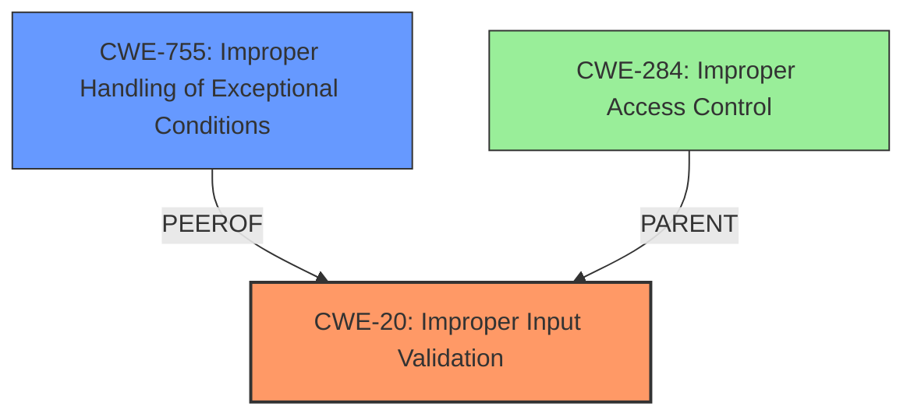

# Analysis Report for CVE-2024-37364

# Vulnerability Analysis Report: CVE-2024-37364

## Description

Ariane Allegro Scenario Player through 2024-03-05, when Ariane Duo kiosk mode is used, allows physically proximate attackers to obtain sensitive information (such as hotel invoice content with PII), and potentially create unauthorized room keys, by entering a guest-search quote character and then accessing the underlying Windows OS.

## Vulnerability Description Key Phrases

- **Impact:** ['obtain sensitive information', 'create unauthorized room keys']
- **Vector:** entering a guest-search quote character and then accessing the underlying Windows OS
- **Attacker:** physically proximate attackers
- **Product:** Ariane Allegro Scenario Player
- **Version:** through 2024-03-05
- **Component:** Ariane Duo kiosk mode

## Analysis (with Relationship Data)

# Summary
| CWE ID | CWE Name | Confidence | CWE Abstraction Level | CWE Vulnerability Mapping Label | CWE-Vulnerability Mapping Notes |
|---|---|---|---|---|---|
| CWE-20 | Improper Input Validation | 0.9 | Class |  Primary CWE | Discouraged |
| CWE-755 | Improper Handling of Exceptional Conditions | 0.7 | Class | Secondary Candidate | Discouraged |
| CWE-284 | Improper Access Control | 0.5 | Pillar | Secondary Candidate | Discouraged |

## Evidence and Confidence

*   **Confidence Score:** 0.7
*   **Evidence Strength:** MEDIUM

## Relationship Analysis
The primary relationship identified is that **CWE-20** Improper Input Validation can **CANPRECEDE** **CWE-22** Path Traversal (which is not selected here, but relevant because access to the underlying OS is gained), and **CWE-755** Improper Handling of Exceptional Conditions relates to the application crashing instead of handling the input gracefully. The higher-level **CWE-284** Improper Access Control is considered, but is too abstract.



## Vulnerability Chain
The vulnerability chain starts with **CWE-20** Improper Input Validation, leading to a crash due to **CWE-755** Improper Handling of Exceptional Conditions, and ultimately bypassing the kiosk mode, which suggests **CWE-284** Improper Access Control. The root cause is **improper input validation** that leads to the crash.

## Summary of Analysis
The initial analysis focused on the provided information and the retriever results. The primary vulnerability is due to **improper input validation** (**CWE-20**), which then causes a crash (**improper handling of exceptional conditions**, **CWE-755**), leading to the bypass of the kiosk mode (**improper access control**, **CWE-284**).

The evidence to support this is: "The application fails to properly handle single quote characters in the guest name input, leading to a crash. The application's crash is not gracefully handled, leading to a termination and exposing the underlying OS instead of restarting the application or displaying an error message within the kiosk environment. The kiosk mode implementation is insufficient to prevent users from accessing the underlying operating system when the application crashes."

The graph relationships confirm that **CWE-20** can precede other vulnerabilities and that **CWE-755** and **CWE-284** are related but less specific. The selected CWEs are at an appropriate level of specificity, though **CWE-20** is discouraged.

Relevant CWE Information:

# Enhanced Context (25 CWEs)
The following CWEs were identified as potentially relevant to this vulnerability:

## CWE-303: Incorrect Implementation of Authentication Algorithm
**Abstraction Level**: Base
**Similarity Score**: 0.73
**Source**: dense

**Description**:
The requirements for the product dictate the use of an established authentication algorithm, but the implementation of the algorithm is incorrect.

**Mapping Guidance**:
- Usage: Allowed
- Rationale: This CWE entry is at the Base level of abstraction, which is a preferred level of abstraction for mapping to the root causes of vulnerabilities.

*Not Selected*: This is not about Authentication Algorithms

## CWE-451: User Interface (UI) Misrepresentation of Critical Information
**Abstraction Level**: Class
**Similarity Score**: 0.73
**Source**: dense

**Description**:
The user interface (UI) does not properly represent critical information to the user, allowing the information - or its source - to be obscured or spoofed. This is often a component in phishing attacks.

**Mapping Guidance**:
- Usage: Allowed-with-Review
- Rationale: This CWE entry is a Class and might have Base-level children that would be more appropriate

*Not Selected*: This is not about UI Misrepresentation

## CWE-1391: Use of Weak Credentials
**Abstraction Level**: Class
**Similarity Score**: 0.73
**Source**: dense

**Description**:
The product uses weak credentials (such as a default key or hard-coded password) that can be calculated, derived, reused, or guessed by an attacker.

**Mapping Guidance**:
- Usage: Allowed-with-Review
- Rationale: This CWE entry is a Class and might have Base-level children that would be more appropriate

*Not Selected*: This is not about weak credentials

## CWE-497: Exposure of Sensitive System Information to an Unauthorized Control Sphere
**Abstraction Level**: Base
**Similarity Score**: 0.73
**Source**: dense

**Description**:
The product does not properly prevent sensitive system-level information from being accessed by unauthorized actors who do not have the same level of access to the underlying system as the product does.

**Mapping Guidance**:
- Usage: Allowed
- Rationale: This CWE entry is at the Base level of abstraction, which is a preferred level of abstraction for mapping to the root causes of vulnerabilities.

*Not Selected*: This is not the primary cause, it is a result.

## CWE-755: Improper Handling of Exceptional Conditions
**Abstraction Level**: Class
**Similarity Score**: 0.72
**Source**: dense

**Description**:
The product does not handle or incorrectly handles an exceptional condition.

**Mapping Guidance**:
- Usage: Discouraged
- Rationale: This CWE entry is a level-1 Class (i.e., a child of a Pillar). It might have lower-level children that would be more appropriate

*Selected*: This is a result of the **improper input validation**, so it could be a secondary CWE.

## CWE-425: Direct Request ('Forced Browsing')
**Abstraction Level**: Base
**Similarity Score**: 0.72
**Source**: dense

**Description**:
The web application does not adequately enforce appropriate authorization on all restricted URLs, scripts, or files.

**Mapping Guidance**:
- Usage: Allowed
- Rationale: This CWE entry is at the Base level of abstraction, which is a preferred level of abstraction for mapping to the root causes of vulnerabilities.

*Not Selected*: This is not about direct requests

## CWE-288: Authentication Bypass Using an Alternate Path or Channel
**Abstraction Level**: Base
**Similarity Score**: 0.72
**Source**: dense

**Description**:
The product requires authentication, but the product has an alternate path or channel that does not require authentication.

**Mapping Guidance**:
- Usage: Allowed
- Rationale: This CWE entry is at the Base level of abstraction, which is a preferred level of abstraction for mapping to the root causes of vulnerabilities.

*Not Selected*: This is not about authentication bypass.

## CWE-116: Improper Encoding or Escaping of Output
**Abstraction Level**: Class
**Similarity Score**: 0.72
**Source**: dense

**Description**:
The product prepares a structured message for communication with another component, but encoding or escaping of the data is either missing or done incorrectly. As a result, the intended structure of the message is not preserved.

**Mapping Guidance**:
- Usage: Allowed-with-Review
- Rationale: This CWE entry is a Class and might have Base-level children that would be more appropriate

*Not Selected*: This is not about encoding or escaping of output.

## CWE-212: Improper Removal of Sensitive Information Before Storage or Transfer
**Abstraction Level**: Base
**Similarity Score**: 0.72
**Source**: dense

**Description**:
The product stores, transfers, or shares a resource that contains sensitive information, but it does not properly remove that information before the product makes the resource available to unauthorized actors.

**Mapping Guidance**:
- Usage: Allowed
- Rationale: This CWE entry is at the Base level of abstraction, which is a preferred level of abstraction for mapping to the root causes of vulnerabilities.

*Not Selected*: This is not about removal of sensitive information.

## CWE-639: Authorization Bypass Through User-Controlled Key
**Abstraction Level**: Base
**Similarity Score**: 0.72
**Source**: dense

**Description**:
The system's authorization functionality does not prevent one user from gaining access to another user's data or record by modifying the key value identifying the data.

**Mapping Guidance**:
- Usage: Allowed
- Rationale: This CWE entry is at the Base level of abstraction, which is a preferred level of abstraction for mapping to the root causes of vulnerabilities.

*Not Selected*: This is not about authorization bypass through user controlled key.

## CWE-22: Improper Limitation of a Pathname to a Restricted Directory ('Path Traversal')
**Abstraction Level**:


## CWE Relationship Analysis

Current CWEs represent these abstraction levels: .


### Vulnerability Chain Analysis

**Chain starting from CWE-288:**
- 288 (Authentication Bypass Using an Alternate Path or Channel) - ROOT


**Chain starting from CWE-1391:**
- 1391 (Use of Weak Credentials) - ROOT


### CWE Relationship Diagram

```mermaid
graph TD
    classDef primary fill:#f96,stroke:#333,stroke-width:2px
    classDef secondary fill:#69f,stroke:#333
    classDef tertiary fill:#9e9,stroke:#333
```


*Report generated on 2025-07-13 09:39:43*
