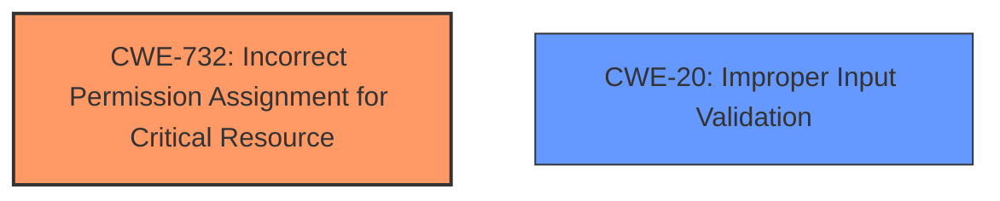

# Raw Analyzer Response for CVE-2024-37365

# Summary

| CWE ID | CWE Name | Confidence | CWE Abstraction Level | CWE Vulnerability Mapping Label | CWE-Vulnerability Mapping Notes |
|---|---|---|---|---|---|
| CWE-732 | Incorrect Permission Assignment for Critical Resource | 0.8 | Class | Allowed-with-Review | Primary CWE |
| CWE-20 | Improper Input Validation | 0.6 | Class | Discouraged | Secondary Candidate |

## Evidence and Confidence

*   **Confidence Score:** 0.7
*   **Evidence Strength:** MEDIUM

## Relationship Analysis
The primary relationship considered was the hierarchical structure of CWEs related to access control and permission management. CWE-732 is a Class-level CWE, while several of its children offer more specific classifications but are not applicable in this case. CWE-20 was also considered as a contributing factor.

## Vulnerability Chain
The vulnerability chain starts with **improper input validation** (CWE-20), which leads to the ability to save projects in public directories. This, in turn, leads to **incorrect permission assignment for critical resources** (CWE-732) because those public directories have overly permissive default permissions, allowing modification/deletion of files and potential privilege escalation through malicious macros.

## Summary of Analysis
The primary assessment is based on the provided evidence from the CVE Reference Links Content Summary, which states: "The vulnerability stems from the affected software allowing users to save projects within a public directory due to **improper input validation**. This is tied to the default folder privileges, which grant excessive access."

The key aspect is that the vulnerability allows users to save projects within a public directory (due to **improper input validation**) and the default folder privileges grant excessive access. This directly relates to **incorrect permission assignment for critical resources** (CWE-732).

The selection of CWE-732 is at the optimal level of specificity because it precisely describes the core issue: the product assigns permissions for critical resources (project files) in a way that allows them to be modified by unintended actors (local users with access to the public directory). While the retriever results suggested other access control related CWEs like CWE-285 and CWE-269, these are less directly applicable as they relate more to authorization checks and privilege management respectively. Here, the core issue is with the *assignment* of permissions to the directory itself, rather than the *checking* of permissions during access.

Relevant CWE Information:

# Enhanced Context (25 CWEs)
The following CWEs were identified as potentially relevant to this vulnerability:

## CWE-732: Incorrect Permission Assignment for Critical Resource
**Abstraction Level**: Class
**Similarity Score**: 1659.77
**Source**: sparse

**Description**:
The product specifies permissions for a security-critical resource in a way that allows that resource to be read or modified by unintended actors.

**Mapping Guidance**:
- Usage: Allowed-with-Review
- Rationale: While the name itself indicates an assignment of permissions for resources, this is often misused for vulnerabilities in which "permissions" are not checked, which is an "authorization" weakness (CWE-285 or descendants) within CWE's model [REF-1287].

## CWE-20: Improper Input Validation
**Abstraction Level**: class
**Similarity Score**: 2.55
**Source**: graph

**Description**:
CWE-20: Improper Input Validation

**Mapping Guidance**:
- Usage: Discouraged
- Rationale: CWE-20 is commonly misused in low-information vulnerability reports when lower-level CWEs could be used instead, or when more details about the vulnerability are available [REF-1287]. It is not useful for trend analysis. It is also a level-1 Class (i.e., a child of a Pillar).

# Complete CWE Specifications

CWE-732: Incorrect Permission Assignment for Critical Resource

CWE-285: Improper Authorization

CWE-269: Improper Privilege Management

CWE-427: Uncontrolled Search Path Element

CWE-61: UNIX Symbolic Link (Symlink) Following

CWE-250: Execution with Unnecessary Privileges

CWE-306: Missing Authentication for Critical Function

CWE-284: Improper Access Control

CWE-94: Improper Control of Generation of Code ('Code Injection')

CWE-98: Improper Control of Filename for Include/Require Statement in PHP Program ('PHP Remote File Inclusion')

## Detailed Analysis of Selected CWEs:

*   **CWE-732: Incorrect Permission Assignment for Critical Resource**
    *   **Explanation:** The vulnerability description states that users can save projects within a public directory, leading to the ability for local users to modify and/or delete files. This aligns with CWE-732, which describes a scenario where the product specifies permissions for a security-critical resource (the project files) in a way that allows unintended actors (local users) to read or modify that resource.
    *   **Security Implications:** This can lead to data corruption, unauthorized modification of project files, and potentially privilege escalation if malicious code is injected into these files.
    *   **Relationship:** CWE-732 is a Class-level CWE.
    *   **Mapping Guidance:** The MITRE mapping guidance for CWE-732 suggests that it can be misused for authorization weaknesses. However, in this case, the core problem isn't with the authorization *check* but with the initial *assignment* of permissions to the public directory. Therefore, CWE-732 is appropriate.
    *   **Confidence:** 0.8

*   **CWE-20: Improper Input Validation**
    *   **Explanation:** The "CVE Reference Links Content Summary" explicitly states: "The vulnerability stems from the affected software allowing users to save projects within a public directory due to **improper input validation**." This means the software isn't properly validating the save path provided by the user, allowing them to save files in unintended locations.
    *   **Security Implications:** By saving files in public directories, an attacker can then take advantage of the overly permissive permissions to modify those files or inject malicious content, leading to potential remote code execution or privilege escalation.
    *   **Relationship:** CWE-20 is a Class-level CWE. It is a high-level weakness that can lead to many other vulnerabilities.
    *   **Mapping Guidance:** The MITRE mapping guidance for CWE-20 discourages its use when lower-level CWEs are available. While this is true, the description specifically mentions **improper input validation** as the root cause allowing users to save to unintended locations, justifying its inclusion as a contributing factor.
    *   **Confidence:** 0.6

## CWEs Considered But Not Used:

*   **CWE-285: Improper Authorization:** While access control is a factor, the primary issue is not with failing to properly authorize an action, but rather with the incorrect assignment of permissions that allow unauthorized actions to begin with.
*   **CWE-269: Improper Privilege Management:** This is more about the management of privileges for an actor (user, role), which doesn't directly fit the scenario of incorrectly assigning permissions to a resource.
*   **CWE-250: Execution with Unnecessary Privileges:** This is more applicable when code is running with higher privileges than needed. While this might be a *consequence* of the vulnerability (e.g., if the application itself has excessive privileges), it's not the direct root cause.
*   **CWE-94: Improper Control of Generation of Code ('Code Injection'):** While remote code execution is the impact, the root cause isn't the *generation* of code but the incorrect assignment of permissions to resources and lack of input validation.