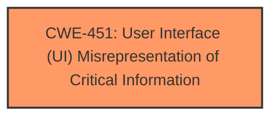

# Analysis for CVE-2024-37406

# Summary

| CWE ID | CWE Name | Confidence | CWE Abstraction Level | CWE Vulnerability Mapping Label | CWE-Vulnerability Mapping Notes |
|---|---|---|---|---|---|
| CWE-451 | User Interface (UI) Misrepresentation of Critical Information | 0.9 | Class | Primary | Allowed-with-Review |

## Evidence and Confidence

*   **Confidence Score:** 0.9
*   **Evidence Strength:** HIGH

## Relationship Analysis
The primary CWE selected is CWE-451, which is a Class-level CWE. While it's generally preferred to select Base or Variant level CWEs, CWE-451 directly addresses the **UI misrepresentation** aspect of the vulnerability. There are child CWEs of CWE-451 to consider, but none seem to fit as well as the parent. The relationships of CWE-451 weren't as insightful as other Class CWEs such as CWE-668.

## Vulnerability Chain
The vulnerability chain starts with the **improper eliding of domain names** in the Brave Shields popup, leading to **domain confusion** for the user. This **domain confusion** can then lead to further vulnerabilities such as phishing. Thus, the chain is: Improper Eliding -> Domain Confusion.

## Summary of Analysis
The vulnerability involves the Brave Android browser displaying domains in the Brave Shields popup elided from the right instead of the left, which may lead to **domain confusion**. The primary weakness is in how the UI represents information, leading to potential deception.

The retriever results suggested several CWEs, including CWE-359 (Exposure of Private Personal Information), CWE-201 (Insertion of Sensitive Information Into Sent Data), and CWE-1021 (Improper Restriction of Rendered UI Layers or Frames). However, these CWEs don't directly address the core issue of **UI misrepresentation** leading to potential user confusion.

CWE-451 (User Interface (UI) Misrepresentation of Critical Information) aligns well with the vulnerability description, as it specifically addresses the scenario where the UI does not properly represent critical information to the user, leading to the information being obscured or spoofed. The **domain confusion** resulting from the **improper eliding** directly falls under this category.

The choice of CWE-451 is at the Class level. While it's preferable to use Base or Variant level CWEs, there isn't a more specific CWE that captures the **UI misrepresentation** aspect of this vulnerability as accurately as CWE-451.

The evidence from the vulnerability description includes the key phrase "**domain confusion**" and the description of how domains are **elided from the right instead of the left**, both of which support the classification of CWE-451.

Relevant CWE Information:

# Enhanced Context (25 CWEs)
The following CWEs were identified as potentially relevant to this vulnerability:

## CWE-451: User Interface (UI) Misrepresentation of Critical Information
**Abstraction Level**: Class
**Similarity Score**: 0.77
**Source**: dense

**Description**:
The user interface (UI) does not properly represent critical information to the user, allowing the information - or its source - to be obscured or spoofed. This is often a component in phishing attacks.

**Mapping Guidance**:
- Usage: Allowed-with-Review
- Rationale: This CWE entry is a Class and might have Base-level children that would be more appropriate