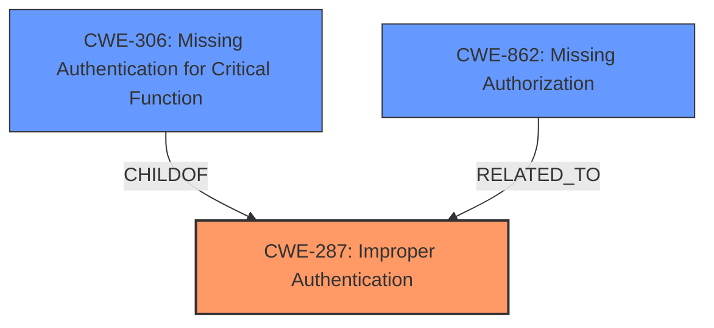

# Analysis for CVE-2024-37566

# Summary
| CWE ID | CWE Name | Confidence | CWE Abstraction Level | CWE Vulnerability Mapping Label | CWE-Vulnerability Mapping Notes |
|---|---|---|---|---|---|
| CWE-287 | Improper Authentication | 0.8 | Class | Primary | Discouraged |
| CWE-306 | Missing Authentication for Critical Function | 0.6 | Base | Secondary Candidate | Allowed |
| CWE-862 | Missing Authorization | 0.4 | Base | Secondary Candidate | Allowed |

## Evidence and Confidence

*   **Confidence Score:** 0.8
*   **Evidence Strength:** MEDIUM

## Relationship Analysis
The primary relationship that influenced my decision was the parent-child relationship between CWE-287 (Improper Authentication) and its children, particularly CWE-306 (Missing Authentication for Critical Function). The guidance suggests using CWE-287 with caution and preferring more specific child CWEs. The choice between CWE-306 and CWE-862 hinges on whether authentication is entirely missing or just improperly implemented, leading to authorization bypass.

## Vulnerability Chain
The vulnerability chain starts with **Improper Authentication**, potentially leading to unauthorized access and control over "Grids" in Infobox NIOS.
  - Root Cause: **Improper Authentication** (CWE-287)
  - Potential Impact: Unauthorized Access to Grids
The chain could be more detailed if specifics about the vulnerable functionality were available.

## Summary of Analysis
The vulnerability description indicates **Improper Authentication for Grids** in Infoblox NIOS. The key phrase "Improper Authentication" directly aligns with CWE-287 (Improper Authentication). However, the guidance suggests that CWE-287 is a high-level class and lower-level CWEs should be used when applicable. The available evidence doesn't clearly indicate whether authentication is entirely missing (CWE-306) or present but flawed, leading to authorization issues (CWE-862). Given the lack of detail, I've chosen CWE-287 as the primary CWE due to its direct match to the vulnerability description, but acknowledge the possibility of it being refined to CWE-306 if authentication is entirely absent for the affected functionality. I am also considering CWE-862 since **Improper Authentication** could mean that authorization checks are missing after authentication.

Relevant CWE Information:

# Enhanced Context (25 CWEs)
The following CWEs were identified as potentially relevant to this vulnerability:

## CWE-303: Incorrect Implementation of Authentication Algorithm
**Abstraction Level**: Base
**Similarity Score**: 0.74
**Source**: dense

**Description**:
The requirements for the product dictate the use of an established authentication algorithm, but the implementation of the algorithm is incorrect.

**Mapping Guidance**:
- Usage: Allowed
- Rationale: This CWE entry is at the Base level of abstraction, which is a preferred level of abstraction for mapping to the root causes of vulnerabilities.

**Why NOT Used**: This CWE is not used because the vulnerability description doesn't specify if an algorithm was used and implemented incorrectly.

## CWE-1391: Use of Weak Credentials
**Abstraction Level**: Class
**Similarity Score**: 0.73
**Source**: dense

**Description**:
The product uses weak credentials (such as a default key or hard-coded password) that can be calculated, derived, reused, or guessed by an attacker.

**Mapping Guidance**:
- Usage: Allowed-with-Review
- Rationale: This CWE entry is a Class and might have Base-level children that would be more appropriate

**Why NOT Used**: This CWE is not used because the vulnerability description doesn't specify the use of weak credentials.

## CWE-345: Insufficient Verification of Data Authenticity
**Abstraction Level**: Class
**Similarity Score**: 0.73
**Source**: dense

**Description**:
The product does not sufficiently verify the origin or authenticity of data, in a way that causes it to accept invalid data.

**Mapping Guidance**:
- Usage: Discouraged
- Rationale: This CWE entry is a level-1 Class (i.e., a child of a Pillar). It might have lower-level children that would be more appropriate

**Why NOT Used**: This CWE is not used because the vulnerability description doesn't specify the verification of data authenticity.

## CWE-280: Improper Handling of Insufficient Permissions or Privileges 
**Abstraction Level**: Base
**Similarity Score**: 0.73
**Source**: dense

**Description**:
The product does not handle or incorrectly handles when it has insufficient privileges to access resources or functionality as specified by their permissions. This may cause it to follow unexpected code paths that may leave the product in an invalid state.

**Mapping Guidance**:
- Usage: Allowed
- Rationale: This CWE entry is at the Base level of abstraction, which is a preferred level of abstraction for mapping to the root causes of vulnerabilities.

**Why NOT Used**: This CWE is not used because the vulnerability description doesn't specify if insufficient permissions or privileges are handled.

## CWE-288: Authentication Bypass Using an Alternate Path or Channel
**Abstraction Level**: Base
**Similarity Score**: 0.73
**Source**: dense

**Description**:
The product requires authentication, but the product has an alternate path or channel that does not require authentication.

**Mapping Guidance**:
- Usage: Allowed
- Rationale: This CWE entry is at the Base level of abstraction, which is a preferred level of abstraction for mapping to the root causes of vulnerabilities.

**Why NOT Used**: This CWE is not used because the vulnerability description doesn't specify the use of alternate path or channel to bypass authentication.

## CWE-807: Reliance on Untrusted Inputs in a Security Decision
**Abstraction Level**: Base
**Similarity Score**: 0.73
**Source**: dense

**Description**:
The product uses a protection mechanism that relies on the existence or values of an input, but the input can be modified by an untrusted actor in a way that bypasses the protection mechanism.

**Mapping Guidance**:
- Usage: Allowed
- Rationale: This CWE entry is at the Base level of abstraction, which is a preferred level of abstraction for mapping to the root causes of vulnerabilities.

**Why NOT Used**: This CWE is not used because the vulnerability description doesn't specify the reliance on untrusted inputs in a security decision.

## CWE-497: Exposure of Sensitive System Information to an Unauthorized Control Sphere
**Abstraction Level**: Base
**Similarity Score**: 0.73
**Source**: dense

**Description**:
The product does not properly prevent sensitive system-level information from being accessed by unauthorized actors who do not have the same level of access to the underlying system as the product does.

**Mapping Guidance**:
- Usage: Allowed
- Rationale: This CWE entry is at the Base level of abstraction, which is a preferred level of abstraction for mapping to the root causes of vulnerabilities.

**Why NOT Used**: This CWE is not used because the vulnerability description doesn't specify the exposure of sensitive system information to an unauthorized control sphere.

## CWE-212: Improper Removal of Sensitive Information Before Storage or Transfer
**Abstraction Level**: Base
**Similarity Score**: 0.73
**Source**: dense

**Description**:
The product stores, transfers, or shares a resource that contains sensitive information, but it does not properly remove that information before the product makes the resource available to unauthorized actors.

**Mapping Guidance**:
- Usage: Allowed
- Rationale: This CWE entry is at the Base level of abstraction, which is a preferred level of abstraction for mapping to the root causes of vulnerabilities.

**Why NOT Used**: This CWE is not used because the vulnerability description doesn't specify the removal of sensitive information before storage or transfer.

## CWE-204: Observable Response Discrepancy
**Abstraction Level**: Base
**Similarity Score**: 0.72
**Source**: dense

**Description**:
The product provides different responses to incoming requests in a way that reveals internal state information to an unauthorized actor outside of the intended control sphere.

**Mapping Guidance**:
- Usage: Allowed
- Rationale: This CWE entry is at the Base level of abstraction, which is a preferred level of abstraction for mapping to the root causes of vulnerabilities.

**Why NOT Used**: This CWE is not used because the vulnerability description doesn't specify any observable response discrepancy.

## CWE-274: Improper Handling of Insufficient Privileges
**Abstraction Level**: Base
**Similarity Score**: 0.72
**Source**: dense

**Description**:
The product does not handle or incorrectly handles when it has insufficient