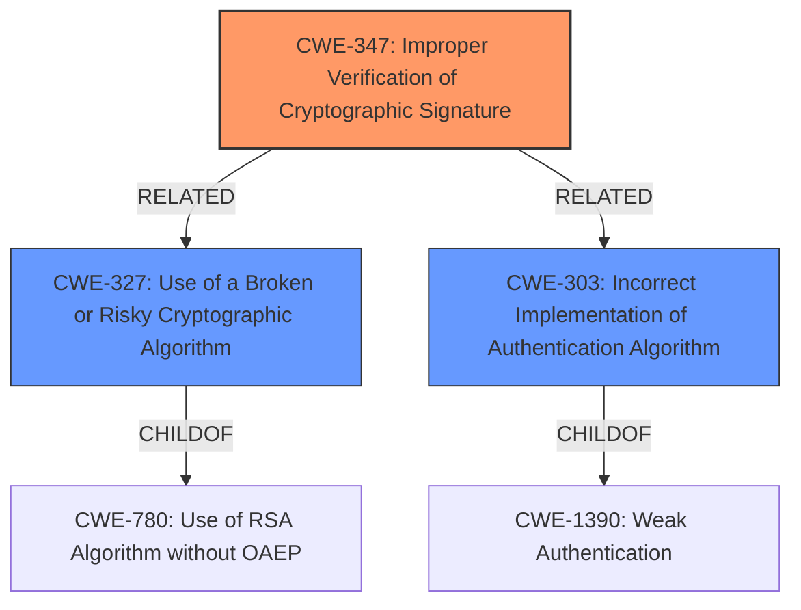

# Enhanced Analysis for CVE-2024-37568

# Summary
| CWE ID | CWE Name | Confidence | CWE Abstraction Level | CWE Vulnerability Mapping Label | CWE-Vulnerability Mapping Notes |
|---|---|---|---|---|---|
| CWE-347 | Improper Verification of Cryptographic Signature | 0.9 | Base | Allowed | Primary CWE. The core issue is the library's failure to properly verify cryptographic signatures. |
| CWE-327 | Use of a Broken or Risky Cryptographic Algorithm | 0.6 | Class | Allowed-with-Review | Secondary Candidate. The library allows algorithm confusion, which effectively uses a broken cryptographic approach. |
| CWE-303 | Incorrect Implementation of Authentication Algorithm | 0.5 | Base | Allowed | Secondary Candidate. The root cause is the incorrect implementation of the authentication algorithm during JWT decoding. |

## Evidence and Confidence

*   **Confidence Score:** 0.7
*   **Evidence Strength:** HIGH

## Relationship Analysis
The primary CWE is CWE-347, which describes the **improper verification of cryptographic signatures**. This is related to other CWEs through hierarchical and chain relationships.

-   CWE-347 is related to CWE-327 (Use of a Broken or Risky Cryptographic Algorithm) because **improper verification** can lead to the use of a broken or risky algorithm.
-   CWE-347 is related to CWE-303 (Incorrect Implementation of Authentication Algorithm) because the **improper verification** may happen due to an incorrect algorithm implementation.
-   CWE-327 and CWE-303 are Class and Base level respectively.



## Vulnerability Chain
The vulnerability chain starts with the **algorithm confusion with asymmetric public keys**, leading to **improper verification of cryptographic signatures**, which enables attackers to perform **token forgery** and gain **unauthorized access**.

Vulnerability Chain:
1.  **Algorithm Confusion (Root Cause):** The library fails to properly distinguish between symmetric and asymmetric key types.
2.  **CWE-347: Improper Verification of Cryptographic Signature:** Due to the algorithm confusion, the cryptographic signature is not properly verified.
3.  **Token Forgery (Impact):** Attackers can forge valid JWTs by using a public key as a secret key with a symmetric algorithm.
4.  **Unauthorized Access (Impact):** By crafting forged tokens, attackers can gain unauthorized access to resources or functionalities.

## Summary of Analysis
The initial assessment focused on the **algorithm confusion** and its direct impact on signature verification. The primary weakness, CWE-347, captures the essence of the vulnerability: the **improper verification of cryptographic signatures** due to the ability to use asymmetric public keys with symmetric HMAC algorithms.

The evidence supporting this decision is derived directly from the vulnerability description and CVE reference:
- "**algorithm confusion with asymmetric public keys**"
- "HMAC verification is allowed with any asymmetric public key."
- "The vulnerability stems from a lack of proper algorithm verification in the `jwt.decode` function"
- "The library does not enforce or warn about the omission of the `algorithm` parameter"
- "The library doesn't properly validate whether the provided key is appropriate for the specified algorithm."
- "Attackers can forge valid JWTs by using a public key as a secret key with a symmetric algorithm"

The graph relationships influenced the understanding of how the **improper verification** can lead to related weaknesses such as using broken algorithms or incorrect implementations.

CWE-347 is the most specific and accurate representation of the vulnerability based on the available evidence, capturing the core issue of **improper signature verification** resulting from the algorithm confusion.

Other CWEs Considered but Not Used:
- CWE-327 (Use of a Broken or Risky Cryptographic Algorithm): Considered as a secondary weakness due to the resulting use of a public key in a symmetric algorithm, which can be viewed as a broken cryptographic approach.
- CWE-303 (Incorrect Implementation of Authentication Algorithm): Considered as a secondary weakness due to the incorrect implementation of the algorithm verification, enabling the vulnerability.
- CWE-328 (Use of Weak Hash), CWE-330 (Use of Insufficiently Random Values), CWE-321 (Use of Hard-coded Cryptographic Key), CWE-780 (Use of RSA Algorithm without OAEP): These were not selected as the vulnerability is not about weak hashes, random values or hardcoded keys but about the **improper verification of cryptographic signatures.**
- CWE-203 (Observable Discrepancy), CWE-208 (Observable Timing Discrepancy), CWE-385 (Covert Timing Channel): These were not selected as the vulnerability is not about timing or observable discrepancies.
- CWE-325 (Missing Cryptographic Step), CWE-304 (Missing Critical Step in Authentication): These were not selected as the vulnerability is not about a missing step, but an incorrect step.
- CWE-804 (Guessable CAPTCHA): This was not selected as the vulnerability is not about CAPTCHA.
- CWE-259 (Use of Hard-coded Password): This was not selected as the vulnerability is not about hard-coded passwords.


## CWE Relationship Analysis

Current CWEs represent these abstraction levels: .


### Vulnerability Chain Analysis

**Chain starting from CWE-1390:**
- 1390 (Weak Authentication) - ROOT


**Chain starting from CWE-321:**
- 321 (Use of Hard-coded Cryptographic Key) - ROOT


### CWE Relationship Diagram

```mermaid
graph TD
    classDef primary fill:#f96,stroke:#333,stroke-width:2px
    classDef secondary fill:#69f,stroke:#333
    classDef tertiary fill:#9e9,stroke:#333
```