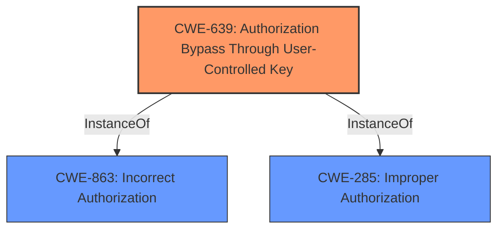

# Analysis for CVE-2024-37665

# Summary
| CWE ID | CWE Name | Confidence | CWE Abstraction Level | CWE Vulnerability Mapping Label | CWE-Vulnerability Mapping Notes |
|---|---|---|---|---|---|
| CWE-639 | Authorization Bypass Through User-Controlled Key | 0.9 | Base | Allowed | Primary CWE. The `userId` parameter is user-controlled and used to access and modify another user's data. |
| CWE-863 | Incorrect Authorization | 0.7 | Class | Allowed-with-Review | Secondary candidate. The product performs an authorization check, but it does so incorrectly. |
| CWE-285 | Improper Authorization | 0.6 | Class | Discouraged | Secondary candidate. The product does not perform or incorrectly performs an authorization check. |

## Evidence and Confidence

*   **Confidence Score:** 0.8
*   **Evidence Strength:** HIGH

## Relationship Analysis
The primary weakness is CWE-639, a Base-level CWE describing authorization bypass via user-controlled key. CWE-863 and CWE-285 are Class-level CWEs representing incorrect and improper authorization, respectively. CWE-639 is a more specific representation of the vulnerability than the Class-level CWEs.

## Vulnerability Chain
The vulnerability chain starts with the lack of proper validation of the `userId` parameter, leading to an authorization bypass and ultimately resulting in privilege escalation.

Lack of proper validation of `userId` (CWE-639) -> Authorization Bypass -> Privilege Escalation (Impact)

## Summary of Analysis
The initial assessment identified CWE-639 as the primary root cause due to the **lack of proper validation** of the user-controlled `userId` parameter. This aligns with the IDOR vulnerability described in the CVE Reference Links Content Summary, where the system relies on the user-supplied `userId` without verifying if the user has the authority to modify the password of the user identified by that ID. The evidence explicitly states, "The vulnerability is due to an Insecure Direct Object Reference (IDOR) in the user management interface of WVP-GB28181-pro 2.0. Specifically, when changing a user's password, the `userId` parameter in the request is not properly validated, allowing an attacker to modify the password of other users, including the administrator account."

The "Authentication vs Authorization vs Access Control Guidance" section helps to distinguish between authentication and authorization issues. In this case, the issue is related to authorization since the attacker is already authenticated, but lacks the authorization to modify other users' passwords. The "Privileges vs Permissions Guidance" further clarifies that this is related to a privilege issue since the attacker is escalating their privileges to administrator.

CWE-863 (Incorrect Authorization) and CWE-285 (Improper Authorization) were considered as secondary candidates. However, CWE-639 (Authorization Bypass Through User-Controlled Key) is more specific as it directly addresses the root cause, which is the **improper handling of the user-controlled key** (`userId` parameter) that leads to the authorization bypass.

The selected CWEs are at the optimal level of specificity, with CWE-639 being a Base-level CWE that precisely describes the vulnerability. The confidence level is high due to the clear evidence and the alignment of the CWE with the vulnerability description.

Relevant CWE Information:

# Enhanced Context (25 CWEs)
The following CWEs were identified as potentially relevant to this vulnerability:

## CWE-639: Authorization Bypass Through User-Controlled Key
**Abstraction Level**: Base
**Similarity Score**: 0.73
**Source**: dense

**Description**:
The system's authorization functionality does not prevent one user from gaining access to another user's data or record by modifying the key value identifying the data.

**Mapping Guidance**:
- Usage: Allowed
- Rationale: This CWE entry is at the Base level of abstraction, which is a preferred level of abstraction for mapping to the root causes of vulnerabilities.

## CWE-863: Incorrect Authorization
**Abstraction Level**: Class
**Similarity Score**: 2965.79
**Source**: sparse

**Description**:
The product performs an authorization check when an actor attempts to access a resource or perform an action, but it does not correctly perform the check.

**Mapping Guidance**:
- Usage: Allowed-with-Review
- Rationale: This CWE entry is a Class and might have Base-level children that would be more appropriate

## CWE-285: Improper Authorization
**Abstraction Level**: Class
**Similarity Score**: 2911.87
**Source**: sparse

**Description**:
The product does not perform or incorrectly performs an authorization check when an actor attempts to access a resource or perform an action.

**Mapping Guidance**:
- Usage: Discouraged
- Rationale: CWE-285 is high-level and lower-level CWEs can frequently be used instead. It is a level-1 Class (i.e., a child of a Pillar).