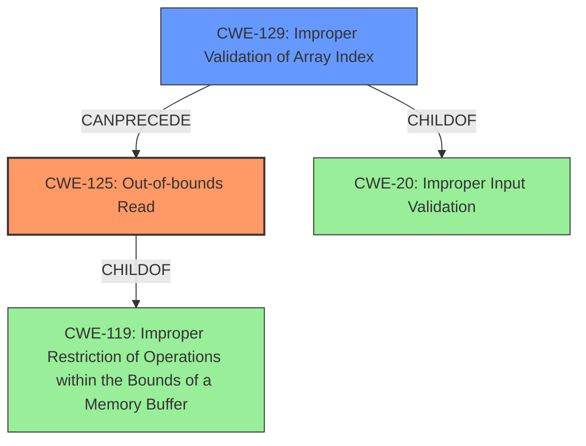

# Raw Analyzer Response for CVE-2024-37676

# Summary
| CWE ID | CWE Name | Confidence | CWE Abstraction Level | CWE Vulnerability Mapping Label | CWE-Vulnerability Mapping Notes |
|---|---|---|---|---|---|
| CWE-125 | Out-of-bounds Read | 0.9 | Base | Primary CWE | Allowed |
| CWE-129 | Improper Validation of Array Index | 0.7 | Variant | Secondary | Allowed |

## Evidence and Confidence

*   **Confidence Score:** 0.8
*   **Evidence Strength:** HIGH

## Relationship Analysis
The primary weakness is **CWE-125 (Out-of-bounds Read)**, which occurs because the `Header_populateFromSettings` function reads beyond the allocated memory due to a mismatch between the configured number of right meter modes and the actual number of right meters. The secondary weakness, **CWE-129 (Improper Validation of Array Index)**, highlights the lack of proper validation of the array index used to access the meter configurations. **CWE-125** is a specific type of memory access error that results from the more general **CWE-119 (Improper Restriction of Operations within the Bounds of a Memory Buffer)**. **CWE-129** can **precede** **CWE-125** because the lack of proper index validation allows the out-of-bounds read to occur.

## Vulnerability Chain
The vulnerability chain starts with the **improper configuration of right meter modes** (potentially leading to **CWE-20 (Improper Input Validation)** if the configuration file is not validated). This leads to **CWE-129 (Improper Validation of Array Index)**, as the index used to access meter configurations is not properly validated. Finally, this results in **CWE-125 (Out-of-bounds Read)** when the `Header_populateFromSettings` function reads beyond the bounds of the allocated memory. The final impact is a potential crash, denial of service, or information disclosure.

## Summary of Analysis
The primary weakness is identified as **CWE-125 (Out-of-bounds Read)**, as the vulnerability description explicitly mentions an **out-of-bounds access** in the `Header_populateFromSettings` function. The supporting evidence from the CVE Reference Links Content Summary confirms that the function reads beyond the bounds of the allocated memory.

The retriever results also list **CWE-125** as a potential candidate with a high score. The hierarchical relationship analysis shows that **CWE-125** is a child of **CWE-119 (Improper Restriction of Operations within the Bounds of a Memory Buffer)**, but **CWE-125** is more specific and accurately represents the vulnerability.

I also considered **CWE-787 (Out-of-bounds Write)** but rejected it because the vulnerability involves reading data past the end of the buffer, not writing. Similarly, **CWE-824 (Access of Uninitialized Pointer)** was considered but rejected because the vulnerability involves reading beyond the bounds of allocated memory, not accessing an uninitialized pointer.

**CWE-129 (Improper Validation of Array Index)** is included as a secondary weakness because the lack of proper validation of the array index contributes to the out-of-bounds read.

The confidence in the assessment is high (0.8) due to the explicit mention of **out-of-bounds access** in the vulnerability description and the supporting evidence from the CVE Reference Links Content Summary.

Relevant CWE Information:

# Enhanced Context (25 CWEs)
The following CWEs were identified as potentially relevant to this vulnerability:

## CWE-193: Off-by-one Error
**Abstraction Level**: Base
**Similarity Score**: 0.69
**Source**: dense

**Description**:
A product calculates or uses an incorrect maximum or minimum value that is 1 more, or 1 less, than the correct value.

**Mapping Guidance**:
- Usage: Allowed
- Rationale: This CWE entry is at the Base level of abstraction, which is a preferred level of abstraction for mapping to the root causes of vulnerabilities.

## CWE-131: Incorrect Calculation of Buffer Size
**Abstraction Level**: Base
**Similarity Score**: 0.69
**Source**: dense

**Description**:
The product does not correctly calculate the size to be used when allocating a buffer, which could lead to a buffer overflow.

**Mapping Guidance**:
- Usage: Allowed
- Rationale: This CWE entry is at the Base level of abstraction, which is a preferred level of abstraction for mapping to the root causes of vulnerabilities.

## CWE-789: Memory Allocation with Excessive Size Value
**Abstraction Level**: Variant
**Similarity Score**: 0.69
**Source**: dense

**Description**:
The product allocates memory based on an untrusted, large size value, but it does not ensure that the size is within expected limits, allowing arbitrary amounts of memory to be allocated.

**Mapping Guidance**:
- Usage: Allowed
- Rationale: This CWE entry is at the Variant level of abstraction, which is a preferred level of abstraction for mapping to the root causes of vulnerabilities.

## CWE-755: Improper Handling of Exceptional Conditions
**Abstraction Level**: Class
**Similarity Score**: 0.69
**Source**: dense

**Description**:
The product does not handle or incorrectly handles an exceptional condition.

**Mapping Guidance**:
- Usage: Discouraged
- Rationale: This CWE entry is a level-1 Class (i.e., a child of a Pillar). It might have lower-level children that would be more appropriate

## CWE-908: Use of Uninitialized Resource
**Abstraction Level**: Base
**Similarity Score**: 0.68
**Source**: dense

**Description**:
The product uses or accesses a resource that has not been initialized.

**Mapping Guidance**:
- Usage: Allowed
- Rationale: This CWE entry is at the Base level of abstraction, which is a preferred level of abstraction for mapping to the root causes of vulnerabilities.

## CWE-125: Out-of-bounds Read
**Abstraction Level**: Base
**Similarity Score**: 0.68
**Source**: dense

**Description**:
The product reads data past the end, or before the beginning, of the intended buffer.

**Mapping Guidance**:
- Usage: Allowed
- Rationale: This CWE entry is at the Base level of abstraction, which is a preferred level of abstraction for mapping to the root causes of vulnerabilities.

## CWE-191: Integer Underflow (Wrap or Wraparound)
**Abstraction Level**: Base
**Similarity Score**: 0.68
**Source**: dense

**Description**:
The product subtracts one value from another, such that the result is less than the minimum allowable integer value, which produces a value that is not equal to the correct result.

**Mapping Guidance**:
- Usage: Allowed
- Rationale: This CWE entry is at the Base level of abstraction, which is a preferred level of abstraction for mapping to the root causes of vulnerabilities.

## CWE-824: Access of Uninitialized Pointer
**Abstraction Level**: Base
**Similarity Score**: 0.68
**Source**: dense

**Description**:
The product accesses or uses a pointer that has not been initialized.

**Mapping Guidance**:
- Usage: Allowed
- Rationale: This CWE entry is at the Base level of abstraction, which is a preferred level of abstraction for mapping to the root causes of vulnerabilities.

## CWE-252: Unchecked Return Value
**Abstraction Level**: Base
**Similarity Score**: 0.68
**Source**: dense

**Description**:
The product does not check the return value from a method or function, which can prevent it from detecting unexpected states and conditions.

**Mapping Guidance**:
- Usage: Allowed
- Rationale: This CWE entry is at the Base level of abstraction, which is a preferred level of abstraction for mapping to the root causes of vulnerabilities.

## CWE-754: Improper Check for Unusual or Exceptional Conditions
**Abstraction Level**: Class
**Similarity Score**: 0.68
**Source**: dense

**Description**:
The product does not check or incorrectly checks for unusual or exceptional conditions that are not expected to occur frequently during day to day operation of the product.

**Mapping Guidance**:
- Usage: Allowed-with-Review
- Rationale: This CWE