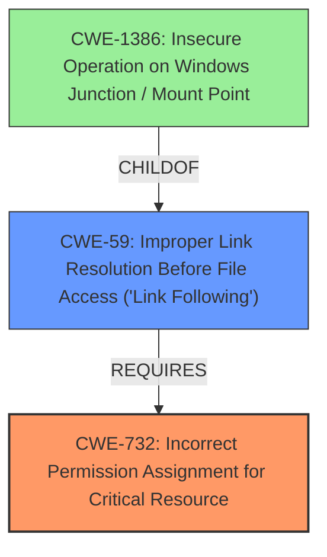

# Analysis for CVE-2024-37726

# Summary
| CWE ID | CWE Name | Confidence | CWE Abstraction Level | CWE Vulnerability Mapping Label | CWE-Vulnerability Mapping Notes |
|---|---|---|---|---|---|
| CWE-732 | Incorrect Permission Assignment for Critical Resource | 0.9 | Class | Allowed-with-Review | Primary CWE. The application writes a file to a low-privilege user-controlled directory with **incorrect permissions** which allows a low-privileged user to manipulate the file system. |
| CWE-59 | Improper Link Resolution Before File Access ('Link Following') | 0.7 | Base | Allowed | Secondary CWE. The application is susceptible to symlink attacks due to insufficient checks on the target location of file write operations. |

## Evidence and Confidence

*   **Confidence Score:** 0.8
*   **Evidence Strength:** HIGH

## Relationship Analysis
The primary CWE is CWE-732 Incorrect Permission Assignment for Critical Resource, which is a Class-level CWE. CWE-59 Improper Link Resolution Before File Access ('Link Following') is a Base-level CWE and a child of CWE-59. The vulnerability involves writing files with **insecure permissions** to a user-controlled directory, making it susceptible to symlink attacks. CWE-59 describes the **improper** handling of links, allowing attackers to redirect file operations.

## Vulnerability Chain
1.  **Root Cause:** CWE-732: Incorrect Permission Assignment for Critical Resource: The application writes files with **insecure permissions** to a user-controlled directory.
2.  **Weakness:** CWE-59: Improper Link Resolution Before File Access ('Link Following'): The application **does not properly** validate or sanitize file paths, allowing symlink attacks.
3.  **Impact:** Privilege escalation via arbitrary file overwrite or deletion.

## Summary of Analysis
The primary weakness is CWE-732, as the vulnerability stems from writing files with **insecure permissions** to a user-controlled directory. The secondary weakness is CWE-59, which is a consequence of the **improper** handling of file paths, enabling symlink attacks.

Evidence:
*   "**Insecure Permissions** vulnerability in Micro-Star International Co., Ltd MSI Center v.2.0.36.0 allows a local attacker to escalate privileges via the Export System Info function in MSI.CentralServer.exe"
*   "The vulnerability is caused by the MSI Center application running with NT AUTHORITY\SYSTEM privileges and writing a file to a low-privilege user-controlled directory."
*   "This allows a low-privileged user to manipulate the file system with symlinks and trick the application into writing to or overwriting arbitrary files in the system."

CWE-732 is chosen because it directly addresses the **incorrect assignment** of permissions for critical resources, leading to potential compromise. CWE-59 is included as a secondary weakness because it describes the mechanism by which the **insecure permissions** can be exploited.

Other CWEs Considered:

*   CWE-269: Improper Privilege Management: While privilege management is involved, CWE-732 is more specific to the **incorrect permission assignment**.
*   CWE-285: Improper Authorization: Authorization is not the primary issue; it's the **insecure permission assignment** that allows unauthorized access.
*   CWE-782: Exposed IOCTL with Insufficient Access Control: This is not an IOCTL issue.