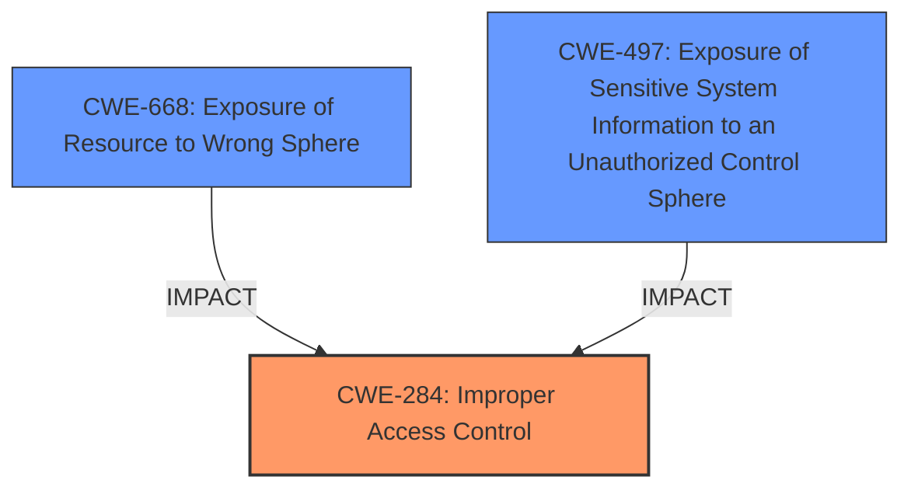

# Analysis Report for CVE-2024-37742

# Vulnerability Analysis Report: CVE-2024-37742

## Description

**Insecure Access Control** in Safe Exam Browser (SEB) = 3.5.0 on Windows. The vulnerability allows an attacker to share clipboard data between the SEB kiosk mode and the underlying system, compromising exam integrity. By exploiting this flaw, an attacker can bypass exam controls and gain an unfair advantage during exams.

## Vulnerability Description Key Phrases

- **Rootcause:** Insecure Access Control
- **Impact:** ['integrity', 'share clipboard data between the SEB kiosk mode and the underlying system']
- **Product:** Safe Exam Browser (SEB)
- **Version:** 3.5.0

## Analysis (with Relationship Data)

# Summary
| CWE ID | CWE Name | Confidence | CWE Abstraction Level | CWE Vulnerability Mapping Label | CWE-Vulnerability Mapping Notes |
|---|---|---|---|---|---|
| CWE-284 | Improper Access Control | 0.8 | Class | Primary CWE | Allowed-with-Review |
| CWE-668 | Exposure of Resource to Wrong Sphere | 0.6 | Class | Secondary Candidate | Discouraged |
| CWE-497 | Exposure of Sensitive System Information to an Unauthorized Control Sphere | 0.5 | Base | Secondary Candidate | Allowed |

## Evidence and Confidence

*   **Confidence Score:** 0.8
*   **Evidence Strength:** HIGH

## Relationship Analysis
The primary relationship that influenced the decision was the hierarchical relationship. While CWE-284 (Improper Access Control) is a high-level class, the available evidence points to a general access control issue without specifying whether it's due to authentication or authorization. CWE-668 (Exposure of Resource to Wrong Sphere) and CWE-497 (Exposure of Sensitive System Information to an Unauthorized Control Sphere) are related as they describe the outcome of the access control issue, but CWE-284 best represents the root cause.



## Vulnerability Chain
The vulnerability chain starts with **Insecure Access Control** (CWE-284), leading to the ability to share clipboard data between the SEB kiosk mode and the underlying system, resulting in compromised exam integrity.

*   **Root Cause:** CWE-284 (Improper Access Control)
*   **Weakness:** Sharing clipboard data between SEB and the system (CWE-668).
*   **Impact:** Compromised exam integrity.

## Summary of Analysis
The initial analysis focused on identifying the root cause of the vulnerability, which was determined to be **Insecure Access Control**. The vulnerability description and CVE reference summary both support this conclusion.

CWE-284 (Improper Access Control) was chosen as the primary CWE because it represents the general access control issue. According to the provided guidance, "CWE-284: Improper Access Control – top-level category used when access control failure exists but root cause is unclear. This should be avoided **if** a more specific child CWE like 285, 862, 863, or 306 is appropriate." In this case, the root cause is an **Insecure Access Control** mechanism. It is not explicitly stated to be missing authentication, missing authorization, or incorrect authorization. Therefore, CWE-284 is the most appropriate.

CWE-668 (Exposure of Resource to Wrong Sphere) was considered because the vulnerability allows clipboard data to be shared between the SEB kiosk mode and the underlying system. However, this is a consequence of the **Insecure Access Control** rather than the root cause itself.

CWE-497 (Exposure of Sensitive System Information to an Unauthorized Control Sphere) was also considered because the clipboard data could contain sensitive information. However, similar to CWE-668, this is a consequence rather than the root cause.

The selection of CWE-284 is at the optimal level of specificity because it directly addresses the root cause of the vulnerability as described in the provided evidence.

Relevant CWE Information:

# Enhanced Context (25 CWEs)
The following CWEs were identified as potentially relevant to this vulnerability:

## CWE-668: Exposure of Resource to Wrong Sphere
**Abstraction Level**: Class
**Similarity Score**: 0.77
**Source**: dense

**Description**:
The product exposes a resource to the wrong control sphere, providing unintended actors with inappropriate access to the resource.

**Mapping Guidance**:
- Usage: Discouraged
- Rationale: CWE-668 is high-level and is often misused as a catch-all when lower-level CWE IDs might be applicable. It is sometimes used for low-information vulnerability reports [REF-1287]. It is a level-1 Class (i.e., a child of a Pillar). It is not useful for trend analysis.

## CWE-610: Externally Controlled Reference to a Resource in Another Sphere
**Abstraction Level**: Class
**Similarity Score**: 0.75
**Source**: dense

**Description**:
The product uses an externally controlled name or reference that resolves to a resource that is outside of the intended control sphere.

**Mapping Guidance**:
- Usage: Discouraged
- Rationale: This CWE entry is a level-1 Class (i.e., a child of a Pillar). It might have lower-level children that would be more appropriate

## CWE-451: User Interface (UI) Misrepresentation of Critical Information
**Abstraction Level**: Class
**Similarity Score**: 0.75
**Source**: dense

**Description**:
The user interface (UI) does not properly represent critical information to the user, allowing the information - or its source - to be obscured or spoofed. This is often a component in phishing attacks.

**Mapping Guidance**:
- Usage: Allowed-with-Review
- Rationale: This CWE entry is a Class and might have Base-level children that would be more appropriate

## CWE-497: Exposure of Sensitive System Information to an Unauthorized Control Sphere
**Abstraction Level**: Base
**Similarity Score**: 0.75
**Source**: dense

**Description**:
The product does not properly prevent sensitive system-level information from being accessed by unauthorized actors who do not have the same level of access to the underlying system as the product does.

**Mapping Guidance**:
- Usage: Allowed
- Rationale: This CWE entry is at the Base level of abstraction, which is a preferred level of abstraction for mapping to the root causes of vulnerabilities.

## CWE-639: Authorization Bypass Through User-Controlled Key
**Abstraction Level**: Base
**Similarity Score**: 0.75
**Source**: dense

**Description**:
The system's authorization functionality does not prevent one user from gaining access to another user's data or record by modifying the key value identifying the data.

**Mapping Guidance**:
- Usage: Allowed
- Rationale: This CWE entry is at the Base level of abstraction, which is a preferred level of abstraction for mapping to the root causes of vulnerabilities.

## CWE-212: Improper Removal of Sensitive Information Before Storage or Transfer
**Abstraction Level**: Base
**Similarity Score**: 0.74
**Source**: dense

**Description**:
The product stores, transfers, or shares a resource that contains sensitive information, but it does not properly remove that information before the product makes the resource available to unauthorized actors.

**Mapping Guidance**:
- Usage: Allowed
- Rationale: This CWE entry is at the Base level of abstraction, which is a preferred level of abstraction for mapping to the root causes of vulnerabilities.

## CWE-41: Improper Resolution of Path Equivalence
**Abstraction Level**: Base
**Similarity Score**: 0.74
**Source**: dense

**Description**:
The product is vulnerable to file system contents disclosure through path equivalence. Path equivalence involves the use of special characters in file and directory names. The associated manipulations are intended to generate multiple names for the same object.

**Mapping Guidance**:
- Usage: Allowed
- Rationale: This CWE entry is at the Base level of abstraction, which is a preferred level of abstraction for mapping to the root causes of vulnerabilities.

## CWE-472: External Control of Assumed-Immutable Web Parameter
**Abstraction Level**: Base
**Similarity Score**: 0.74
**Source**: dense

**Description**:
The web application does not sufficiently verify inputs that are assumed to be immutable but are actually externally controllable, such as hidden form fields.

**Mapping Guidance**:
- Usage: Allowed
- Rationale: This CWE entry is at the Base level of abstraction, which is a preferred level of abstraction for mapping to the root causes of vulnerabilities.

## CWE-59: Improper Link Resolution Before File Access ('Link Following')
**Abstraction Level**: Base
**Similarity Score**: 0.74
**Source**: dense

**Description**:
The product attempts to access a file based on the filename, but it does not properly prevent that filename from identifying a link or shortcut that resolves to an unintended resource.

**Mapping Guidance**:
- Usage: Allowed
- Rationale: This CWE entry is at the Base level of abstraction, which is a preferred level of abstraction for mapping to the root causes of vulnerabilities.

## CWE-267: Privilege Defined With Unsafe Actions
**Abstraction Level**: Base
**Similarity Score**: 0.74
**Source**: dense

**Description**:
A particular privilege, role, capability, or right can be used to perform unsafe


## CWE Relationship Analysis

Current CWEs represent these abstraction levels: .


### Vulnerability Chain Analysis

**Chain starting from CWE-610:**
- 610 (Externally Controlled Reference to a Resource in Another Sphere) - ROOT


**Chain starting from CWE-639:**
- 639 (Authorization Bypass Through User-Controlled Key) - ROOT


### CWE Relationship Diagram

```mermaid
graph TD
    classDef primary fill:#f96,stroke:#333,stroke-width:2px
    classDef secondary fill:#69f,stroke:#333
    classDef tertiary fill:#9e9,stroke:#333
```


*Report generated on 2025-07-13 09:50:21*
