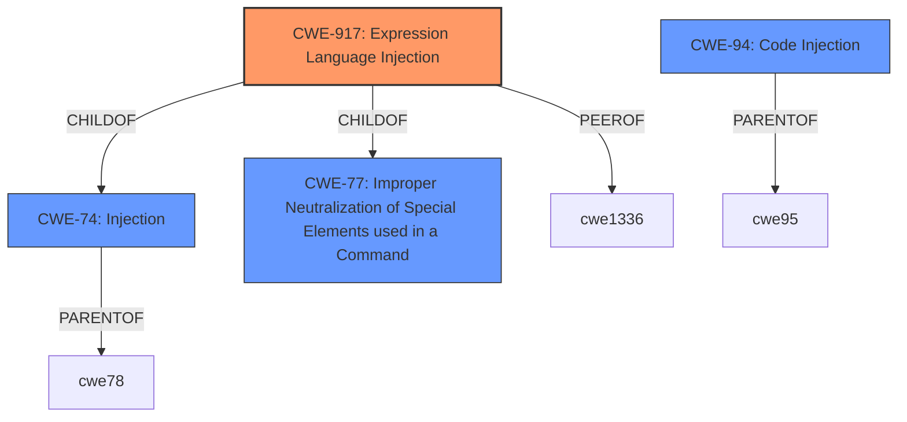

# Analysis Report for CVE-2024-37759

# Vulnerability Analysis Report: CVE-2024-37759

## Description

DataGear v5.0.0 and earlier was discovered to contain a SpEL (Spring Expression Language) **expression injection** vulnerability via the Data Viewing interface.

## Vulnerability Description Key Phrases

- **Weakness:** expression injection
- **Product:** DataGear
- **Version:** v5.0.0 and earlier
- **Component:** Data Viewing interface

## Analysis (with Relationship Data)

# Summary
| CWE ID | CWE Name | Confidence | CWE Abstraction Level | CWE Vulnerability Mapping Label | CWE-Vulnerability Mapping Notes |
|---|---|---|---|---|---|
| CWE-917 | Improper Neutralization of Special Elements used in an Expression Language Statement ('Expression Language Injection') | 1.0 | Base | Primary CWE | Allowed |
| CWE-94 | Improper Control of Generation of Code ('Code Injection') | 0.7 | Base | Secondary Candidate | Allowed-with-Review |

## Evidence and Confidence

*   **Confidence Score:** 0.9
*   **Evidence Strength:** HIGH

## Relationship Analysis
The primary relationship is that CWE-917 (Expression Language Injection) is a specific type of CWE-74 (Injection) and CWE-94 (Code Injection). Specifically, CWE-917 focuses on expression languages. The Retriever Results also show CWE-917 and CWE-94 as top candidates. Since the vulnerability involves SpEL, a type of expression language, CWE-917 is the more specific and appropriate choice. CWE-917 is a child of CWE-77 and CWE-74.



## Vulnerability Chain
The vulnerability chain starts with the **improper handling of user-supplied input** that is directly parsed as a SpEL expression, leading to **expression injection**, which allows for **remote code execution**.

1.  User input (SpEL expression)
2.  **CWE-917: Improper Neutralization of Special Elements used in an Expression Language Statement ('Expression Language Injection')** - Root Cause: The application fails to sanitize or validate user input before parsing it as a SpEL expression.
3.  Remote Code Execution - Impact: Successful exploitation allows an attacker to execute arbitrary code on the server.

## Summary of Analysis
The primary CWE is CWE-917 because the vulnerability description clearly states that it is a SpEL **expression injection** vulnerability. The evidence from the "CVE Reference Links Content Summary" section supports this, specifically mentioning the lack of sanitization of user-provided input before parsing it as a SpEL expression. The vulnerable code snippet also confirms that the application directly parses SpEL expressions without validation. The retriever results also rank CWE-917 as the top candidate. CWE-94 (Code Injection) was considered but is less specific than CWE-917, which explicitly addresses expression language injection. The selection of CWE-917 is based on strong evidence and aligns with the CWE specifications and mapping guidance. The evidence provided from the CVE Reference Links Content Summary is as follows: "This function directly parses SpEL (Spring Expression Language) expressions without any sanitization or filtering. The expression parameter is controllable by the user, leading to SpEL injection."

Relevant CWE Information:

# Enhanced Context (25 CWEs)
The following CWEs were identified as potentially relevant to this vulnerability:

## CWE-917: Improper Neutralization of Special Elements used in an Expression Language Statement ('Expression Language Injection')
**Abstraction Level**: Base
**Similarity Score**: 0.79
**Source**: dense

**Description**:
The product constructs all or part of an expression language (EL) statement in a framework such as a Java Server Page (JSP) using externally-influenced input from an upstream component, but it does not neutralize or incorrectly neutralizes special elements that could modify the intended EL statement before it is executed.

**Mapping Guidance**:
- Usage: Allowed
- Rationale: This CWE entry is at the Base level of abstraction, which is a preferred level of abstraction for mapping to the root causes of vulnerabilities.


## CWE Relationship Analysis

Current CWEs represent these abstraction levels: .


### Vulnerability Chain Analysis

**Chain starting from CWE-74:**
- 74 (Improper Neutralization of Special Elements in Output Used by a Downstream Component ('Injection')) - ROOT


**Chain starting from CWE-917:**
- 917 (Improper Neutralization of Special Elements used in an Expression Language Statement ('Expression Language Injection')) - ROOT


### CWE Relationship Diagram

```mermaid
graph TD
    classDef primary fill:#f96,stroke:#333,stroke-width:2px
    classDef secondary fill:#69f,stroke:#333
    classDef tertiary fill:#9e9,stroke:#333
```


*Report generated on 2025-07-13 09:50:54*
