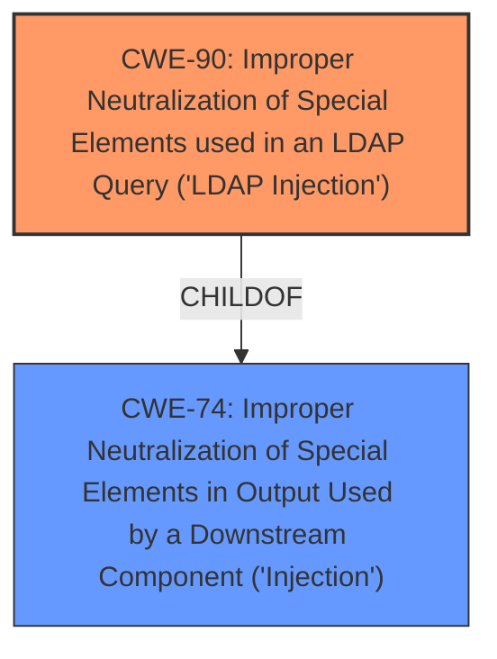

# Enhanced Analysis for CVE-2024-37782

# Summary
| CWE ID | CWE Name | Confidence | CWE Abstraction Level | CWE Vulnerability Mapping Label | CWE-Vulnerability Mapping Notes |
|---|---|---|---|---|---|
| CWE-90 | Improper Neutralization of Special Elements used in an LDAP Query ('LDAP Injection') | 1.0 | Base | Allowed | Primary CWE: The vulnerability is explicitly identified as an LDAP injection. |
| CWE-74 | Improper Neutralization of Special Elements in Output Used by a Downstream Component ('Injection') | 0.6 | Class | Discouraged | Secondary Candidate: A more general form of injection, but CWE-90 is more specific. |

## Evidence and Confidence

*   **Confidence Score:** 1.0
*   **Evidence Strength:** HIGH

## Relationship Analysis
The primary relationship is that CWE-90 is a specific type of injection, which is a child of the more general CWE-74. However, since the vulnerability is explicitly an LDAP injection, CWE-90 is the more appropriate choice.



## Vulnerability Chain
The vulnerability chain is as follows:
1.  **Root Cause:** **LDAP Injection** (CWE-90) due to **improper sanitization of the username field**.
2.  **Impact:** Attackers can access sensitive data or execute arbitrary commands.

## Summary of Analysis
The primary vulnerability is clearly an LDAP injection vulnerability (CWE-90) due to the **lack of proper input sanitization** in the username field. The evidence from the "CVE Reference Links Content Summary" section strongly supports this classification, stating that "The root cause of the vulnerability is the lack of proper input sanitization in the username field of the CentreStack login portal. This allows an attacker to inject malicious LDAP queries." The description and impact align perfectly with the definition of CWE-90.

CWE-74 was considered as a more general "Injection" issue, but it was determined that CWE-90 is a more specific and accurate representation of the vulnerability. The retriever results also listed several other injection-related CWEs, such as CWE-89 (SQL Injection), CWE-78 (OS Command Injection), and CWE-917 (Expression Language Injection), but these were not selected as they do not align with the described LDAP injection.

The selection of CWE-90 is at the optimal level of specificity, as it is a Base-level CWE that directly addresses the identified vulnerability.

Relevant CWE Information:

# Enhanced Context (25 CWEs)
The following CWEs were identified as potentially relevant to this vulnerability:

## CWE-90: Improper Neutralization of Special Elements used in an LDAP Query ('LDAP Injection')
**Abstraction Level**: Base
**Similarity Score**: 0.82
**Source**: dense

**Description**:
The product constructs all or part of an LDAP query using externally-influenced input from an upstream component, but it does not neutralize or incorrectly neutralizes special elements that could modify the intended LDAP query when it is sent to a downstream component.

**Mapping Guidance**:
- Usage: Allowed
- Rationale: This CWE entry is at the Base level of abstraction, which is a preferred level of abstraction for mapping to the root causes of vulnerabilities.


## CWE Relationship Analysis

Current CWEs represent these abstraction levels: .


### Vulnerability Chain Analysis

**Chain starting from CWE-90:**
- 90 (Improper Neutralization of Special Elements used in an LDAP Query ('LDAP Injection')) - ROOT


**Chain starting from CWE-89:**
- 89 (Improper Neutralization of Special Elements used in an SQL Command ('SQL Injection')) - ROOT


### CWE Relationship Diagram

```mermaid
graph TD
    classDef primary fill:#f96,stroke:#333,stroke-width:2px
    classDef secondary fill:#69f,stroke:#333
    classDef tertiary fill:#9e9,stroke:#333
```