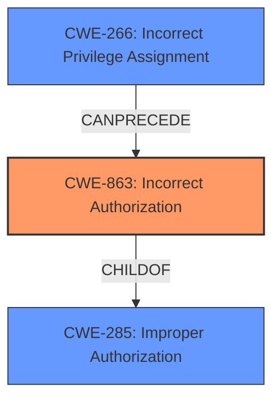

# Enhanced Analysis for CVE-2024-37882

# Summary
| CWE ID | CWE Name | Confidence | CWE Abstraction Level | CWE Vulnerability Mapping Label | CWE-Vulnerability Mapping Notes |
|---|---|---|---|---|---|
| CWE-863 | Incorrect Authorization | 0.9 | Class | Allowed-with-Review | Primary CWE: The system performs an authorization check, but it's done incorrectly. |
| CWE-266 | Incorrect Privilege Assignment | 0.7 | Base | Allowed | Secondary: Incorrect privilege assignment could be part of what lead to the authorization issue. |
| CWE-285 | Improper Authorization | 0.6 | Class | Discouraged | Secondary: The product does not perform or incorrectly performs an authorization check when an actor attempts to access a resource or perform an action. |

## Evidence and Confidence

*   **Confidence Score:** 0.8
*   **Evidence Strength:** HIGH

## Relationship Analysis
The primary CWE is CWE-863, which represents a flawed authorization check. CWE-285 (Improper Authorization) is a parent of CWE-863, but CWE-863 provides more specific information about the nature of the authorization failure (an incorrect check, not a missing one). CWE-266 (Incorrect Privilege Assignment) is included as an underlying cause, because incorrect privilege assignments may have played a role in the authorization vulnerability.



## Vulnerability Chain
1.  **Root Cause:** **Incorrect authorization** (**CWE-863**) allows users with "read&share" permissions to grant more permissions than they possess when resharing items. **Incorrect Privilege Assignment** (**CWE-266**) may be an underlying contributor.
2.  **Weakness:** The system fails to validate whether the user has the right to grant higher permissions than they themselves were given.
3.  **Impact:** Privilege escalation, potential data breach. A user with limited permissions can elevate their effective permissions by resharing.

## Summary of Analysis
The primary vulnerability is an **incorrect authorization** check (**CWE-863**). The system allows a user with "read&share" permissions to grant higher permissions when resharing. This indicates a flaw in the logic that checks the user's permissions before allowing the resharing operation.

The evidence for this is in the CVE Reference Links Content Summary: "The vulnerability stems from a flaw in Nextcloud's sharing mechanism, where a recipient of a shared item with "read&share" permissions could reshare the item with *more* permissions than originally granted. This indicates an issue with how Nextcloud was validating permissions when resharing."

The **privileges vs permissions guidance** was helpful in determining the right CWE. In this case, the vulnerability deals with incorrect checks on permissions for a specific action, which suggests CWE-863.

CWE-285 was considered but not selected as the primary CWE because it's a more general case of improper authorization. CWE-863 is more specific since it explicitly states that the authorization check is performed, but it's done incorrectly.

Several CWEs from the **Retriever Results** were considered but ultimately not chosen as the primary CWE:

*   CWE-209, CWE-639, CWE-532, CWE-201, CWE-23, CWE-789, CWE-732, CWE-862, CWE-93, CWE-117: These are less directly related to the core **authorization** issue. They focus on aspects like information leakage, resource management, or input validation, which are not the primary weakness in this case.

Relevant CWE Information:

# Enhanced Context (25 CWEs)
The following CWEs were identified as potentially relevant to this vulnerability:

## CWE-267: Privilege Defined With Unsafe Actions
**Abstraction Level**: Base
**Similarity Score**: 0.80
**Source**: dense

**Description**:
A particular privilege, role, capability, or right can be used to perform unsafe actions that were not intended, even when it is assigned to the correct entity.

**Mapping Guidance**:
- Usage: Allowed
- Rationale: This CWE entry is at the Base level of abstraction, which is a preferred level of abstraction for mapping to the root causes of vulnerabilities.


## CWE-266: Incorrect Privilege Assignment
**Abstraction Level**: Base
**Similarity Score**: 0.79
**Source**: dense

**Description**:
A product incorrectly assigns a privilege to a particular actor, creating an unintended sphere of control for that actor.

**Mapping Guidance**:
- Usage: Allowed
- Rationale: This CWE entry is at the Base level of abstraction, which is a preferred level of abstraction for mapping to the root causes of vulnerabilities.


## CWE-212: Improper Removal of Sensitive Information Before Storage or Transfer
**Abstraction Level**: Base
**Similarity Score**: 0.79
**Source**: dense

**Description**:
The product stores, transfers, or shares a resource that contains sensitive information, but it does not properly remove that information before the product makes the resource available to unauthorized actors.

**Mapping Guidance**:
- Usage: Allowed
- Rationale: This CWE entry is at the Base level of abstraction, which is a preferred level of abstraction for mapping to the root causes of vulnerabilities.


## CWE-209: Generation of Error Message Containing Sensitive Information
**Abstraction Level**: Base
**Similarity Score**: 0.78
**Source**: dense

**Description**:
The product generates an error message that includes sensitive information about its environment, users, or associated data.

**Mapping Guidance**:
- Usage: Allowed
- Rationale: This CWE entry is at the Base level of abstraction, which is a preferred level of abstraction for mapping to the root causes of vulnerabilities.


## CWE-280: Improper Handling of Insufficient Permissions or Privileges 
**Abstraction Level**: Base
**Similarity Score**: 0.78
**Source**: dense

**Description**:
The product does not handle or incorrectly handles when it has insufficient privileges to access resources or functionality as specified by their permissions. This may cause it to follow unexpected code paths that may leave the product in an invalid state.

**Mapping Guidance**:
- Usage: Allowed
- Rationale: This CWE entry is at the Base level of abstraction, which is a preferred level of abstraction for mapping to the root causes of vulnerabilities.


## CWE-668: Exposure of Resource to Wrong Sphere
**Abstraction Level**: Class
**Similarity Score**: 0.78
**Source**: dense

**Description**:
The product exposes a resource to the wrong control sphere, providing unintended actors with inappropriate access to the resource.

**Mapping Guidance**:
- Usage: Discouraged
- Rationale: CWE-668 is high-level and is often misused as a catch-all when lower-level CWE IDs might be applicable. It is sometimes used for low-information vulnerability reports [REF-1287]. It is a level-1 Class (i.e., a child of a Pillar). It is not useful for trend analysis.


## CWE-41: Improper Resolution of Path Equivalence
**Abstraction Level**: Base
**Similarity Score**: 0.78
**Source**: dense

**Description**:
The product is vulnerable to file system contents disclosure through path equivalence. Path equivalence involves the use of special characters in file and directory names. The associated manipulations are intended to generate multiple names for the same object.

**Mapping Guidance**:
- Usage: Allowed
- Rationale: This CWE entry is at the Base level of abstraction, which is a preferred level of abstraction for mapping to the root causes of vulnerabilities.


## CWE-639: Authorization Bypass Through User-Controlled Key
**Abstraction Level**: Base
**Similarity Score**: 0.78
**Source**: dense

**Description**:
The system's authorization functionality does not prevent one user from gaining access to another user's data or record by modifying the key value identifying the data.

**Mapping Guidance**:
- Usage: Allowed
- Rationale: This CWE entry is at the Base level of abstraction, which is a preferred level of abstraction for mapping to the root causes of vulnerabilities.


## CWE-274: Improper Handling of Insufficient Privileges
**Abstraction Level**: Base
**Similarity Score**: 0.77
**Source**: dense

**Description**:
The product does not handle or incorrectly handles when it has insufficient privileges to perform an operation, leading to resultant weaknesses.

**Mapping Guidance**:
- Usage: Discouraged
- Rationale: This CWE entry could be deprecated in a future version of CWE.


## CWE-59: Improper Link Resolution Before File Access ('Link Following')
**Abstraction Level**: Base


## CWE Relationship Analysis

Current CWEs represent these abstraction levels: .


### Vulnerability Chain Analysis

**Chain starting from CWE-274:**
- 274 (Improper Handling of Insufficient Privileges) - ROOT


**Chain starting from CWE-93:**
- 93 (Improper Neutralization of CRLF Sequences ('CRLF Injection')) - ROOT


### CWE Relationship Diagram

```mermaid
graph TD
    classDef primary fill:#f96,stroke:#333,stroke-width:2px
    classDef secondary fill:#69f,stroke:#333
    classDef tertiary fill:#9e9,stroke:#333
```