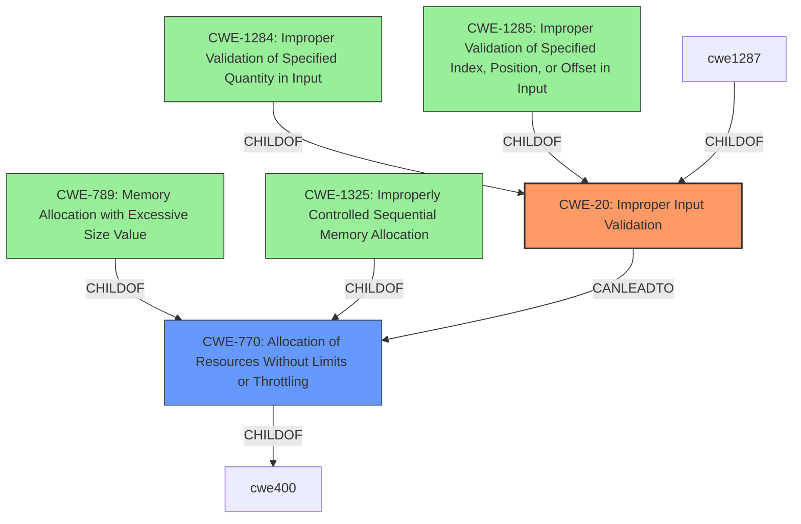

# Analysis for CVE-2024-37917

# Summary
| CWE ID | CWE Name | Confidence | CWE Abstraction Level | CWE Vulnerability Mapping Label | CWE-Vulnerability Mapping Notes |
|---|---|---|---|---|---|
| CWE-20 | Improper Input Validation | 1.0 | Class | Primary | Allowed |
| CWE-770 | Allocation of Resources Without Limits or Throttling | 0.5 | Base | Secondary Candidate | Allowed |

## Evidence and Confidence

*   **Confidence Score:** 0.8
*   **Evidence Strength:** HIGH

## Relationship Analysis
The primary relationship considered was the parent-child relationship, specifically how CWE-20 serves as a high-level classification. The retriever results suggested more specific Base and Variant level CWEs, such as CWE-1284, CWE-789, CWE-1285, CWE-1325, and CWE-770. However, given the limited detail in the description, the broader CWE-20 seems more appropriate. There's also a chain relationship to consider, where improper input validation (CWE-20) can lead to resource exhaustion issues addressed by CWE-770.

## Vulnerability Chain
The vulnerability chain begins with **improper input validation** (CWE-20), which allows a remote attacker to send a crafted signalling message. This leads to a denial of service (software abort). While the description doesn't explicitly state the mechanism causing the denial of service, it could involve resource exhaustion or an unhandled exception. Therefore, CWE-20 is the root cause. A secondary effect could be CWE-770 (Allocation of Resources Without Limits or Throttling) contributing to the DoS.

## Summary of Analysis
The primary assessment is heavily based on the **rootcause** identified as "**improper input validation**" in both the vulnerability description and the CVE reference summary.

The vulnerability description states: "Pexip Infinity before 35.0 has **improper input validation** that allows remote attackers to trigger a denial of service (software abort) via a crafted signalling message."

The CVE Reference Links Content Summary states: "**Root cause of vulnerability:** Insufficient input validation in the signalling implementation(s)."

Given this direct evidence, CWE-20 (Improper Input Validation) is the most appropriate primary classification, despite its Class level of abstraction. The retriever results suggested more specific CWEs. However, lacking further details on *how* the input validation is flawed, opting for a more specific CWE would be speculative. The potential for resource exhaustion due to **improper input validation** makes CWE-770 a possible secondary classification.

Other CWEs considered:
*   CWE-1284, CWE-1285, CWE-1286, CWE-1287, CWE-789, CWE-1325: These are more specific input validation CWEs, but the description doesn't provide enough detail to confirm they apply.
*   CWE-770: Allocation of Resources Without Limits or Throttling: This is a possible consequence of the **improper input validation**, but without more information, it's a secondary consideration.
*   CWE-835: Loop with Unreachable Exit Condition ('Infinite Loop'): This is unlikely given the input-driven nature of the vulnerability.
*   CWE-617: Reachable Assertion: There is no evidence to suggest that this vulnerability involves hitting a reachable assertion.
*   CWE-770, CWE-1325: Given that a denial-of-service is possible, these resource exhaustion CWEs were considered.

In summary, the evidence points strongly to CWE-20 as the primary weakness, with potential secondary weaknesses related to resource management. The final selection prioritizes accuracy based on the available information and avoids over-speculation.

Relevant CWE Information:

# Enhanced Context (25 CWEs)
The following CWEs were identified as potentially relevant to this vulnerability:

## CWE-1285: Improper Validation of Specified Index, Position, or Offset in Input
**Abstraction Level**: Base
**Similarity Score**: 0.71
**Source**: dense

**Description**:
The product receives input that is expected to specify an index, position, or offset into an indexable resource such as a buffer or file, but it does not validate or incorrectly validates that the specified index/position/offset has the required properties.

**Mapping Guidance**:
- Usage: Allowed
- Rationale: This CWE entry is at the Base level of abstraction, which is a preferred level of abstraction for mapping to the root causes of vulnerabilities.

## CWE-20: Improper Input Validation
**Abstraction Level**: Class
**Similarity Score**: 0.70
**Source**: dense

**Description**:
The product receives input or data, but it does
        not validate or incorrectly validates that the input has the
        properties that are required to process the data safely and
        correctly.

**Mapping Guidance**:
- Usage: Discouraged
- Rationale: CWE-20 is commonly misused in low-information vulnerability reports when lower-level CWEs could be used instead, or when more details about the vulnerability are available [REF-1287]. It is not useful for trend analysis. It is also a level-1 Class (i.e., a child of a Pillar).

## CWE-346: Origin Validation Error
**Abstraction Level**: Class
**Similarity Score**: 0.70
**Source**: dense

**Description**:
The product does not properly verify that the source of data or communication is valid.

**Mapping Guidance**:
- Usage: Allowed-with-Review
- Rationale: This CWE entry is a Class and might have Base-level children that would be more appropriate

## CWE-755: Improper Handling of Exceptional Conditions
**Abstraction Level**: Class
**Similarity Score**: 0.70
**Source**: dense

**Description**:
The product does not handle or incorrectly handles an exceptional condition.

**Mapping Guidance**:
- Usage: Discouraged
- Rationale: This CWE entry is a level-1 Class (i.e., a child of a Pillar). It might have lower-level children that would be more appropriate

## CWE-345: Insufficient Verification of Data Authenticity
**Abstraction Level**: Class
**Similarity Score**: 0.69
**Source**: dense

**Description**:
The product does not sufficiently verify the origin or authenticity of data, in a way that causes it to accept invalid data.

**Mapping Guidance**:
- Usage: Discouraged
- Rationale: This CWE entry is a level-1 Class (i.e., a child of a Pillar). It might have lower-level children that would be more appropriate

## CWE-754: Improper Check for Unusual or Exceptional Conditions
**Abstraction Level**: Class
**Similarity Score**: 0.69
**Source**: dense

**Description**:
The product does not check or incorrectly checks for unusual or exceptional conditions that are not expected to occur frequently during day to day operation of the product.

**Mapping Guidance**:
- Usage: Allowed-with-Review
- Rationale: This CWE entry is a Class and might have Base-level children that would be more appropriate

## CWE-807: Reliance on Untrusted Inputs in a Security Decision
**Abstraction Level**: Base
**Similarity Score**: 0.68
**Source**: dense

**Description**:
The product uses a protection mechanism that relies on the existence or values of an input, but the input can be modified by an untrusted actor in a way that bypasses the protection mechanism.

**Mapping Guidance**:
- Usage: Allowed
- Rationale: This CWE entry is at the Base level of abstraction, which is a preferred level