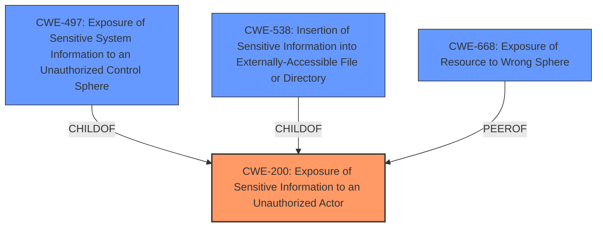

# Analysis Report for CVE-2024-37991

# Vulnerability Analysis Report: CVE-2024-37991

## Description

A vulnerability has been identified in SIMATIC Reader RF610R CMIIT (6GT2811-6BC10-2AA0) (All versions < V4.2), SIMATIC Reader RF610R ETSI (6GT2811-6BC10-0AA0) (All versions < V4.2), SIMATIC Reader RF610R FCC (6GT2811-6BC10-1AA0) (All versions < V4.2), SIMATIC Reader RF615R CMIIT (6GT2811-6CC10-2AA0) (All versions < V4.2), SIMATIC Reader RF615R ETSI (6GT2811-6CC10-0AA0) (All versions < V4.2), SIMATIC Reader RF615R FCC (6GT2811-6CC10-1AA0) (All versions < V4.2), SIMATIC Reader RF650R ARIB (6GT2811-6AB20-4AA0) (All versions < V4.2), SIMATIC Reader RF650R CMIIT (6GT2811-6AB20-2AA0) (All versions < V4.2), SIMATIC Reader RF650R ETSI (6GT2811-6AB20-0AA0) (All versions < V4.2), SIMATIC Reader RF650R FCC (6GT2811-6AB20-1AA0) (All versions < V4.2), SIMATIC Reader RF680R ARIB (6GT2811-6AA10-4AA0) (All versions < V4.2), SIMATIC Reader RF680R CMIIT (6GT2811-6AA10-2AA0) (All versions < V4.2), SIMATIC Reader RF680R ETSI (6GT2811-6AA10-0AA0) (All versions < V4.2), SIMATIC Reader RF680R FCC (6GT2811-6AA10-1AA0) (All versions < V4.2), SIMATIC Reader RF685R ARIB (6GT2811-6CA10-4AA0) (All versions < V4.2), SIMATIC Reader RF685R CMIIT (6GT2811-6CA10-2AA0) (All versions < V4.2), SIMATIC Reader RF685R ETSI (6GT2811-6CA10-0AA0) (All versions < V4.2), SIMATIC Reader RF685R FCC (6GT2811-6CA10-1AA0) (All versions < V4.2), SIMATIC RF1140R (6GT2831-6CB00) (All versions < V1.1), SIMATIC RF1170R (6GT2831-6BB00) (All versions < V1.1), SIMATIC RF166C (6GT2002-0EE20) (All versions < V2.2), SIMATIC RF185C (6GT

## Vulnerability Description Key Phrases

- **Product:** SIMATIC Reader RF610R
- **Version:** All versions < V4.2

## Analysis (with Relationship Data)

# Summary
| CWE ID | CWE Name | Confidence | CWE Abstraction Level | CWE Vulnerability Mapping Label | CWE-Vulnerability Mapping Notes |
|---|---|---|---|---|---|
| CWE-200 | Exposure of Sensitive Information to an Unauthorized Actor | 0.9 | Class | Primary CWE | Allowed-with-Review |

## Evidence and Confidence

*   **Confidence Score:** 0.9
*   **Evidence Strength:** HIGH

## Relationship Analysis
The primary relationship that influenced my decision was the parent-child relationship between CWE-200 and more specific CWEs. While CWE-200 is a class-level CWE, it directly addresses the core issue of sensitive information exposure due to **missing authentication**. The retriever results suggested several other CWEs, but they were either too broad (like CWE-400, CWE-755, and CWE-119) or focused on different aspects (like resource consumption or code injection).



## Vulnerability Chain
The vulnerability chain starts with the **missing authentication**, leading to the **exposure of sensitive information** contained in the service log files.
  - **Root Cause:** Missing Authentication
  - **Weakness:** Exposure of Sensitive Information
  - **Impact:** Unauthorized access to sensitive data

## Summary of Analysis
The analysis is primarily based on the provided "CVE Reference Links Content Summary," which explicitly states that "The service log files of the affected application can be accessed without proper authentication," indicating **a lack of proper authentication** as the root cause. The summary also mentions "CWE-200: Exposure of Sensitive Information to an Unauthorized Actor," which is the most accurate high-level representation of the vulnerability's core weakness. While more specific CWEs might exist, the current evidence points strongly to CWE-200 as the primary issue.

The retriever results included CWE-400 (Uncontrolled Resource Consumption), CWE-835 (Loop with Unreachable Exit Condition), and CWE-94 (Improper Control of Generation of Code), but these are not directly related to the described vulnerability. The focus is clearly on the **unauthenticated access** leading to information exposure, which aligns perfectly with CWE-200.

The selection of CWE-200 is at an appropriate level of specificity, given the available information. While more detailed CWEs related to authentication bypass or specific types of information exposure might be applicable, the current description doesn't provide sufficient evidence to justify a more granular classification.

Relevant CWE Information:

# Enhanced Context (25 CWEs)
The following CWEs were identified as potentially relevant to this vulnerability:

## CWE-668: Exposure of Resource to Wrong Sphere
**Abstraction Level**: Class
**Similarity Score**: 0.77
**Source**: dense

**Description**:
The product exposes a resource to the wrong control sphere, providing unintended actors with inappropriate access to the resource.

**Mapping Guidance**:
- Usage: Discouraged
- Rationale: CWE-668 is high-level and is often misused as a catch-all when lower-level CWE IDs might be applicable. It is sometimes used for low-information vulnerability reports [REF-1287]. It is a level-1 Class (i.e., a child of a Pillar). It is not useful for trend analysis.


## CWE-345: Insufficient Verification of Data Authenticity
**Abstraction Level**: Class
**Similarity Score**: 0.77
**Source**: dense

**Description**:
The product does not sufficiently verify the origin or authenticity of data, in a way that causes it to accept invalid data.

**Mapping Guidance**:
- Usage: Discouraged
- Rationale: This CWE entry is a level-1 Class (i.e., a child of a Pillar). It might have lower-level children that would be more appropriate


## CWE-303: Incorrect Implementation of Authentication Algorithm
**Abstraction Level**: Base
**Similarity Score**: 0.77
**Source**: dense

**Description**:
The requirements for the product dictate the use of an established authentication algorithm, but the implementation of the algorithm is incorrect.

**Mapping Guidance**:
- Usage: Allowed
- Rationale: This CWE entry is at the Base level of abstraction, which is a preferred level of abstraction for mapping to the root causes of vulnerabilities.


## CWE-497: Exposure of Sensitive System Information to an Unauthorized Control Sphere
**Abstraction Level**: Base
**Similarity Score**: 0.77
**Source**: dense

**Description**:
The product does not properly prevent sensitive system-level information from being accessed by unauthorized actors who do not have the same level of access to the underlying system as the product does.

**Mapping Guidance**:
- Usage: Allowed
- Rationale: This CWE entry is at the Base level of abstraction, which is a preferred level of abstraction for mapping to the root causes of vulnerabilities.


## CWE-1391: Use of Weak Credentials
**Abstraction Level**: Class
**Similarity Score**: 0.76
**Source**: dense

**Description**:
The product uses weak credentials (such as a default key or hard-coded password) that can be calculated, derived, reused, or guessed by an attacker.

**Mapping Guidance**:
- Usage: Allowed-with-Review
- Rationale: This CWE entry is a Class and might have Base-level children that would be more appropriate


## CWE-200: Exposure of Sensitive Information to an Unauthorized Actor
**Abstraction Level**: Class
**Similarity Score**: 0.76
**Source**: dense

**Description**:
The product exposes sensitive information to an actor that is not explicitly authorized to have access to that information.

**Mapping Guidance**:
- Usage: Discouraged
- Rationale: CWE-200 is commonly misused to represent the loss of confidentiality in a vulnerability, but confidentiality loss is a technical impact - not a root cause error. As of CWE 4.9, over 400 CWE entries can lead to a loss of confidentiality. Other options are often available. [REF-1287].


## CWE-824: Access of Uninitialized Pointer
**Abstraction Level**: Base
**Similarity Score**: 0.76
**Source**: dense

**Description**:
The product accesses or uses a pointer that has not been initialized.

**Mapping Guidance**:
- Usage: Allowed
- Rationale: This CWE entry is at the Base level of abstraction, which is a preferred level of abstraction for mapping to the root causes of vulnerabilities.


## CWE-294: Authentication Bypass by Capture-replay
**Abstraction Level**: Base
**Similarity Score**: 0.76
**Source**: dense

**Description**:
A capture-replay flaw exists when the design of the product makes it possible for a malicious user to sniff network traffic and bypass authentication by replaying it to the server in question to the same effect as the original message (or with minor changes).

**Mapping Guidance**:
- Usage: Allowed
- Rationale: This CWE entry is at the Base level of abstraction, which is a preferred level of abstraction for mapping to the root causes of vulnerabilities.


## CWE-755: Improper Handling of Exceptional Conditions
**Abstraction Level**: Class
**Similarity Score**: 0.76
**Source**: dense

**Description**:
The product does not handle or incorrectly handles an exceptional condition.

**Mapping Guidance**:
- Usage: Discouraged
- Rationale: This CWE entry is a level-1 Class (i.e., a child of a Pillar). It might have lower-level children that would be more appropriate


## CWE-798: Use of Hard-coded Credentials
**Abstraction Level**: Base
**Similarity Score**: 0.76
**Source**: dense

**Description**:
The product contains hard-coded credentials, such as a password or cryptographic key.

**Mapping Guidance**:
- Usage: Allowed
- Rationale: This CWE entry is at the Base level of abstraction, which is a preferred level of abstraction for mapping to the root causes of vulnerabilities.


## CWE-400: Uncontrolled Resource Consumption
**Abstraction Level**: Class
**Similarity Score**: 990.45
**Source**: sparse

**Description**:
The product does not properly control the allocation and maintenance of a limited resource, thereby enabling an actor to influence the amount of resources consumed, eventually leading to the exhaustion of available resources.

**Mapping Guidance**:
- Usage: Discouraged
- Rationale: CWE-40


## CWE Relationship Analysis

Current CWEs represent these abstraction levels: .


### Vulnerability Chain Analysis

**Chain starting from CWE-1391:**
- 1391 (Use of Weak Credentials) - ROOT


**Chain starting from CWE-400:**
- 400 (Uncontrolled Resource Consumption) - ROOT


### CWE Relationship Diagram

```mermaid
graph TD
    classDef primary fill:#f96,stroke:#333,stroke-width:2px
    classDef secondary fill:#69f,stroke:#333
    classDef tertiary fill:#9e9,stroke:#333
```


*Report generated on 2025-07-13 09:59:24*
