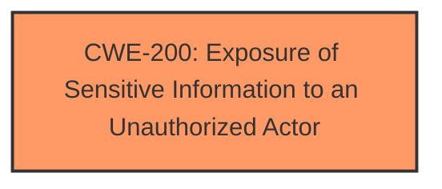

# Enhanced Analysis for CVE-2024-38017

# Summary
| CWE ID | CWE Name | Confidence | CWE Abstraction Level | CWE Vulnerability Mapping Label | CWE-Vulnerability Mapping Notes |
|---|---|---|---|---|---|
| CWE-200 | Exposure of Sensitive Information to an Unauthorized Actor | 0.7 | Class | Primary | Discouraged, but chosen because the description explicitly mentions "Information Disclosure Vulnerability" and no root cause is provided. |

## Evidence and Confidence

*   **Confidence Score:** 0.7
*   **Evidence Strength:** LOW

## Relationship Analysis
The primary identified CWE is CWE-200 (Exposure of Sensitive Information to an Unauthorized Actor), which is a Class-level CWE. While discouraged, it's selected because it aligns with the explicit mention of "Information Disclosure Vulnerability" in the vulnerability description. Given the limited information, a more specific CWE cannot be determined.



## Vulnerability Chain
The vulnerability chain is limited due to the lack of root cause information. The chain consists of:
1.  **Root Cause:** Unknown (due to lack of information in the description)
2.  **Weakness:** Information Disclosure (CWE-200)
3.  **Impact:** Exposure of sensitive information

## Summary of Analysis
The primary challenge is the absence of a clearly defined root cause in the vulnerability description and CVE Reference Links Content Summary. The description focuses on the impact, which is "Information Disclosure." The "CWE for similar CVE Descriptions" lists CWE-NVD-noinfo as the primary match, indicating a lack of information.

Given the limited information, the best course of action is to map the vulnerability to CWE-200 (Exposure of Sensitive Information to an Unauthorized Actor), which directly reflects the stated impact. This decision acknowledges the lack of root cause evidence while still providing a classification that aligns with the available information.

I considered other CWEs listed in the retriever results, such as CWE-1295 (Debug Messages Revealing Unnecessary Information), CWE-209 (Generation of Error Message Containing Sensitive Information), and CWE-204 (Observable Response Discrepancy). However, these CWEs require more specific evidence related to the mechanism of information disclosure, which is not present in the description.

Relevant CWE Information:
# Enhanced Context (25 CWEs)
The following CWEs were identified as potentially relevant to this vulnerability:

#


## CWE Relationship Analysis

Current CWEs represent these abstraction levels: .


### Vulnerability Chain Analysis

**Chain starting from CWE-1295:**
- 1295 (Debug Messages Revealing Unnecessary Information) - ROOT


**Chain starting from CWE-200:**
- 200 (Exposure of Sensitive Information to an Unauthorized Actor) - ROOT


### CWE Relationship Diagram

```mermaid
graph TD
    classDef primary fill:#f96,stroke:#333,stroke-width:2px
    classDef secondary fill:#69f,stroke:#333
    classDef tertiary fill:#9e9,stroke:#333
```