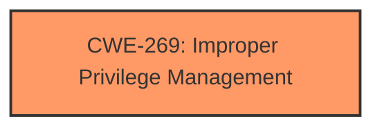

# Analysis for CVE-2024-38033

# Summary
| CWE ID | CWE Name | Confidence | CWE Abstraction Level | CWE Vulnerability Mapping Label | CWE-Vulnerability Mapping Notes |
|---|---|---|---|---|---|
| CWE-269 | Improper Privilege Management | 0.4 | Class |  | Discouraged |

## Evidence and Confidence

*   **Confidence Score:** 0.4
*   **Evidence Strength:** LOW

## Relationship Analysis
The analysis considered the hierarchical relationships, especially the parent-child relationships, but due to limited evidence, the selection remains at the Class level. The retriever results also pointed towards privilege-related CWEs.

## Vulnerability Chain
The vulnerability chain is not clear from the provided information. The **impact** is "Elevation of Privilege," but the root cause is not specified. Thus, only CWE-269 is considered, representing the general area of privilege management.

## Summary of Analysis
The primary challenge is the lack of specific information about the root cause of the "Elevation of Privilege" vulnerability in PowerShell. The provided description is vague, and the CVE Reference Links Content Summary is unhelpful ("UNRELATED"). The analysis relies heavily on the impact statement and the retriever results, which point towards privilege-related CWEs.

CWE-NVD-noinfo was considered, as it was the Primary CWE Match and Top CWE from the similar CVE Descriptions, but it is not a real CWE and shouldn't be used.

CWE-668 (Exposure of Resource to Wrong Sphere) was the other Top CWE from similar CVE Descriptions, but it's discouraged.

The retriever results suggest several CWEs, including CWE-59, CWE-266, CWE-1386, CWE-123, CWE-454, CWE-127, CWE-825, CWE-378, CWE-648, and CWE-416. However, without more details, it's difficult to select a more specific CWE.

CWE-269 (Improper Privilege Management) is chosen as a general Class-level CWE that encompasses the broad issue of privilege handling. However, it's important to note that CWE-269 is discouraged for being too generic.

Relevant CWE Information:

# Enhanced Context (25 CWEs)
The following CWEs were identified as potentially relevant to this vulnerability:

## CWE-269: Improper Privilege Management
**Abstraction Level**: Class
**Similarity Score**: 1195.54
**Source**: sparse

**Description**:
The product does not properly assign, modify, track, or check privileges for an actor, creating an unintended sphere of control for that actor.

**Mapping Guidance**:
- Usage: Discouraged
- Rationale: CWE-269 is commonly misused. It can be conflated with "privilege escalation," which is a technical impact that is listed in many low-information vulnerability reports [REF-1287]. It is not useful for trend analysis.

Given the limited information, the selection of CWE-269 is tentative, with a low confidence score of 0.4. More information would be needed to pinpoint the specific root cause and select a more appropriate Base or Variant CWE.