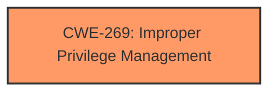

# Analysis for CVE-2024-38124

# Summary
| CWE ID | CWE Name | Confidence | CWE Abstraction Level | CWE Vulnerability Mapping Label | CWE-Vulnerability Mapping Notes |
|---|---|---|---|---|---|
| CWE-269 | Improper Privilege Management | 0.5 | Class | Primary | Discouraged |

## Evidence and Confidence

*   **Confidence Score:** 0.5
*   **Evidence Strength:** LOW

## Relationship Analysis
The primary candidate CWE-269 is a Class-level CWE. There are many potential Base-level children of CWE-269 that could be more appropriate.

## Vulnerability Chain
The vulnerability chain is simple:
1.  **ROOT CAUSE:** Improper Privilege Management (CWE-269)
2.  **IMPACT:** Elevation of Privilege

## Summary of Analysis
The vulnerability description indicates an Elevation of Privilege in Windows Netlogon. The provided information is very limited. The key phrase is "Elevation of Privilege", indicating a privilege management issue.

The retriever results and enhanced context both suggest privilege-related CWEs. The top retriever results include CWE-1204 (Generation of Weak Initialization Vector (IV)), CWE-59 (Improper Link Resolution Before File Access ('Link Following')), CWE-1386 (Insecure Operation on Windows Junction / Mount Point), and CWE-123 (Write-what-where Condition), but these do not directly relate to privilege management.

Given the limited information, the best match is CWE-269 (Improper Privilege Management), which is a Class-level CWE. Although the guidance discourages the use of CWE-269, the lack of specific root cause details prevents selecting a more specific Base-level CWE. Since the vulnerability results in "Elevation of Privilege", and the description indicates a problem with "Netlogon" which handles user authentication and authorization, this further supports the selection of CWE-269.

Relevant CWE Information:
*   CWE-269: Improper Privilege Management

I am only partially confident in this assessment because of the limited evidence, and the general nature of the vulnerability description.