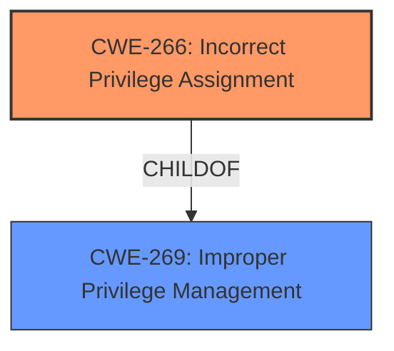

# Enhanced Analysis for CVE-2024-38129

# Summary
| CWE ID | CWE Name | Confidence | CWE Abstraction Level | CWE Vulnerability Mapping Label | CWE-Vulnerability Mapping Notes |
|---|---|---|---|---|---|
| CWE-266 | Incorrect Privilege Assignment | 0.6 | Base | Primary CWE | Allowed |

## Evidence and Confidence

*   **Confidence Score:** 0.6
*   **Evidence Strength:** LOW

## Relationship Analysis
The primary focus is on the privilege aspect due to the "Elevation of Privilege" impact. While other CWEs like CWE-59 (Improper Link Resolution) are present in the Retriever Results, they don't directly address the core issue of privilege management. The guidance on privileges vs. permissions strongly suggests focusing on CWE-266 (Incorrect Privilege Assignment) when a user is assigned the wrong role.



## Vulnerability Chain
The chain starts with a **root cause** of an **incorrect privilege assignment (CWE-266)**, leading to the **impact** of an elevation of privilege.

## Summary of Analysis
The initial assessment focused on identifying the **root cause** of the vulnerability. The **Vulnerability Description** states that the vulnerability leads to "Elevation of Privilege" in the "Kerberos" component of "Windows". The **CWE for similar CVE Descriptions** lists CWE-NVD-noinfo as the primary match, which indicates a lack of detailed information. However, the "Top CWEs" also includes CWE-269 (Improper Privilege Management). Given the guidance provided on privileges and permissions, and the fact that elevation of privilege is explicitly mentioned, CWE-266 (Incorrect Privilege Assignment) is chosen as the primary CWE. While other CWEs appeared in the retriever results, they were deemed less relevant to the core issue of privilege misassignment. The evidence is not strong due to the lack of details in the vulnerability description and CVE Reference Links Content Summary, hence the Confidence score is low.

Relevant CWE Information:

# Enhanced Context (25 CWEs)
The following CWEs were identified as potentially relevant to this vulnerability:

## CWE-266: Incorrect Privilege Assignment
**Abstraction Level**: Base
**Similarity Score**: 0.80
**Source**: dense

**Description**:
A product incorrectly assigns a privilege to a particular actor, creating an unintended sphere of control for that actor.

**Mapping Guidance**:
- Usage: Allowed
- Rationale: This CWE entry is at the Base level of abstraction, which is a preferred level of abstraction for mapping to the root causes of vulnerabilities.


## CWE Relationship Analysis

Current CWEs represent these abstraction levels: .


### Vulnerability Chain Analysis

**Chain starting from CWE-59:**
- 59 (Improper Link Resolution Before File Access ('Link Following')) - ROOT


**Chain starting from CWE-266:**
- 266 (Incorrect Privilege Assignment) - ROOT


### CWE Relationship Diagram

```mermaid
graph TD
    classDef primary fill:#f96,stroke:#333,stroke-width:2px
    classDef secondary fill:#69f,stroke:#333
    classDef tertiary fill:#9e9,stroke:#333
```