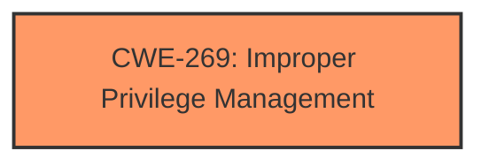

# Analysis Report for CVE-2024-38162

# Vulnerability Analysis Report: CVE-2024-38162

## Description

Azure Connected Machine Agent Elevation of Privilege Vulnerability

## Vulnerability Description Key Phrases

- **Impact:** Elevation of Privilege
- **Product:** Azure Connected Machine Agent

## Analysis (with Relationship Data)

# Summary
| CWE ID | CWE Name | Confidence | CWE Abstraction Level | CWE Vulnerability Mapping Label | CWE-Vulnerability Mapping Notes |
|---|---|---|---|---|---|
| CWE-269 | Improper Privilege Management | 0.5 | Class | Primary | Discouraged |

## Evidence and Confidence

*   **Confidence Score:** 0.5
*   **Evidence Strength:** LOW

## Relationship Analysis
The primary consideration was the lack of detailed information. Therefore, a higher-level Class CWE, CWE-269, was selected, as it represents a general category of privilege management issues. This decision took into account the discouraged usage of CWE-269 and the guidance to seek lower-level CWEs when possible. However, in the absence of specific root cause details, a more granular mapping could not be confidently achieved.



## Vulnerability Chain
The vulnerability description only mentions an "Elevation of Privilege". Without further details, the chain consists of only the high-level weakness of Improper Privilege Management leading to the impact of elevated privileges.

## Summary of Analysis
The analysis is heavily constrained by the limited information provided in the vulnerability description and CVE Reference Links Content Summary. The decision to assign CWE-269 is based on the vulnerability's stated impact of "Elevation of Privilege" and the product being the "Azure Connected Machine Agent".

The primary evidence is the "Elevation of Privilege" impact statement. Given the lack of specific root cause details, the higher-level CWE-269, "Improper Privilege Management," was selected. The retriever results also listed CWE-269, further supporting this selection. The usage is discouraged because CWE-269 is commonly misused.

Relevant CWE Information:

# Enhanced Context (25 CWEs)
The following CWEs were identified as potentially relevant to this vulnerability:

## CWE Classification Guidance

The following guidance has been automatically included because relevant keywords were detected in the vulnerability description:

### Privileges vs Permissions Guidance

# Complete CWE Specifications

CWE-191: Integer Underflow (Wrap or Wraparound)
CWE-295: Improper Certificate Validation
CWE-73: External Control of File Name or Path
CWE-266: Incorrect Privilege Assignment
CWE-269: Improper Privilege Management
CWE-59: Improper Link Resolution Before File Access ('Link Following')
CWE-732: Incorrect Permission Assignment for Critical Resource
CWE-1284: Improper Validation of Specified Quantity in Input
CWE-250: Execution with Unnecessary Privileges
CWE-22: Improper Limitation of a Pathname to a Restricted Directory ('Path Traversal')

Based on the above information, my analysis is as follows:

1. **Content Matching:** The vulnerability description states "Elevation of Privilege". The term aligns with the general concept of privilege management.

2. **Relationship Analysis:** The retriever results suggested several CWEs related to privilege and permission management. The selection of CWE-269 was influenced by its higher-level classification, suitable when specific root cause details are absent.

3. **Mapping Guidance Analysis:** The privilege guidance was reviewed. Given the lack of root cause, CWE-269 was deemed more appropriate than more specific CWEs like CWE-266 or CWE-250.

4. **Mitigation Analysis:** Mitigation would involve proper privilege management.

5. **Evidence-Based Decision Making:** The limited evidence (impact statement) constrains the confidence level. The selection is based on the general nature of the vulnerability.

**CWE Selection Justification:**

*   **CWE-269 Improper Privilege Management:** The description indicates an elevation of privilege, a general category which this CWE falls under. Given the limited information, this is the most appropriate high-level classification.

**CWEs Considered But Not Used:**

*   CWE-266, CWE-250, CWE-863: These are more specific privilege-related CWEs, but there's no evidence to support their selection.
*   CWE-285, CWE-862: These relate to authorization, but the description doesn't indicate authorization issues.
*   CWE-59, CWE-73, CWE-22: These relate to file path manipulation. There's no evidence to support their selection.


## CWE Relationship Analysis

Current CWEs represent these abstraction levels: .


### Vulnerability Chain Analysis

**Chain starting from CWE-863:**
- 863 (Incorrect Authorization) - ROOT


**Chain starting from CWE-1284:**
- 1284 (Improper Validation of Specified Quantity in Input) - ROOT


### CWE Relationship Diagram

```mermaid
graph TD
    classDef primary fill:#f96,stroke:#333,stroke-width:2px
    classDef secondary fill:#69f,stroke:#333
    classDef tertiary fill:#9e9,stroke:#333
```


*Report generated on 2025-07-13 10:09:50*
