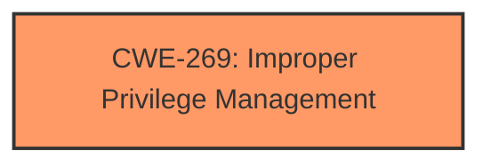

# Raw Analyzer Response for CVE-2024-38163

# Summary
| CWE ID | CWE Name | Confidence | CWE Abstraction Level | CWE Vulnerability Mapping Label | CWE-Vulnerability Mapping Notes |
|---|---|---|---|---|---|
| CWE-269 | Improper Privilege Management | 0.6 | Class | Primary | Discouraged |

## Evidence and Confidence

*   **Confidence Score:** 0.6
*   **Evidence Strength:** LOW

## Relationship Analysis
The primary CWE is CWE-269, "Improper Privilege Management", which is a class-level CWE. There are other, more specific CWEs that could be considered if more information was provided. CWE-269 is a parent of CWE-250 and CWE-274. The guidance discourages the use of CWE-269 because it's commonly misused and doesn't provide useful trend analysis.

## Vulnerability Chain
The vulnerability chain starts with the Windows Update Stack and results in an elevation of privilege. Due to the limited information, it is difficult to pinpoint the exact root cause, but the end result is an elevation of privilege.

## Summary of Analysis
The initial analysis considered the provided vulnerability description, key phrases, and CWE information. The primary focus was on identifying the root cause of the elevation of privilege. However, the provided information is very limited. The description states "Windows Update Stack Elevation of Privilege Vulnerability". The key phrases include "impact: elevation of privilege", "product: Windows", and "component: Update Stack". The CWE for similar CVE Descriptions lists "CWE-NVD-noinfo", "CWE-269", and "CWE-362".

The retriever results offer several candidate CWEs, but none are a perfect fit given the lack of information. The guidance provided emphasizes the distinction between privileges and permissions. Given the impact is "elevation of privilege," the focus is on privilege-related CWEs.

CWE-269, "Improper Privilege Management", is selected as the primary CWE because it broadly covers the scenario where privileges are not properly managed, leading to an unintended elevation of privilege. Although it is a Class-level CWE and discouraged, the limited information makes it difficult to select a more specific Base-level CWE.

I considered other CWEs, such as CWE-266 (Incorrect Privilege Assignment) and CWE-250 (Execution with Unnecessary Privileges), but there isn't enough evidence to determine whether the vulnerability involves an incorrect assignment of privileges or execution with unnecessary privileges. Therefore, I opted for the more general CWE-269.

Relevant CWE Information:
CWE-269: Improper Privilege Management
CWE-266: Incorrect Privilege Assignment
CWE-250: Execution with Unnecessary Privileges