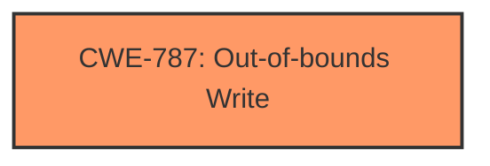

# Analysis for CVE-2024-38178

# Summary
| CWE ID | CWE Name | Confidence | CWE Abstraction Level | CWE Vulnerability Mapping Label | CWE-Vulnerability Mapping Notes |
|---|---|---|---|---|---|
| CWE-787 | Out-of-bounds Write | 0.9 | Base | Primary | Allowed |

## Evidence and Confidence

*   **Confidence Score:** 0.9
*   **Evidence Strength:** LOW

## Relationship Analysis
The primary identified CWE is CWE-787 (**CWE-787: Out-of-bounds Write**). This is a base-level CWE, providing a specific description of the **weakness**. The retriever results also suggested CWE-416 (**CWE-416: Use After Free**), CWE-123 (**CWE-123: Write-what-where Condition**), and CWE-824 (**CWE-824: Access of Uninitialized Pointer**), which have peer or child relationships. However, based on the limited information, CWE-787 remains the most appropriate.

## Vulnerability Chain
The vulnerability chain is simple: the **Scripting Engine Memory Corruption Vulnerability** leads directly to an Out-of-bounds Write (CWE-787).

## Summary of Analysis
Based on the limited information provided - specifically the **weakness** description "Scripting Engine Memory Corruption Vulnerability" - I have selected CWE-787 (**CWE-787: Out-of-bounds Write**) as the primary CWE.

The vulnerability description key phrases mention "Scripting Engine Memory Corruption Vulnerability," which directly aligns with memory corruption issues that often lead to out-of-bounds writes. The retriever results also list CWE-787 as the top match.

The other CWEs from the Retriever Results were considered but not used because there was no other evidence in the vulnerability description to suggest their inclusion. For example, CWE-416 (**CWE-416: Use After Free**) and CWE-123 (**CWE-123: Write-what-where Condition**) would require more information to justify their inclusion, as the description doesn't explicitly mention freeing memory or the ability to write arbitrary values to arbitrary locations.

The confidence level is 0.9 because the description is vague, but it does align with the top CWE.