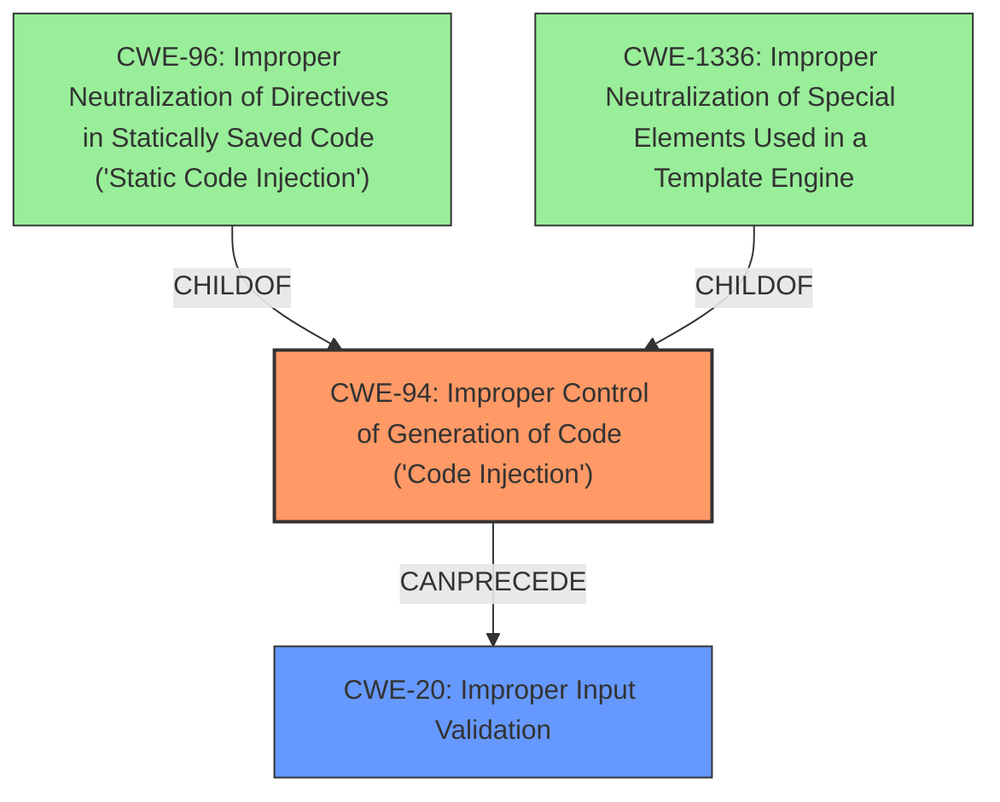

# Analysis Report for CVE-2024-38195

# Vulnerability Analysis Report: CVE-2024-38195

## Description

Azure CycleCloud Remote Code Execution Vulnerability

## Vulnerability Description Key Phrases

- **Rootcause:** The vulnerability stems from the improper handling of user-supplied data during the creation of Azure CycleCloud cluster templates, specifically within the 'template' parameter.
- **Weakness:** Insufficient input sanitization and validation, allowing for the injection of malicious code within template parameters that are later interpreted by the CycleCloud system.
- **Impact:** Successful exploitation leads to remote code execution on the target Azure CycleCloud server, potentially allowing an attacker to gain full control over the system, including data exfiltration or further compromise of the Azure environment.
- **Vector:** The attack vector is through the submission of a crafted request to the CycleCloud API that contains malicious code within the template parameter.
- **Attacker:** An unauthenticated remote attacker can exploit this vulnerability if they can reach the CycleCloud API.
- **Product:** Azure CycleCloud
- **Version:** All versions prior to the patched version. (Please specify the patched version if known)
- **Component:** Cluster template creation

## Analysis (with Relationship Data)

# Summary
| CWE ID | CWE Name | Confidence | CWE Abstraction Level | CWE Vulnerability Mapping Label | CWE-Vulnerability Mapping Notes |
|---|---|---|---|---|---|
| CWE-94 | Improper Control of Generation of Code ('Code Injection') | 0.8 | Base | Primary | Allowed-with-Review |
| CWE-20 | Improper Input Validation | 0.7 | Class | Secondary | Allowed-with-Review |

## Evidence and Confidence

*   **Confidence Score:** 0.75
*   **Evidence Strength:** MEDIUM

## Relationship Analysis
The primary relationship that influenced the decision was the parent-child relationship between CWE-913 (Improper Control of Dynamically-Generated Code) and CWE-94. While CWE-913 seemed initially appealing, the description focuses on dynamically generated code, but the provided text did not provide enough evidence.
CWE-94, as a parent of CWE-96 and CWE-1336, also captures the code injection aspect. The chain relationship of CWE-94 potentially leading to CWE-98 (Improper Control of Filename) was also considered, but no direct evidence supported it.
CWE-20 was included as the weakness of **improper input validation** is present.



## Vulnerability Chain
The vulnerability chain starts with **insufficient input sanitization and validation** and the **improper handling of user-supplied data**. This leads to the ability to inject malicious code within template parameters. The injected code is then interpreted by the CycleCloud system, resulting in remote code execution.

## Summary of Analysis
The primary CWE selected is CWE-94 (Improper Control of Generation of Code ('Code Injection')). This aligns with the vulnerability description, which states that the vulnerability stems from the **improper handling of user-supplied data** during the creation of Azure CycleCloud cluster templates, specifically within the 'template' parameter, ultimately leading to remote code execution. The **insufficient input sanitization and validation** also makes CWE-20 a good secondary candidate.

The retriever results suggested CWE-94 as a candidate, and the description of CWE-94 aligns well with the vulnerability description, as an unauthenticated remote attacker can inject code via the API and execute it on the system.

Other CWEs were considered but ultimately rejected:

*   CWE-1336: Improper Neutralization of Special Elements Used in a Template Engine - While the vulnerability involves templates, the root cause is more about the lack of control over code generation rather than template-specific issues.
*   CWE-79: Improper Neutralization of Input During Web Page Generation ('Cross-site Scripting') - This is specific to web page generation, and the vulnerability is not limited to that context.
*   CWE-78: Improper Neutralization of Special Elements used in an OS Command ('OS Command Injection') - This is specific to OS commands, and the vulnerability is not limited to that context.

The final selections of CWE-94 and CWE-20 are at the optimal level of specificity, capturing the root cause of code injection and the contributing factor of **improper input validation**.


## CWE Relationship Analysis

Current CWEs represent these abstraction levels: .


### Vulnerability Chain Analysis

**Chain starting from CWE-94:**
- 94 (Improper Control of Generation of Code ('Code Injection')) - ROOT


**Chain starting from CWE-79:**
- 79 (Improper Neutralization of Input During Web Page Generation ('Cross-site Scripting')) - ROOT


### CWE Relationship Diagram

```mermaid
graph TD
    classDef primary fill:#f96,stroke:#333,stroke-width:2px
    classDef secondary fill:#69f,stroke:#333
    classDef tertiary fill:#9e9,stroke:#333
```


*Report generated on 2025-07-13 10:12:50*
