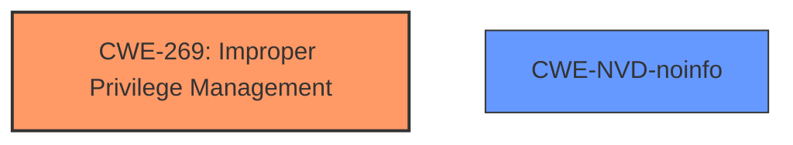

# Raw Analyzer Response for CVE-2024-38196

# Summary
| CWE ID     | CWE Name                                                                    | Confidence | CWE Abstraction Level | CWE Vulnerability Mapping Label | CWE-Vulnerability Mapping Notes |
|------------|-----------------------------------------------------------------------------|------------|-----------------------|---------------------------------|-----------------------------------|
| CWE-269    | Improper Privilege Management                                                 | 0.4        | Class                 | Primary                           | Discouraged                       |
| CWE-NVD-noinfo | NVD has no information for this vulnerability                         | 0.4        | Unknown                 | Secondary                           |                                   |

## Evidence and Confidence

*   **Confidence Score:** 0.4
*   **Evidence Strength:** LOW

## Relationship Analysis
The primary relationship influencing the decision is the parent-child relationship between CWE-269 and its potential children, which were considered but not definitively supported by the limited evidence. The absence of specific details on the root cause makes it difficult to pinpoint a more precise CWE.

## Vulnerability Chain
The vulnerability chain is not clear due to the lack of details. The description points to an elevation of privilege, suggesting an initial state where the privileges were not properly managed, leading to the final impact of elevated privileges.

## Summary of Analysis
The initial assessment considered several CWEs related to privilege management and access control. However, the limited information available makes it challenging to pinpoint the exact root cause. The "CWE for similar CVE Descriptions" lists CWE-NVD-noinfo as the primary match, and CWE-269 as the next most frequent. Given the evidence, it is reasonable to classify this vulnerability as CWE-269, Improper Privilege Management, but with low confidence.

The decision is heavily based on the "Vulnerability Description Key Phrases" indicating "elevation of privilege". Without more details, a more specific CWE cannot be assigned. This selection is at a Class level due to the lack of information.

Relevant CWE Information:

# Enhanced Context (25 CWEs)
The following CWEs were identified as potentially relevant to this vulnerability:

## CWE-266: Incorrect Privilege Assignment
**Abstraction Level**: Base
**Similarity Score**: 0.79

## CWE-59: Improper Link Resolution Before File Access ('Link Following')
**Abstraction Level**: Base
**Similarity Score**: 0.78

## CWE-280: Improper Handling of Insufficient Permissions or Privileges 
**Abstraction Level**: Base
**Similarity Score**: 0.78

## CWE-274: Improper Handling of Insufficient Privileges
**Abstraction Level**: Base
**Similarity Score**: 0.78

## CWE-267: Privilege Defined With Unsafe Actions
**Abstraction Level**: Base
**Similarity Score**: 0.78

## CWE-41: Improper Resolution of Path Equivalence
**Abstraction Level**: Base
**Similarity Score**: 0.77

## CWE-667: Improper Locking
**Abstraction Level**: Class
**Similarity Score**: 0.76

## CWE-668: Exposure of Resource to Wrong Sphere
**Abstraction Level**: Class
**Similarity Score**: 0.75

## CWE-754: Improper Check for Unusual or Exceptional Conditions
**Abstraction Level**: Class
**Similarity Score**: 0.75

## CWE-703: Improper Check or Handling of Exceptional Conditions
**Abstraction Level**: Pillar
**Similarity Score**: 0.75

## CWE-863: Incorrect Authorization
**Abstraction Level**: Class
**Similarity Score**: 1233.27

## CWE-269: Improper Privilege Management
**Abstraction Level**: Class
**Similarity Score**: 1228.82

## CWE-367: Time-of-check Time-of-use (TOCTOU) Race Condition
**Abstraction Level**: Base
**Similarity Score**: 1219.16

## CWE-362: Concurrent Execution using Shared Resource with Improper Synchronization ('Race Condition')
**Abstraction Level**: Class
**Similarity Score**: 1201.50

## CWE-285: Improper Authorization
**Abstraction Level**: Class
**Similarity Score**: 1201.38

## CWE-476: NULL Pointer Dereference
**Abstraction Level**: base
**Similarity Score**: 4.33

## CWE-609: Double-Checked Locking
**Abstraction Level**: base
**Similarity Score**: 4.33

## CWE-367: Time-of-check Time-of-use (TOCTOU) Race Condition
**Abstraction Level**: base
**Similarity Score**: 4.33

## CWE-363: Race Condition Enabling Link Following
**Abstraction Level**: base
**Similarity Score**: 2.87

## CWE-362: Concurrent Execution using Shared Resource with Improper Synchronization ('Race Condition')
**Abstraction Level**: class
**Similarity Score**: 2.55

## CWE-274: Improper Handling of Insufficient Privileges
**Abstraction Level**: Base
**Similarity Score**: 2.50

## CWE-280: Improper Handling of Insufficient Permissions or Privileges 
**Abstraction Level**: Base
**Similarity Score**: 2.50

## CWE-250: Execution with Unnecessary Privileges
**Abstraction Level**: base
**Similarity Score**: 2.47

## CWE-1386: Insecure Operation on Windows Junction / Mount Point
**Abstraction Level**: base
**Similarity Score**: 2.47

## CWE-123: Write-what-where Condition
**Abstraction Level**: base
**Similarity Score**: 2.42

**CWE-269: Improper Privilege Management** is selected as the primary CWE because the vulnerability is described as an elevation of privilege, which directly relates to privilege management. However, it is assigned with low confidence (0.4) due to the limited information about the root cause. The mapping guidance discourages the use of CWE-269, but it is used here because of the lack of other rootcause information.

**CWE-NVD-noinfo** is included as a secondary CWE because the NVD has no information for this vulnerability, as indicated in the "CWE for similar CVE Descriptions" section.

CWEs considered but not used:

*   CWE-266 (Incorrect Privilege Assignment): Considered, but there is no specific evidence to confirm that the privileges were incorrectly assigned.
*   CWE-285 (Improper Authorization): Considered, but there is no indication of an authorization check being performed incorrectly.
*   CWE-863 (Incorrect Authorization): Similar to CWE-285, there's no evidence of a flawed authorization process.
*   CWE-250 (Execution with Unnecessary Privileges): Not enough information to determine if the component was running with unnecessary privileges.

The decision favors a higher-level CWE due to the lack of detailed information, acknowledging that a more specific CWE could be assigned if more evidence were available.