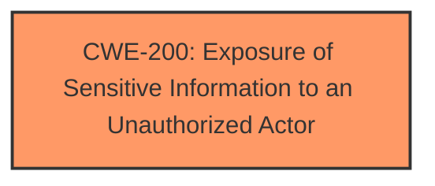

# Analysis for CVE-2024-38203

# Summary
| CWE ID | CWE Name | Confidence | CWE Abstraction Level | CWE Vulnerability Mapping Label | CWE-Vulnerability Mapping Notes |
|---|---|---|---|---|---|
| CWE-200 | Exposure of Sensitive Information to an Unauthorized Actor | 0.6 | Class | Discouraged | The vulnerability is described as an "Information Disclosure Vulnerability". CWE-200 is a class-level CWE that represents the exposure of sensitive information to an unauthorized actor, so it is a reasonable, though non-specific, fit. It is discouraged to use, but it is selected due to the lack of further information. |

## Evidence and Confidence

*   **Confidence Score:** 0.6
*   **Evidence Strength:** LOW

## Relationship Analysis
The primary relationship considered was the parent-child relationship. Several more specific child CWEs of CWE-200 were considered, but without more information about the specific mechanism of information disclosure, it is difficult to select a more specific CWE.

## Vulnerability Chain
The vulnerability chain starts with the **weakness** and leads directly to the impact:

**Information Disclosure Vulnerability** (CWE-200) -> Information Disclosure

## Summary of Analysis
The vulnerability description indicates an **Information Disclosure Vulnerability** in the Windows Package Library Manager. The available information is very limited, with the CVE Reference Links marked as "UNRELATED". The primary piece of evidence is the vulnerability description itself, specifically the phrase "Information Disclosure Vulnerability."

Given the lack of specific details, I'm assigning CWE-200 (Exposure of Sensitive Information to an Unauthorized Actor). While CWE-200 is a Class-level CWE and its use is discouraged, the description directly aligns with the stated impact. Without more specifics, a more granular CWE cannot be confidently assigned.

Several other CWEs were considered but rejected due to a lack of supporting evidence. These include CWE-426 (Untrusted Search Path), CWE-201 (Insertion of Sensitive Information Into Sent Data), CWE-178 (Improper Handling of Case Sensitivity), and others.

I am overriding the general mapping guidance to use a discouraged CWE because the provided information is extremely limited, and the description explicitly refers to information disclosure.