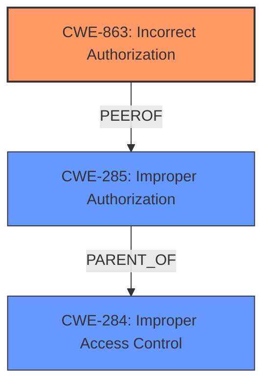

# Raw Analyzer Response for CVE-2024-38204

# Summary
| CWE ID | CWE Name | Confidence | CWE Abstraction Level | CWE Vulnerability Mapping Label | CWE-Vulnerability Mapping Notes |
|---|---|---|---|---|---|
| CWE-863 | Incorrect Authorization | 0.9 | Class | Allowed-with-Review | The application performs an authorization check, but does it incorrectly. |

## Evidence and Confidence

*   **Confidence Score:** 0.9
*   **Evidence Strength:** MEDIUM

## Relationship Analysis
The primary CWE is CWE-863, which is a Class-level CWE. The retriever results showed several potential CWEs related to authorization and access control. The guidance suggests that CWE-284 (Improper Access Control) should be avoided if a more specific child CWE like 862, 863, or 306 is appropriate. Given the specific mention of **improper access control** leading to privilege elevation and that an "authorized attacker" is able to elevate privileges, CWE-863 is the most fitting because it indicates that an authorization check is present but flawed. The classification guidance directs us to authentication CWE-306 when there is no identity check, CWE-862, when there is no role/privilege check after login, and CWE-863, when the role check is present but flawed.

## Vulnerability Chain
The vulnerability chain starts with **improper access control** (CWE-284 could be considered as a high level starting point), which leads to **incorrect authorization** (CWE-863) and ultimately results in an authorized attacker being able to elevate privileges.

## Summary of Analysis
The initial assessment considered CWE-284 due to the phrase "**improper access control**" in the vulnerability description. However, the guidance suggests using a more specific CWE if possible. The presence of an "authorized attacker" implies that authentication is likely in place, but the authorization is flawed, leading to privilege elevation. Therefore, CWE-863 (Incorrect Authorization) is chosen as the primary CWE, as it accurately reflects the scenario where the authorization check is present but flawed, allowing an attacker to elevate privileges. The vulnerability description suggests that there is a flaw in the authorization mechanism that allows privilege escalation, making CWE-863 the most appropriate choice.

Relevant CWE Information:

# Enhanced Context (25 CWEs)
The following CWEs were identified as potentially relevant to this vulnerability:

## CWE Classification Guidance

The following guidance has been automatically included because relevant keywords were detected in the vulnerability description:

### Authentication vs Authorization vs Access Control Guidance

## ===Guidance===

### Level Set – Authentication vs Authorization vs Access Control

**Authentication**:
Determines *who* the actor is (identity validation). This is typically the *first step* in access control.

* Example phrases: "user must log in", "lack of login check", "bypasses login"
* CWE relevance: authentication is usually mapped to CWE-306 or its children.

  * **CWE-306**: *Missing Authentication for Critical Function* – used when no identity validation is enforced for sensitive functionality (e.g., password reset, user deletion).

**Authorization**:
Determines *what* an authenticated actor is allowed to do. It decides access *after* identity is verified.

* Example phrases: "unauthorized access", "regular user can access admin panel", "role checks are missing"
* CWE relevance: use CWEs like 862, 863, 285 for authorization errors:

  * **CWE-862**: *Missing Authorization* – the application doesn't check whether the user is authorized at all.
  * **CWE-863**: *Incorrect Authorization* – the application checks authorization, but does it incorrectly (e.g., flawed logic).
  * **CWE-285**: *Improper Authorization* – general category for any flawed authorization logic or design.

**Access Control**:
A broader term that includes both authentication and authorization. Governs how resources are protected and who can access them under what conditions.

* CWE relevance:

  * **CWE-284**: *Improper Access Control* – top-level category used when access control failure exists but root cause is unclear.
  * This should be avoided **if** a more specific child CWE like 285, 862, 863, or 306 is appropriate.

---

## Mapping Discussion – Common Misclassification Patterns

### 1. **CWE-306 vs CWE-862**:

* **306** is about lack of **authentication** (e.g., *no login required at all*).
* **862** is about lack of **authorization** *after* authentication (e.g., *admin check missing*).
* ✅ Example CWE-306: *“An unauthenticated attacker can invoke the password reset API.”*
* ✅ Example CWE-862: *“An authenticated user without admin privileges can delete any user account.”*

### 2. **CWE-285 vs CWE-284**:

* **285** is specific to authorization flaws – it's a better choice than 284 **if** the issue involves *improper or missing role checks*.
* **284** should be reserved for general access control issues when it’s unclear whether the issue lies in authn or authz.

---

## Technical Impact vs Root Cause Clarification

**Phrase like "unauthorized access" is not enough.**

* If you **cannot determine whether identity was checked**, assume it’s **authorization** and consider 862 or 863.
* If you **know no login happened**, lean toward **authentication** → CWE-306.
* If the **access control policy is unclear or inconsistently enforced**, but it's not due to missing checks, consider **CWE-284**.

---

## Good Mapping Examples

* ✅ **CWE-306**: “The endpoint `/admin/deleteUser` does not require any authentication.”
* ✅ **CWE-862**: “Any logged-in user can change any other user's email without being an admin.”
* ✅ **CWE-863**: “An admin check exists but incorrectly grants access to non-admin users.”
* ✅ **CWE-285**: “Application uses a static role check that fails when roles change dynamically.”
* ✅ **CWE-284**: “Inconsistent enforcement of access rules across services with unclear policy source.”

---

## Summary – Quick LLM Rules of Thumb

| **Indicator**                                              | **Likely CWE** |
| ---------------------------------------------------------- | -------------- |
| No identity check (no login)                               | CWE-306        |
| No role/privilege check after login                        | CWE-862        |
| Role check is present but flawed                           | CWE-863        |
| General or ambiguous authorization failure                 | CWE-285        |
| High-level access control problem with no clear root cause | CWE-284        |