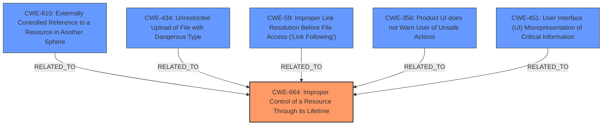

# Raw Analyzer Response for CVE-2024-38217

# Summary
| CWE ID     | CWE Name                                                        | Confidence | CWE Abstraction Level | CWE Vulnerability Mapping Label | CWE-Vulnerability Mapping Notes |
|------------|-----------------------------------------------------------------|------------|-----------------------|---------------------------------|-----------------------------------|
| CWE-664    | Improper Control of a Resource Through its Lifetime           | 0.7        | Class                 | Primary CWE                     | Allowed                         |
| CWE-610    | Externally Controlled Reference to a Resource in Another Sphere | 0.6        | Class                 | Secondary Candidate            | Discouraged                     |
| CWE-434    | Unrestricted Upload of File with Dangerous Type                | 0.5        | Base                  | Secondary Candidate            | Allowed                         |
| CWE-59     | Improper Link Resolution Before File Access ('Link Following')  | 0.5        | Base                  | Secondary Candidate            | Allowed                         |
| CWE-356    | Product UI does not Warn User of Unsafe Actions                | 0.5        | Base                  | Secondary Candidate            | Allowed                         |
| CWE-451    | User Interface (UI) Misrepresentation of Critical Information  | 0.5        | Class                 | Secondary Candidate            | Allowed-with-Review             |

## Evidence and Confidence

*   **Confidence Score:** 0.7
*   **Evidence Strength:** MEDIUM

## Relationship Analysis
The analysis reveals a complex relationship between the identified CWEs. CWE-664 serves as the primary classification due to the improper control of resources through its lifetime, which encompasses the exploitation of LNK files and the bypassing of security features. CWE-610, CWE-434, CWE-59, CWE-356, and CWE-451 are considered as they represent related aspects of the vulnerability, such as external control of resources, file upload issues, link following, lack of user warnings, and UI misrepresentation. However, these are secondary because they describe specific manifestations or contributing factors rather than the overarching root cause.

## Vulnerability Chain
The vulnerability chain begins with the attacker's ability to manipulate resources, specifically LNK files. This leads to the **improper control** of these resources (**CWE-664**). Subsequently, the attacker can introduce externally controlled references (**CWE-610**), potentially upload dangerous file types (**CWE-434**), exploit improper link resolution (**CWE-59**), and leverage the lack of user warnings (**CWE-356**) or UI misrepresentation (**CWE-451**) to bypass security features and execute malicious code.
- **CWE-664 (Primary): Improper Control of a Resource Through its Lifetime**
    - CWE-610: Externally Controlled Reference to a Resource in Another Sphere
    - CWE-434: Unrestricted Upload of File with Dangerous Type
    - CWE-59: Improper Link Resolution Before File Access ('Link Following')
    - CWE-356: Product UI does not Warn User of Unsafe Actions
    - CWE-451: User Interface (UI) Misrepresentation of Critical Information

## Summary of Analysis
The initial assessment focused on identifying the root cause and contributing factors to the vulnerability. Based on the provided evidence, the primary weakness lies in the **improper control of resources** (**CWE-664**) that enables attackers to bypass security features. While CWE-610, CWE-434, CWE-59, CWE-356, and CWE-451 capture specific aspects of the attack, they do not fully represent the underlying weakness. The graph relationships highlight how these CWEs are related to the primary weakness, each contributing to the overall vulnerability.

The selection of CWE-664 as the primary CWE is based on its ability to encompass the various attack vectors and contributing factors. The evidence supporting this decision includes the description of LNK stomping, reputation hijacking, and other techniques that allow attackers to manipulate resources and bypass security features.

The chosen CWEs are at an appropriate level of specificity, capturing both the root cause and the key contributing factors to the vulnerability.

Relevant CWE Information:

# Enhanced Context (25 CWEs)
The following CWEs were identified as potentially relevant to this vulnerability:

## CWE-451: User Interface (UI) Misrepresentation of Critical Information
**Abstraction Level**: Class
**Similarity Score**: 0.77
**Source**: dense

**Description**:
The user interface (UI) does not properly represent critical information to the user, allowing the information - or its source - to be obscured or spoofed. This is often a component in phishing attacks.

**Mapping Guidance**:
- Usage: Allowed-with-Review
- Rationale: This CWE entry is a Class and might have Base-level children that would be more appropriate

## CWE-59: Improper Link Resolution Before File Access ('Link Following')
**Abstraction Level**: Base
**Similarity Score**: 0.76
**Source**: dense

**Description**:
The product attempts to access a file based on the filename, but it does not properly prevent that filename from identifying a link or shortcut that resolves to an unintended resource.

**Mapping Guidance**:
- Usage: Allowed
- Rationale: This CWE entry is at the Base level of abstraction, which is a preferred level of abstraction for mapping to the root causes of vulnerabilities.

## CWE-427: Uncontrolled Search Path Element
**Abstraction Level**: Base
**Similarity Score**: 0.75
**Source**: dense

**Description**:
The product uses a fixed or controlled search path to find resources, but one or more locations in that path can be under the control of unintended actors.

**Mapping Guidance**:
- Usage: Allowed
- Rationale: This CWE entry is at the Base level of abstraction, which is a preferred level of abstraction for mapping to the root causes of vulnerabilities.

## CWE-73: External Control of File Name or Path
**Abstraction Level**: Base
**Similarity Score**: 0.74
**Source**: dense

**Description**:
The product allows user input to control or influence paths or file names that are used in filesystem operations.

**Mapping Guidance**:
- Usage: Allowed
- Rationale: This CWE entry is at the Base level of abstraction, which is a preferred level of abstraction for mapping to the root causes of vulnerabilities.

## CWE-472: External Control of Assumed-Immutable Web Parameter
**Abstraction Level**: Base
**Similarity Score**: 0.74
**Source**: dense

**Description**:
The web application does not sufficiently verify inputs that are assumed to be immutable but are actually externally controllable, such as hidden form fields.

**Mapping Guidance**:
- Usage: Allowed
- Rationale: This CWE entry is at the Base level of abstraction, which is a preferred level of abstraction for mapping to the root causes of vulnerabilities.

## CWE-345: Insufficient Verification of Data Authenticity
**Abstraction Level**: Class
**Similarity Score**: 0.74
**Source**: dense

**Description**:
The product does not sufficiently verify the origin or authenticity of data, in a way that causes it to accept invalid data.

**Mapping Guidance**:
- Usage: Discouraged
- Rationale: This CWE entry is a level-1 Class (i.e., a child of a Pillar). It might have lower-level children that would be more appropriate

## CWE-356: Product UI does not Warn User of Unsafe Actions
**Abstraction Level**: Base
**Similarity Score**: 0.73
**Source**: dense

**Description**:
The product's user interface does not warn the user before undertaking an unsafe action on behalf of that user. This makes it easier for attackers to trick users into inflicting damage to their system.

**Mapping Guidance**:
- Usage: Allowed
- Rationale: This CWE entry is at the Base level of abstraction, which is a preferred level