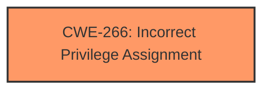

# Enhanced Analysis for CVE-2024-38223

# Summary
| CWE ID | CWE Name | Confidence | CWE Abstraction Level | CWE Vulnerability Mapping Label | CWE-Vulnerability Mapping Notes |
|---|---|---|---|---|---|
| CWE-266 | Incorrect Privilege Assignment | 0.7 | Base | Allowed | Primary CWE. The **incorrect privilege assignment** during the initial machine configuration leads to an **elevation of privilege** |

## Evidence and Confidence

*   **Confidence Score:** 0.7
*   **Evidence Strength:** LOW

## Relationship Analysis
The primary CWE is CWE-266, which is a base level CWE. No child CWEs were considered due to lack of evidence.



## Vulnerability Chain
The vulnerability chain starts with an **incorrect privilege assignment** (CWE-266) during the initial machine configuration, which directly leads to an **elevation of privilege**.

## Summary of Analysis
The analysis is based on the provided evidence, which is limited. The vulnerability description mentions an **elevation of privilege** due to a misconfiguration during the initial machine configuration. Given the guidance about privileges vs. permissions, and the fact that the issue happens during initial configuration, CWE-266 seems like the best fit.

The retriever results listed CWE-266 high. CWE-266 (Incorrect Privilege Assignment) is a base level CWE and is allowed.

CWE-285 (Improper Authorization) was considered but not used because the issue appears to be with the initial assignment of privileges rather than an authorization check performed at runtime.

Relevant CWE Information:

# Enhanced Context (25 CWEs)
The following CWEs were identified as potentially relevant to this vulnerability:

## CWE-266: Incorrect Privilege Assignment
**Abstraction Level**: Base
**Similarity Score**: 0.79
**Source**: dense

**Description**:
A product incorrectly assigns a privilege to a particular actor, creating an unintended sphere of control for that actor.

**Mapping Guidance**:
- Usage: Allowed
- Rationale: This CWE entry is at the Base level of abstraction, which is a preferred level of abstraction for mapping to the root causes of vulnerabilities.


## CWE Relationship Analysis

Current CWEs represent these abstraction levels: .


### Vulnerability Chain Analysis

**Chain starting from CWE-266:**
- 266 (Incorrect Privilege Assignment) - ROOT


**Chain starting from CWE-285:**
- 285 (Improper Authorization) - ROOT


### CWE Relationship Diagram

```mermaid
graph TD
    classDef primary fill:#f96,stroke:#333,stroke-width:2px
    classDef secondary fill:#69f,stroke:#333
    classDef tertiary fill:#9e9,stroke:#333
```