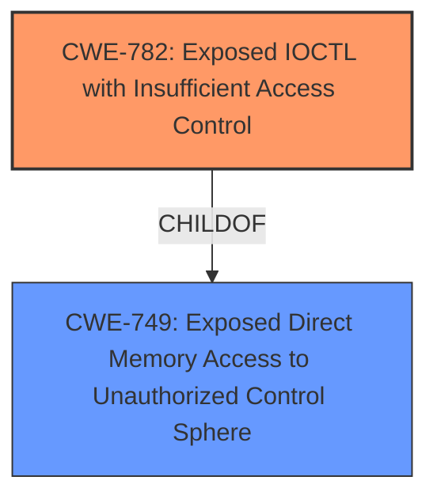

# Enhanced Analysis for CVE-2024-38241

# Summary
| CWE ID | CWE Name | Confidence | CWE Abstraction Level | CWE Vulnerability Mapping Label | CWE-Vulnerability Mapping Notes |
|---|---|---|---|---|---|
| CWE-782 | Exposed IOCTL with Insufficient Access Control | 0.75 | Variant |  | Allowed |

## Evidence and Confidence

*   **Confidence Score:** 0.75
*   **Evidence Strength:** LOW

## Relationship Analysis
The primary relationship influencing the decision was the hierarchical one. CWE-782 is a variant of CWE-749 (which wasn't in the retriever results), and the vulnerability description hints at an issue related to access control within an IOCTL context. However, due to the lack of detailed information, this relationship serves more as a guiding factor than a definitive confirmation.



## Vulnerability Chain
The chain of events is not fully evident from the limited information. The assumed chain is:
1.  Exposed IOCTL with Insufficient Access Control (CWE-782)
2.  Elevation of Privilege (Impact)

Missing links: The exact mechanism by which the insufficient access control leads to elevation of privilege is not specified.

## Summary of Analysis
The initial assessment focused on the limited information available: "Kernel Streaming Service Driver Elevation of Privilege Vulnerability". The primary challenge is the lack of specific details regarding the vulnerability's root cause. The phrase "Elevation of Privilege" suggests an access control or privilege management issue.

Given the limited evidence, CWE-782 "Exposed IOCTL with Insufficient Access Control" seems to be the most relevant based on the retriever results and the relationships between the CWEs. It directly relates to a driver context (Kernel Streaming Service Driver) and access control issues. However, the confidence remains relatively low due to the lack of explicit confirmation in the provided information.

Relevant CWE Information:

# Enhanced Context (25 CWEs)
The following CWEs were identified as potentially relevant to this vulnerability:

## CWE Classification Guidance

The following guidance has been automatically included because relevant keywords were detected in the vulnerability description:

### Privileges vs Permissions Guidance

# Complete CWE Specifications

CWE-667: Improper Locking

CWE-1285: Improper Validation of Specified Index, Position, or Offset in Input

CWE-362: Concurrent Execution using Shared Resource with Improper Synchronization ('Race Condition')

CWE-787: Out-of-bounds Write

CWE-59: Improper Link Resolution Before File Access ('Link Following')

CWE-415: Double Free

CWE-367: Time-of-check Time-of-use (TOCTOU) Race Condition

CWE-197: Numeric Truncation Error

CWE-782: Exposed IOCTL with Insufficient Access Control

CWE-363: Race Condition Enabling Link Following

CWE-782 is chosen because it is the most descriptive based on the term "Kernel Streaming Service Driver".

**CWE-782: Exposed IOCTL with Insufficient Access Control**
*   **How the vulnerability's details match the CWE's characteristics:** The vulnerability description mentions a "Kernel Streaming Service Driver" and an "Elevation of Privilege". IOCTLs (Input/Output Control codes) are a common mechanism for user-mode applications to interact with kernel-mode drivers. If an IOCTL is exposed without proper access control, it could allow unauthorized users to perform privileged operations, leading to elevation of privilege.
*   **The security implications and potential impact:** An attacker could exploit this vulnerability to gain elevated privileges on the system, potentially leading to arbitrary code execution, data theft, or denial of service.
*   **Any parent-child relationships or chain patterns that influenced your mapping:** CWE-782 is a Variant of CWE-749 (Exposed Direct Memory Access to Unauthorized Control Sphere) and a child of CWE-749.
*   **Whether the weakness is primary or secondary in the vulnerability:** This is considered the primary weakness due to its direct relationship to the exposed IOCTL and the resulting elevation of privilege.
*   **How the official MITRE mapping guidance influenced your decision:** The allowed usage and variant abstraction level makes it a good candidate.

**Other CWEs Considered and Rejected:**

*   CWE-NVD-noinfo: This is too generic and doesn't provide any specific information about the vulnerability.
*   CWE-787: Out-of-bounds Write: While out-of-bounds writes can lead to elevation of privilege, there's no direct evidence in the description to suggest this is the root cause.
*   CWE-125: Out-of-bounds Read: Similar to CWE-787, there is no direct evidence.
*   CWE-667: Improper Locking & CWE-362: Concurrent Execution using Shared Resource with Improper Synchronization ('Race Condition'): These are related to concurrency issues, but there's no information to suggest a race condition is involved.
*   CWE-59: Improper Link Resolution Before File Access ('Link Following'): This is related to file access issues, and does not fit the vulnerability description.
*   CWE-415: Double Free: Memory corruption issues are possible but lack direct evidence.
*   CWE-367: Time-of-check Time-of-use (TOCTOU) Race Condition: Similar to the above race condition CWEs, it lacks specific evidence.
*   CWE-197: Numeric Truncation Error: There's no indication of numeric truncation.
*   CWE-363: Race Condition Enabling Link Following: This is related to race conditions and link following, which does not fit the vulnerability description.
*   CWE-1285: Improper Validation of Specified Index, Position, or Offset in Input: This could be relevant if input validation within the IOCTL is missing, but there isn't enough evidence.


## CWE Relationship Analysis

Current CWEs represent these abstraction levels: .


### Vulnerability Chain Analysis

**Chain starting from CWE-125:**
- 125 (Out-of-bounds Read) - ROOT


**Chain starting from CWE-59:**
- 59 (Improper Link Resolution Before File Access ('Link Following')) - ROOT


### CWE Relationship Diagram

```mermaid
graph TD
    classDef primary fill:#f96,stroke:#333,stroke-width:2px
    classDef secondary fill:#69f,stroke:#333
    classDef tertiary fill:#9e9,stroke:#333
```