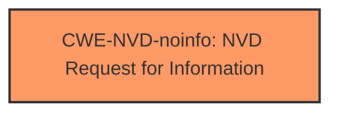

# Analysis Report for CVE-2024-38245

# Vulnerability Analysis Report: CVE-2024-38245

## Description

Kernel Streaming Service Driver Elevation of Privilege Vulnerability

## Vulnerability Description Key Phrases

- **Impact:** Elevation of Privilege
- **Component:** Kernel Streaming Service Driver

## Analysis (with Relationship Data)

# Summary
| CWE ID | CWE Name | Confidence | CWE Abstraction Level | CWE Vulnerability Mapping Label | CWE-Vulnerability Mapping Notes |
|---|---|---|---|---|---|
| CWE-NVD-noinfo | NVD Request for Information | 0.7 | N/A | Primary | N/A |

## Evidence and Confidence

*   **Confidence Score:** 0.7
*   **Evidence Strength:** LOW

## Relationship Analysis
Since the primary CWE is CWE-NVD-noinfo, there are no relationships to analyze.



## Vulnerability Chain
The vulnerability chain cannot be determined due to the lack of information.

## Summary of Analysis
The vulnerability description provides very limited information. The vulnerability is described as a "Kernel Streaming Service Driver Elevation of Privilege Vulnerability". The key phrases only indicate the impact (Elevation of Privilege) and the component (Kernel Streaming Service Driver). The CVE Reference Links Content Summary is "UNRELATED". The CWE for similar CVE Descriptions lists CWE-NVD-noinfo as the primary match.

Given the lack of information, the most appropriate CWE is CWE-NVD-noinfo, which indicates that the NVD (National Vulnerability Database) needs more information to properly classify the vulnerability.

The retriever results suggest other CWEs such as CWE-667, CWE-1285, CWE-362, CWE-787, CWE-59, CWE-415, CWE-367, CWE-197, CWE-782, and CWE-363. However, without more information about the root cause of the vulnerability, it is not possible to determine if these CWEs are applicable.

I am relying heavily on the "CWE for similar CVE Descriptions" which states the **Primary CWE Match** is CWE-NVD-noinfo.

Relevant CWE Information:

# Enhanced Context (25 CWEs)
The following CWEs were identified as potentially relevant to this vulnerability:

## CWE-266: Incorrect Privilege Assignment
**Abstraction Level**: Base
**Similarity Score**: 0.78
**Source**: dense

## CWE-280: Improper Handling of Insufficient Permissions or Privileges 
**Abstraction Level**: Base
**Similarity Score**: 0.78
**Source**: dense

## CWE-267: Privilege Defined With Unsafe Actions
**Abstraction Level**: Base
**Similarity Score**: 0.78
**Source**: dense

## CWE-274: Improper Handling of Insufficient Privileges
**Abstraction Level**: Base
**Similarity Score**: 0.77
**Source**: dense

## CWE-667: Improper Locking
**Abstraction Level**: Class
**Similarity Score**: 0.77
**Source**: dense

## CWE-59: Improper Link Resolution Before File Access ('Link Following')
**Abstraction Level**: Base
**Similarity Score**: 0.76
**Source**: dense

## CWE-41: Improper Resolution of Path Equivalence
**Abstraction Level**: Base
**Similarity Score**: 0.76
**Source**: dense

## CWE-703: Improper Check or Handling of Exceptional Conditions
**Abstraction Level**: Pillar
**Similarity Score**: 0.75
**Source**: dense

## CWE-754: Improper Check for Unusual or Exceptional Conditions
**Abstraction Level**: Class
**Similarity Score**: 0.75
**Source**: dense

## CWE-668: Exposure of Resource to Wrong Sphere
**Abstraction Level**: Class
**Similarity Score**: 0.75
**Source**: dense

## CWE-367: Time-of-check Time-of-use (TOCTOU) Race Condition
**Abstraction Level**: Base
**Similarity Score**: 1235.29
**Source**: sparse

## CWE-863: Incorrect Authorization
**Abstraction Level**: Class
**Similarity Score**: 1226.59
**Source**: sparse

## CWE-362: Concurrent Execution using Shared Resource with Improper Synchronization ('Race Condition')
**Abstraction Level**: Class
**Similarity Score**: 1225.73
**Source**: sparse

## CWE-269: Improper Privilege Management
**Abstraction Level**: Class
**Similarity Score**: 1215.88
**Source**: sparse

## CWE-267: Privilege Defined With Unsafe Actions
**Abstraction Level**: Base
**Similarity Score**: 1188.10
**Source**: sparse

## CWE-363: Race Condition Enabling Link Following
**Abstraction Level**: base
**Similarity Score**: 4.33
**Source**: graph

## CWE-787: Out-of-bounds Write
**Abstraction Level**: base
**Similarity Score**: 3.89
**Source**: graph

## CWE-123: Write-what-where Condition
**Abstraction Level**: base
**Similarity Score**: 3.13
**Source**: graph

## CWE-782: Exposed IOCTL with Insufficient Access Control
**Abstraction Level**: variant
**Similarity Score**: 2.97
**Source**: graph

## CWE-125: Out-of-bounds Read
**Abstraction Level**: base
**Similarity Score**: 2.95
**Source**: graph

## CWE-59: Improper Link Resolution Before File Access ('Link Following')
**Abstraction Level**: Base
**Similarity Score**: 2.90
**Source**: graph

## CWE-364: Signal Handler Race Condition
**Abstraction Level**: base
**Similarity Score**: 2.87
**Source**: graph

## CWE-609: Double-Checked Locking
**Abstraction Level**: base
**Similarity Score**: 2.87
**Source**: graph

## CWE-416: Use After Free
**Abstraction Level**: variant
**Similarity Score**: 2.69
**Source**: graph

## CWE-781: Improper Address Validation in IOCTL with METHOD_NEITHER I/O Control Code
**Abstraction Level**: variant
**Similarity Score**: 2.68
**Source**: graph


## CWE Relationship Analysis

Current CWEs represent these abstraction levels: .


### Vulnerability Chain Analysis

**Chain starting from CWE-274:**
- 274 (Improper Handling of Insufficient Privileges) - ROOT


**Chain starting from CWE-416:**
- 416 (Use After Free) - ROOT


### CWE Relationship Diagram

```mermaid
graph TD
    classDef primary fill:#f96,stroke:#333,stroke-width:2px
    classDef secondary fill:#69f,stroke:#333
    classDef tertiary fill:#9e9,stroke:#333
```


*Report generated on 2025-07-13 10:20:50*
