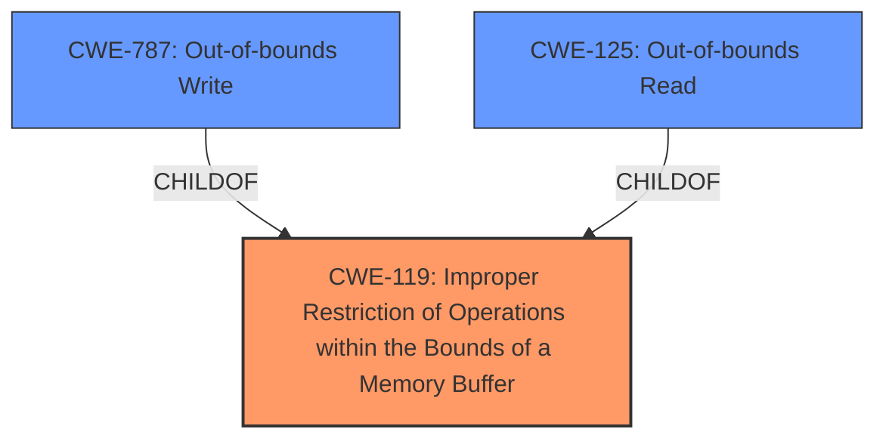

# Raw Analyzer Response for CVE-2024-38267

# Summary
| CWE ID  | CWE Name  | Confidence | CWE Abstraction Level | CWE Vulnerability Mapping Label | CWE-Vulnerability Mapping Notes |
|-----------------|--------------------------------------------------------------------|-------------------|-------------------------|------------------------------------|------------------------------------|
| **CWE-119** | Improper Restriction of Operations within the Bounds of a Memory Buffer | 0.9 | Class |  Primary | Allowed-with-Review |
| CWE-787 | Out-of-bounds Write | 0.6 | Base | Secondary | Allowed |
| CWE-125 | Out-of-bounds Read | 0.6 | Base | Secondary | Allowed |

## Evidence and Confidence

*   **Confidence Score:** 0.9
*   **Evidence Strength:** HIGH

## Relationship Analysis
The primary CWE selected is CWE-119, which is a Class-level CWE. While it would be ideal to have a more specific Base or Variant CWE, the provided evidence strongly suggests a buffer boundary issue. The Retriever Results also highlight CWE-787 and CWE-125 as potential candidates, and these are related to CWE-119. CWE-787 (Out-of-bounds Write) and CWE-125 (Out-of-bounds Read) are both children of CWE-119. The relationships suggest a potential chain where an improper restriction could lead to either a read or write beyond buffer boundaries.

## Vulnerability Chain
The vulnerability chain starts with an **improper restriction of operations within the bounds of a memory buffer** (CWE-119) during IPv6 address parsing. This leads to potential memory corruptions, ultimately resulting in a thread crash. The chain can be seen as:

1.  **Root Cause:** CWE-119 (**Improper Restriction of Operations within the Bounds of a Memory Buffer**)
2.  **Impact:** Memory corruption (potentially through out-of-bounds read or write)
3.  **Final Impact:** Thread crash

## Summary of Analysis
The initial analysis focused on identifying the root cause of the vulnerability, which is clearly stated as an **improper restriction of operations within the bounds of a memory buffer** in the IPv6 address parser. This aligns directly with CWE-119. The retriever results also point to CWE-119 as a top candidate. The surrounding context indicates that the **improper restriction** leads to memory corruption, which could be further specified as either CWE-787 (**Out-of-bounds Write**) or CWE-125 (**Out-of-bounds Read**), depending on the exact nature of the memory corruption (read or write). Given the provided information, it is reasonable to consider both CWE-787 and CWE-125 as secondary weaknesses resulting from the primary weakness, CWE-119.

The evidence for the root cause is directly available in the "**Vulnerability Description Key Phrases**" section. The confidence in this assessment is high (0.9) due to the clear description of the vulnerability and the supporting evidence from the retriever results and CVE description.

The decision to use CWE-119 as the primary CWE is optimal because it directly represents the **improper restriction**, which is the root cause. While CWE-787 and CWE-125 are more specific, they are consequences of the **improper restriction** rather than the cause itself.

Relevant CWE Information:

# Enhanced Context (25 CWEs)
The following CWEs were identified as potentially relevant to this vulnerability:

## CWE-131: Incorrect Calculation of Buffer Size
**Abstraction Level**: Base
**Similarity Score**: 0.77
**Source**: dense

**Description**:
The product does not correctly calculate the size to be used when allocating a buffer, which could lead to a buffer overflow.

**Mapping Guidance**:
- Usage: Allowed
- Rationale: This CWE entry is at the Base level of abstraction, which is a preferred level of abstraction for mapping to the root causes of vulnerabilities.

## CWE-280: Improper Handling of Insufficient Permissions or Privileges 
**Abstraction Level**: Base
**Similarity Score**: 0.77
**Source**: dense

**Description**:
The product does not handle or incorrectly handles when it has insufficient privileges to access resources or functionality as specified by their permissions. This may cause it to follow unexpected code paths that may leave the product in an invalid state.

**Mapping Guidance**:
- Usage: Allowed
- Rationale: This CWE entry is at the Base level of abstraction, which is a preferred level of abstraction for mapping to the root causes of vulnerabilities.

## CWE-703: Improper Check or Handling of Exceptional Conditions
**Abstraction Level**: Pillar
**Similarity Score**: 0.77
**Source**: dense

**Description**:
The product does not properly anticipate or handle exceptional conditions that rarely occur during normal operation of the product.

**Mapping Guidance**:
- Usage: Discouraged
- Rationale: This CWE entry is extremely high-level, a Pillar.

## CWE-274: Improper Handling of Insufficient Privileges
**Abstraction Level**: Base
**Similarity Score**: 0.77
**Source**: dense

**Description**:
The product does not handle or incorrectly handles when it has insufficient privileges to perform an operation, leading to resultant weaknesses.

**Mapping Guidance**:
- Usage: Discouraged
- Rationale: This CWE entry could be deprecated in a future version of CWE.

## CWE-754: Improper Check for Unusual or Exceptional Conditions
**Abstraction Level**: Class
**Similarity Score**: 0.77
**Source**: dense

**Description**:
The product does not check or incorrectly checks for unusual or exceptional conditions that are not expected to occur frequently during day to day operation of the product.

**Mapping Guidance**:
- Usage: Allowed-with-Review
- Rationale: This CWE entry is a Class and might have Base-level children that would be more appropriate

## CWE-191: Integer Underflow (Wrap or Wraparound)
**Abstraction Level**: Base
**Similarity Score**: 0.77
**Source**: dense

**Description**:
The product subtracts one value from another, such that the result is less than the minimum allowable integer value, which produces a value that is not equal to the correct result.

**Mapping Guidance**:
- Usage: Allowed
- Rationale: This CWE entry is at the Base level of abstraction, which is a preferred level of abstraction for mapping to the root causes of vulnerabilities.

## CWE-266: Incorrect Privilege Assignment
**Abstraction Level**: Base
**Similarity Score**: 0.76
**Source**: dense

**Description**:
A product incorrectly assigns a privilege to a particular actor, creating an unintended sphere of control for that actor.

**Mapping Guidance**:
- Usage: Allowed
- Rationale: This CWE entry is at the Base level of abstraction, which is a preferred level of abstraction for mapping to the root causes of vulnerabilities.

## CWE-667: Improper Locking
**Abstraction Level**: Class
**Similarity Score**: 0.76
**Source**: dense

**Description**:
The product does not properly acquire or release a lock on a resource, leading to unexpected resource state changes and behaviors.

**Mapping Guidance**:
- Usage: Allowed-with-Review
- Rationale: This CWE entry is a Class and might have Base-level children that would be more appropriate

## CWE-404: Improper Resource Shutdown or Release
**Abstraction Level**: Class
**Similarity Score**: 0.76
**Source**: dense

**Description**:
The product does not release or incorrectly releases a resource before it is made available for re-use.

**Mapping Guidance**:
- Usage: Allowed-with-Review
- Rationale: This CWE entry is a Class and might have Base-level children that would be more appropriate

## CWE-755: Improper Handling of Exceptional Conditions
**Abstraction Level**: Class
**Similarity Score**: 0.76
**Source**: dense

**Description**:
The product does not handle or incorrectly handles an exceptional condition.

**Mapping Guidance**:
- Usage: Discouraged
- Rationale: This CWE entry is a level-1 Class (i.e., a child of a Pillar). It might have lower-level children that would be more appropriate

## CWE-269: Improper Privilege Management
**Abstraction Level**: Class
**Similarity Score**: 1484.83
**Source**: sparse

**Description**:
The product does not properly assign, modify, track, or check privileges for an actor, creating an unintended sphere of control for that actor