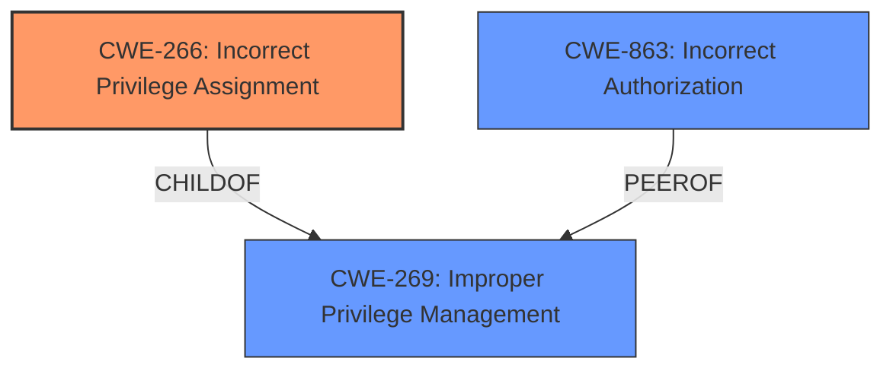

# Analysis Report for CVE-2024-38291

# Vulnerability Analysis Report: CVE-2024-38291

## Description

In XIQ-SE before 24.2.11, a low-privileged user may be able to access admin passwords, which could lead to privilege escalation.

## Vulnerability Description Key Phrases

- **Impact:** ['access admin passwords', 'privilege escalation']
- **Attacker:** low-privileged user
- **Product:** XIQ-SE
- **Version:** before 24.2.11

## Analysis (with Relationship Data)

# Summary
| CWE ID  | CWE Name                                                     | Confidence | CWE Abstraction Level | CWE Vulnerability Mapping Label | CWE-Vulnerability Mapping Notes |
| :-------- | :----------------------------------------------------------- | :--------- | :-------------------- | :------------------------------ | :------------------------------ |
| CWE-266   | Incorrect Privilege Assignment                               | 0.9        | Base                  | Primary                         | Allowed                         |
| CWE-863 | Incorrect Authorization                                    | 0.7       | Class                 | Secondary                       | Allowed-with-Review             |
| CWE-269   | Improper Privilege Management                              | 0.6        | Class                 | Secondary                       | Discouraged                     |

## Evidence and Confidence

*   **Confidence Score:** 0.9
*   **Evidence Strength:** HIGH

## Relationship Analysis
The primary CWE is CWE-266, which deals with the incorrect assignment of privileges. This is more specific than CWE-269 (Improper Privilege Management) or CWE-285 (Improper Authorization), which are higher-level classes. CWE-863 (Incorrect Authorization) is also considered, as the vulnerability could involve a flawed authorization check. However, the description emphasizes the **incorrect assignment** of privileges, making CWE-266 the most accurate root cause.



## Vulnerability Chain
The vulnerability chain starts with the **incorrect assignment of privileges** (CWE-266) to a low-privileged user, which allows them to access admin passwords. This leads to potential privilege escalation. The missing link here is how the low-privileged user is able to access admin passwords after the incorrect privilege assignment.

## Summary of Analysis
The initial analysis focused on identifying the root cause of the vulnerability, which is the means by which a low-privileged user is able to access admin passwords and escalate their privileges. The vulnerability description and CVE summary explicitly mention that a low-privileged user is able to access admin passwords, leading to privilege escalation. The guidance "Privileges vs Permissions Guidance" was very helpful.

The relationships between CWEs helped refine the selection: CWE-266 is a more specific Base CWE compared to the Class CWEs like CWE-269 and CWE-285. The decision to prioritize CWE-266 is based on the evidence that the core issue is an **incorrect assignment** of privileges rather than a general failure in privilege management or authorization.

The selected CWEs are at the optimal level of specificity because CWE-266 accurately represents the **root cause** of the vulnerability, while also accounting for authorization weaknesses that may be exploited if privileges are misconfigured.

Relevant CWE Information:

# Enhanced Context (25 CWEs)
The following CWEs were identified as potentially relevant to this vulnerability:

## CWE-266: Incorrect Privilege Assignment
**Abstraction Level**: Base
**Similarity Score**: 0.79
**Source**: dense

**Description**:
A product incorrectly assigns a privilege to a particular actor, creating an unintended sphere of control for that actor.

**Mapping Guidance**:
- Usage: Allowed
- Rationale: This CWE entry is at the Base level of abstraction, which is a preferred level of abstraction for mapping to the root causes of vulnerabilities.

**Technical Explanation**: The vulnerability description states that a low-privileged user is able to access admin passwords. This directly aligns with CWE-266, which describes a scenario where a product incorrectly assigns a privilege, creating an unintended sphere of control. In this case, the low-privileged user is granted the privilege to access sensitive admin passwords.
**Security Implications**: This vulnerability can lead to privilege escalation, where an attacker with limited access can gain administrative control over the system. This could result in data breaches, system compromise, and other severe security incidents.
**Relationship Analysis**: CWE-266 is a Base CWE and is more specific than its parent, CWE-269 (Improper Privilege Management), which is a Class CWE. This specificity makes CWE-266 a more suitable choice for mapping this vulnerability.
**Mapping Guidance Analysis**: The MITRE mapping guidance explicitly allows the use of CWE-266 at the Base level, which supports its selection as the primary CWE.

## CWE-863: Incorrect Authorization
**Abstraction Level**: Class
**Similarity Score**: 1486.99
**Source**: sparse

**Description**:
The product performs an authorization check when an actor attempts to access a resource or perform an action, but it does not correctly perform the check.

**Mapping Guidance**:
- Usage: Allowed-with-Review
- Rationale: This CWE entry is a Class and might have Base-level children that would be more appropriate

**Technical Explanation**: While the root cause appears to be **incorrect privilege assignment**, the access to admin passwords also implies there may be an authorization problem present. An authorization check might be in place, but the low-privileged user is somehow able to bypass it due to the assigned incorrect privilege.
**Security Implications**: If authorization checks are incorrectly performed, an attacker may gain access to resources or functionality that should otherwise be inaccessible to them.
**Relationship Analysis**: CWE-863 is a Class-level CWE.
**Mapping Guidance Analysis**: The mapping guidance suggests using more specific Base-level children if available, but in this case, the primary issue is the privilege assignment that leads to the access of admin passwords.

## CWE-269: Improper Privilege Management
**Abstraction Level**: Class
**Similarity Score**: 0.74
**Source**: dense

**Description**:
The product does not properly assign, modify, track, or check privileges for an actor, creating an unintended sphere of control for that actor.

**Mapping Guidance**:
- Usage: Discouraged
- Rationale: CWE-269 is commonly misused. It can be conflated with "privilege escalation," which is a technical impact that is listed in many low-information vulnerability reports [REF-1287]. It is not useful for trend analysis.

**Technical Explanation**: The description of CWE-269 aligns with the general problem of privilege management issues, where privileges are not properly assigned or tracked. However, the vulnerability description specifically points to the ability of a low-privileged user to access admin passwords, indicating a more precise weakness related to **incorrect privilege assignment** rather than a general failure in privilege management.
**Security Implications**: Improper privilege management can lead to unauthorized access to sensitive data and system resources, potentially allowing attackers to escalate their privileges and compromise the system.
**Relationship Analysis**: CWE-269 is a Class CWE and is a parent of CWE-266. While it represents a broader category of privilege-related issues, CWE-266 provides a more specific description of the vulnerability.
**Mapping Guidance Analysis**: The MITRE mapping guidance discourages the use of CWE-269 because it is commonly misused and not useful for trend analysis.

CWEs Considered But Not Used:

*   **CWE-285: Improper Authorization:** This was considered, but the evidence points more towards an **incorrect assignment of privileges** (CWE-266) rather than a general failure in authorization.
*   **CWE-732: Incorrect Permission Assignment for Critical Resource:** While related to access control, this CWE focuses on permissions for resources rather than privileges for users. The vulnerability description emphasizes user privileges, making CWE-266 a better fit.
*   **CWE-276: Incorrect Default Permissions:** This is related to default permissions set during installation, which is not explicitly mentioned in the vulnerability description.


## CWE Relationship Analysis

Current CWEs represent these abstraction levels: .


### Vulnerability Chain Analysis

**Chain starting from CWE-863:**
- 863 (Incorrect Authorization) - ROOT


**Chain starting from CWE-732:**
- 732 (Incorrect Permission Assignment for Critical Resource) - ROOT


### CWE Relationship Diagram

```mermaid
graph TD
    classDef primary fill:#f96,stroke:#333,stroke-width:2px
    classDef secondary fill:#69f,stroke:#333
    classDef tertiary fill:#9e9,stroke:#333
```


*Report generated on 2025-07-13 10:26:35*
