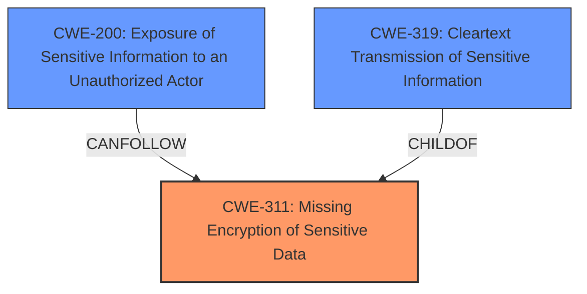

# Raw Analyzer Response for CVE-2024-38302

# Summary
| CWE ID | CWE Name | Confidence | CWE Abstraction Level | CWE Vulnerability Mapping Label | CWE-Vulnerability Mapping Notes |
|---|---|---|---|---|---|
| CWE-311 | Missing Encryption of Sensitive Data | 1.0 | Class | Primary | Discouraged - But most applicable based on provided information |
| CWE-200 | Exposure of Sensitive Information to an Unauthorized Actor | 0.7 | Class | Secondary | Discouraged |
| CWE-319 | Cleartext Transmission of Sensitive Information | 0.6 | Base | Secondary | Allowed |

## Evidence and Confidence

*   **Confidence Score:** 0.8
*   **Evidence Strength:** HIGH

## Relationship Analysis
The primary relationship influencing the CWE selection is the parent-child relationship, with CWE-311 being a class-level CWE. While there are more specific child CWEs (Base, Variant) related to encryption, the provided information doesn't provide enough detail to pinpoint the specific type of **missing encryption**. The vulnerability chain involves a **missing encryption** leading to information disclosure. CWE-200 is a potential impact of the **missing encryption**.

## Vulnerability Chain
The vulnerability chain starts with the **missing encryption of sensitive data** (CWE-311), which then leads to the potential exposure of sensitive information to unauthorized actors (CWE-200). The adjacent network access is the attack vector.

## Summary of Analysis
The initial assessment identified CWE-311 as the primary weakness due to the explicit mention of "**missing encryption of sensitive data**" in both the vulnerability description and the CVE reference summary. The analysis also considered the retriever results, which listed CWE-311, CWE-319, CWE-321, and CWE-327 as potential candidates.

The evidence supporting CWE-311 is strong, with direct mentions in the description: "Dell Data Lakehouse, version(s) 1.0.0.0, contain(s) a **Missing Encryption of Sensitive Data** vulnerability" and in the CVE Reference Links Content Summary: "root_cause: **Missing Encryption of Sensitive Data**".

Although CWE-311 is a Class-level CWE and the guidance discourages its use when more specific options are available, the provided evidence does not allow for a more precise classification. Without knowing the specifics of *how* the encryption is missing, a more specific CWE cannot be selected with confidence. CWE-319 is included as a secondary candidate, assuming the data is transmitted in cleartext.

CWE-200 is included as a secondary candidate because the impact of the **missing encryption** is information disclosure, and this CWE represents that outcome.

Relevant CWE Information:

*   **CWE-311: Missing Encryption of Sensitive Data**
    *   Technical Explanation: The product does not encrypt sensitive information, making it vulnerable to interception and unauthorized access.
    *   Security Implications: Sensitive data can be easily accessed and exploited if encryption is missing.
    *   Relationship: Class-level CWE.
    *   Mapping Guidance: Discouraged, but selected due to lack of specific encryption details.
*   **CWE-200: Exposure of Sensitive Information to an Unauthorized Actor**
    *   Technical Explanation: The product exposes sensitive information to unauthorized actors.
    *   Security Implications: Unauthorized access to sensitive information.
    *   Relationship: Class-level CWE.
    *   Mapping Guidance: Discouraged.
*   **CWE-319: Cleartext Transmission of Sensitive Information**
    *   Technical Explanation: The product transmits sensitive data in cleartext, allowing for interception.
    *   Security Implications: Sensitive data can be intercepted during transmission.
    *   Relationship: Base-level CWE, ChildOf CWE-311
    *   Mapping Guidance: Allowed.

CWEs considered but not used:

*   CWE-321: Use of Hard-coded Cryptographic Key: While a hard-coded key would be a vulnerability, there's no evidence to suggest this is the case here.
*   CWE-327: Use of a Broken or Risky Cryptographic Algorithm: Again, there's no evidence to suggest that the encryption algorithm itself is broken, only that encryption is missing.
*   CWE-326: Inadequate Encryption Strength: Similar to CWE-327, the issue is not the strength of the encryption, but its absence.
*   CWE-259: Use of Hard-coded Password: Not applicable, as this vulnerability is about encryption, not passwords.
*   CWE-119: Improper Restriction of Operations within the Bounds of a Memory Buffer: Not related to the described vulnerability.
*   CWE-284: Improper Access Control: While related to information disclosure, the root cause is the **missing encryption**, not access control.
*   CWE-208: Observable Timing Discrepancy: Not related to the described vulnerability.